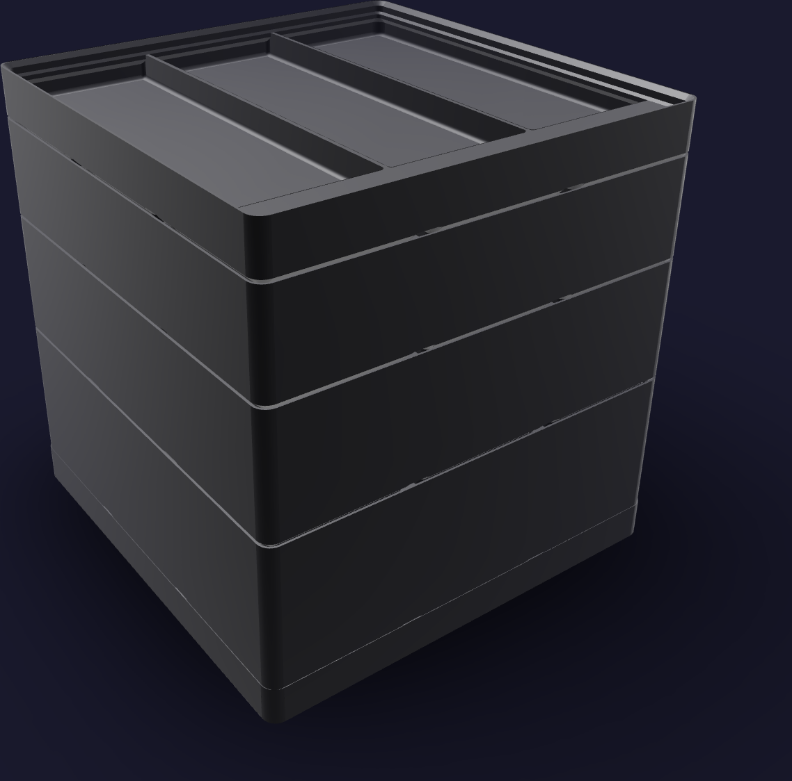
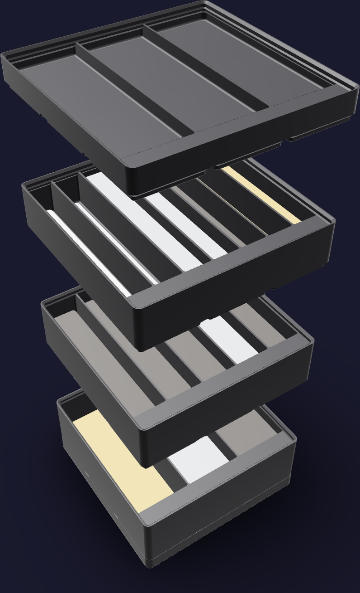

# Fastener job stack



A job stack, because pressing heat-set inserts and driving screws happens in
campaigns: the storeys come off the dock and stand open on the bench for the
length of a card, then go back on it. The closed footprint is
[126 mm x 126 mm](FOOTPRINT) — one 3 x 3 Gridfinity module — and the stack
reaches [128.6 mm](PRINTED_HEIGHT). Nothing rides above the plastic, so that
is the populated height too.

Every storey is the same body: an open bin cut into troughs that run front to
back, [123.5 mm](TROUGH_LENGTH) of trough apiece, with the library's label
ledge along the +Y wall over their open ends. One trough per SKU in the three
stock storeys, [15](SKU_COUNT) of them, and the trough count is all that
separates one storey from the next.

1. **`fasteners-m5`** — [3](M5_TROUGHS) troughs, [40.4 mm](M5_TROUGH_WIDTH)
   wide and [32.2 mm](M5_DEPTH) deep. The compressor's floor stack, all three
   parts of it: the insert, the screw and the fender washer that is what
   actually holds the compressor down (`bom.md` §13 item 8). The heaviest
   storey, so it is the bottom one.
2. **`fasteners-m3`** — [5](M3_TROUGHS) troughs, [23.7 mm](M3_TROUGH_WIDTH)
   wide and [25.2 mm](M3_DEPTH) deep. The five BNUOK M3 cap-screw lengths,
   longest at -X and shortest at +X.
3. **`fasteners-small`** — [7](SMALL_TROUGHS) troughs,
   [16.6 mm](SMALL_TROUGH_WIDTH) wide and [18.2 mm](SMALL_DEPTH) deep. The
   brass, the M2 stock, the two ultra-low-profile M3s, and the two pressed-in
   parts that are not screws.
4. **`fasteners-tray`** — 3 troughs, [40.4 mm](TRAY_TROUGH_WIDTH) wide and
   [4.2 mm](TRAY_DEPTH) deep, empty at rest. It takes the parts in play while
   the storeys under it are out on the bench. It is the top storey, so a screw
   lying in it may stand proud of its rim.



## Printed parts

| Output | Quantity | Print orientation | Envelope |
|---|---:|---|---:|
| `fasteners-m5.step` | 1 | Gridfinity feet on the bed; troughs up | [125.5 x 125.5 x 45.8 mm](M5_ENVELOPE) |
| `fasteners-m3.step` | 1 | Gridfinity feet on the bed; troughs up | [125.5 x 125.5 x 38.8 mm](M3_ENVELOPE) |
| `fasteners-small.step` | 1 | Gridfinity feet on the bed; troughs up | [125.5 x 125.5 x 31.8 mm](SMALL_ENVELOPE) |
| `fasteners-tray.step` | 1 | Gridfinity feet on the bed; troughs up | [125.5 x 125.5 x 17.8 mm](TRAY_ENVELOPE) |
| `fasteners-dock.step` | 1 | Flat face on the bed; Gridfinity recesses up | [126.0 x 126.0 x 10.8 mm](DOCK_ENVELOPE) |

Every part fits the H2C left-nozzle [325 x 320 x 320 mm](H2C_ENVELOPE)
envelope; `fasteners-m5` at [45.8 mm](TALLEST_PART) is the tallest single
print. The dock is the library's own baseplate, and any 3 x 3 Gridfinity
baseplate already on the bench docks this kit instead.

## Contents map

Each trough holds one SKU's whole pack, decanted. Troughs are numbered from -X;
the label ledge stands over the +Y end of every one of them and takes 12 mm
label tape. **Fill** is how deep that pack lies in its trough — the pack's
solid volume at the [45 %](LOOSE_FILL_FRACTION) loose-fill fraction, over a
footprint [106.9 mm](FILL_FOOTPRINT_DEPTH) front to back: the trough inside
[2 mm](CONTENT_CLEARANCE) of hand clearance, stopping
[14.6 mm](LABEL_LEDGE_REACH) short of the +Y wall so that it stands clear of
the ledge whatever its height.

**`fasteners-m5`** — the compressor's floor stack

| Trough | Holds | On hand | Fill |
|---:|---|---:|---:|
| 1 | [MewuDecor M5 x 10 SHCS, black oxide 12.9](https://www.amazon.com/dp/B0BHZVXNJX) | [100](M5X10_COUNT) | [27.4 mm](M5X10_FILL) |
| 2 | [M5 x 25 mm OD fender washers, 304 SS](https://www.amazon.com/dp/B0GSMDY5GL) | [60](M5WASHER_COUNT) | [24.2 mm](M5WASHER_FILL) |
| 3 | [ruthex M5 inserts, RX-M5x9.5](https://www.amazon.com/dp/B07YSVXWS8) | [50](RUTHEXM5_COUNT) | [10.7 mm](RUTHEXM5_FILL) |

**`fasteners-m3`** — the five BNUOK lengths

| Trough | Holds | On hand | Fill |
|---:|---|---:|---:|
| 1 | [BNUOK M3 x 25, black oxide 12.9](https://www.amazon.com/dp/B0DJQGF665) | [60](M3X25_COUNT) | [15.7 mm](M3X25_FILL) |
| 2 | [BNUOK M3 x 12, 304 SS](https://www.amazon.com/dp/B0DJQGMQZM) | [120](M3X12SS_COUNT) | [19.7 mm](M3X12SS_FILL) |
| 3 | [BNUOK M3 x 12, black oxide 12.9](https://www.amazon.com/dp/B0DJQGVK8S) | [120](M3X12_COUNT) | [19.7 mm](M3X12_FILL) |
| 4 | [BNUOK M3 x 10, black oxide 12.9](https://www.amazon.com/dp/B0DJQGGDP2) | [120](M3X10_COUNT) | [17.9 mm](M3X10_FILL) |
| 5 | [BNUOK M3 x 8, black oxide 12.9](https://www.amazon.com/dp/B0DJQGPRPV) | [120](M3X8_COUNT) | [16.2 mm](M3X8_FILL) |

The two M3 x 12 troughs are adjacent and their contents are not
interchangeable: the 304 SS ones close the reservoir caps, which are wet, and
the black-oxide ones bolt the above-counter plate up into the faucet shell,
which is dry.

**`fasteners-small`** — brass, M2, low heads, and the two that are not screws

| Trough | Holds | On hand | Fill |
|---:|---|---:|---:|
| 1 | [ruthex M3 short inserts, RX-M3Sx4.0](https://www.amazon.com/dp/B09ZHSGHXD) | [100](RUTHEXM3_COUNT) | [11.0 mm](RUTHEXM3_FILL) |
| 2 | [ruthex M2 inserts, RX-M2x4](https://www.amazon.com/dp/B088QJG676) | [70](RUTHEXM2_COUNT) | [4.7 mm](RUTHEXM2_FILL) |
| 3 | [Sutemribor M2 x 6, black oxide 12.9](https://www.amazon.com/dp/B0CXQ7Q7L3) | [105](M2X6_COUNT) | [7.2 mm](M2X6_FILL) |
| 4 | McMaster 91223A412, M3 x 6 ultra-low-profile 316 SS | [100](ULPM3X6_COUNT) | [14.0 mm](ULPM3X6_FILL) |
| 5 | McMaster 91223A413, M3 x 8 ultra-low-profile 316 SS | [100](ULPM3X8_COUNT) | [16.3 mm](ULPM3X8_FILL) |
| 6 | [neodymium disc magnets, 3 x 1 mm N52](https://www.amazon.com/dp/B0BQ3LPGZ1) | [100](MAGNET_COUNT) | [1.2 mm](MAGNET_FILL) |
| 7 | [LVDALAB PTFE membrane filters, ø13 mm x 0.45 µm](https://www.amazon.com/dp/B0D41KT345) | [100](MEMBRANE_COUNT) | [3.3 mm](MEMBRANE_FILL) |

**`fasteners-tray`** — the parts in play

| Trough | Takes |
|---:|---|
| 1 | the inserts the card in hand calls for |
| 2 | its screws |
| 3 | what comes back out |

The tray is empty between jobs. Its three troughs are what keeps a card's
count — six inserts for a reservoir cap, twelve for a foam shell — separate
from the packs while the storeys are open on the bench.

## Geometry sources

Every pack on this map is a ledger row: pack counts and ASINs from
[`purchases.md`](../../../ledger/purchases.md), the per-build uses from
[`bom.md`](../../../ledger/bom.md) §13. The bench is the solder and heat-set
station, [`so-solder-bench.html`](../../../assembly/cards/tools/so-solder-bench.html);
the cards this kit is carried to are CC-05, CC-09, EN-01 and PC-03.

- The 42 x 42 x 7 mm modular interface, the base profile, the stacking lip and
  the label ledge that takes 12 mm tape follow the
  [Gridfinity specification](https://github.com/gridfinity-unofficial/specification)
  through the MIT-licensed
  [`cq-gridfinity`](https://github.com/michaelgale/cq-gridfinity) CadQuery
  library. Every storey here is that library's `GridfinityBox` with
  `length_div` and `labels`; nothing is cut from it.
- Socket head cap screw heads are the
  [DIN 912 / ISO 4762 table](https://www.fasteners.eu/standards/din/912/):
  head ø3.80 x 2.00 mm at M2, ø5.50 x 3.00 mm at M3, ø8.50 x 5.00 mm at M5.
  A screw's envelope is that head over a shank of the nominal thread diameter
  and the SKU's own length.
- The ruthex inserts are the maker's own dimensions —
  [M3 short RX-M3Sx4.0](https://www.ruthex.de/en/products/ruthex-gewindeeinsatz-m3s-100stuck-rx-m3x4-0-short-messing-gewindebuchsen-fur-3d-druck)
  at ø4.6 x 4.0 mm,
  [M2 RX-M2x4](https://www.ruthex.de/en/products/ruthex-gewindeeinsatz-m2-70-stuck-rx-m2x4-messing-gewindebuchsen)
  at ø3.6 x 4.0 mm, and
  [M5 RX-M5x9.5](https://www.ruthex.de/en/products/ruthex-gewindeeinsatz-m5-50-stuck-rx-m5x9-5-messing-gewindebuchsen)
  at ø7.1 x 9.5 mm. The knurl is inside the envelope.
- The fender washer's [listing](https://www.amazon.com/dp/B0GSMDY5GL) gives
  ø25 mm outside and ø5 mm inside and no thickness. **1.5 mm is a generous
  envelope**, the thick end of what a 304 washer that wide is rolled at.
- The [magnets](https://www.amazon.com/dp/B0BQ3LPGZ1) are ø3 x 1 mm, 100 to
  the pack, off the listing.
- The [PTFE membrane](https://www.amazon.com/dp/B0D41KT345) listing gives ø13
  mm and the 0.45 µm pore and no thickness. **0.15 mm is a generous
  envelope**, the thick end for a supported disc.
- McMaster publishes neither a head dimension nor a pack count for the
  91223A ultra-low-profile family, and the ledger's two orders record neither.
  **ø6.0 x 1.5 mm and 100 to the pack are generous envelopes** — wider and
  taller than any published ultra-low M3 head, and more screws than either
  order is likely to have carried.

No caliper measurement is an input. Each trough's fill is a heap, not a
replica: the pack's solid volume over the loose-fill fraction, shaped to the
trough it lies in.

**Left out.** The [Molence C45 PCB DIN-rail adapter
clips](https://www.amazon.com/dp/B09KZHY8G4) do not go in this kit. The pack is
20 adapters of 42.6 x 10 x 19.3 mm, which is 164 cm³ of bounding box before any
air between them — more than the [125 cm³](DEEPEST_TROUGH) the kit's deepest
trough holds. They are DIN-rail prototype stock rather than appliance
fastener stock, and they stay in their bag.

## Build and print

Generate the STEP parts and rerun every fit check from the repository root:

```sh
tools/cad-venv/bin/python \
  hardware/printed-parts/shop-storage/fasteners/fasteners_kit.py
```

The stack prints in Bambu PETG Basic black from the AMS 2 Pro on the H2C's
right hotend, like every kit in [`shop-storage/`](../README.md). Keep the
exported orientations, print base down, and leave supports off: the base, the
lip, the dividers and the label ledge are the library's own printable
profiles and nothing else is cut.

Print order does not matter — no storey keys to another. The stack goes
together dock, `fasteners-m5`, `fasteners-m3`, `fasteners-small`,
`fasteners-tray`, and any of them lifts off on its own to go to the bench.

## CAD status

The generator asserts one solid per printed part, the H2C build envelope, all
four seated interfaces of the column, and, for each of the
[15](SKU_COUNT) compartments, three things: that the trough's fill footprint
grown [1 mm](WALL_CLEARANCE) across lies inside that trough's void over the
whole height a fill can reach, that the pack's own fill lies inside it, and
that the fill's top stops at least [1 mm](FILL_HEADROOM) under the bin's
interior ceiling, where the base foot of the storey above lands.

STL tessellations of all five parts return 18 geometry-lint findings and every
one is the same thing: a `[sliver]`, the 1.2 mm straight land inside the
library's stacking lip, once per wall run of each of the four bins. It is the
lip's own printable profile, and the dock, which carries no lip, returns none.
Physical fit has not yet been print-verified.

## Sources
[value](NAME) texts are updated by:
- `/hardware/printed-parts/shop-storage/fasteners/fasteners_kit.py`
