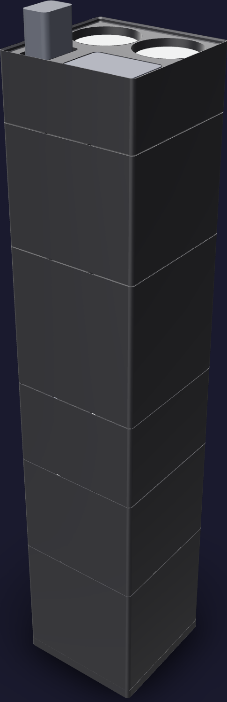
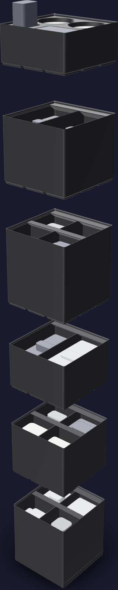
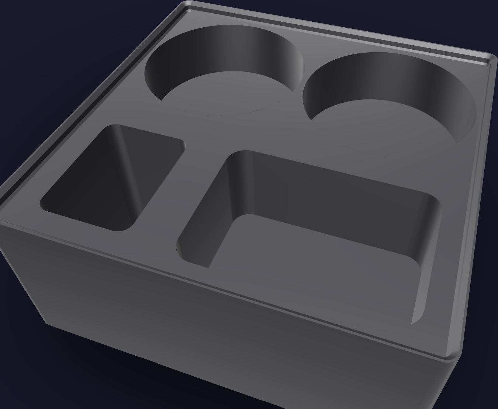

# Fittings job kit



A job stack, because plastic tube and fittings is a campaign job: the joint is made
wherever the piece it joins happens to be — `enclosure-back-top` on the bench, the cold
core on its cart, the chassis through the Y-seam mouth — so the storey that holds the
family in play travels to the work and the rest stays stacked.

Its footprint is [126 mm x 126 mm](FOOTPRINT): one 3 x 3 Gridfinity module. The printed
column reaches [618.5 mm](PRINTED_HEIGHT), and the Mudder cutter standing head-down in
the rack sets the populated height at [647.9 mm](POPULATED_HEIGHT). The column is tall
because the stock is large: [5.0 litres](STOCK_VOLUME) of loose fittings in
[16](COMPARTMENTS) compartments, over an inside of
[15,252 mm^2](FOOTPRINT_AREA). Forty union elbows laid flat side by side cover more than
a whole storey's inside.

The job lives in six storeys, bottom to top. Front is +Y, the operator's edge, and a
compartment named left is on -X:

1. **`fittings-npt`** — [126 mm](FITTINGS_NPT_H), four compartments. Every metal body
   that seals on a taper: the check valves, the reducing couplings and street elbows,
   the barb and flare connectors, and the WR1110 regulator with the SV-125 relief valve,
   one of each per build. Heaviest, so lowest.
2. **`fittings-bulkheads`** — [105 mm](FITTINGS_BULKHEADS_H), four compartments. Every
   through-wall crossing the machine has, in the three bodies that make them, plus the
   push-fit ball valves.
3. **`fittings-stock`** — [84 mm](FITTINGS_STOCK_H), two compartments. The two bulk
   packs that are neither junction nor adapter: the two-way dividers, and the hose
   clamps with the tube stiffeners.
4. **`fittings-adapters`** — [133 mm](FITTINGS_ADAPTERS_H), four compartments. Every
   push-fit-to-thread transition, sorted by which way the thread faces.
5. **`fittings-junctions`** — [105 mm](FITTINGS_JUNCTIONS_H), two compartments. The
   union tees and union elbows the flavor manifold's eight junctions and every turn come
   off. Most reached for, so highest.
6. **`fittings-rack`** — [56 mm](RACK_HEIGHT). The Mudder cutter head-down, two wells
   for the Millrose 70894 tape, and a work well for the fittings in play.



## Printed parts

| Output | Quantity | Print orientation | Envelope |
|---|---:|---|---:|
| `fittings-npt.step` | 1 | Gridfinity feet on the bed, compartments up | [125.5 x 125.5 x 129.8 mm](FITTINGS_NPT_ENV) |
| `fittings-bulkheads.step` | 1 | Gridfinity feet on the bed, compartments up | [125.5 x 125.5 x 108.8 mm](FITTINGS_BULKHEADS_ENV) |
| `fittings-stock.step` | 1 | Gridfinity feet on the bed, compartments up | [125.5 x 125.5 x 87.8 mm](FITTINGS_STOCK_ENV) |
| `fittings-adapters.step` | 1 | Gridfinity feet on the bed, compartments up | [125.5 x 125.5 x 136.8 mm](FITTINGS_ADAPTERS_ENV) |
| `fittings-junctions.step` | 1 | Gridfinity feet on the bed, compartments up | [125.5 x 125.5 x 108.8 mm](FITTINGS_JUNCTIONS_ENV) |
| `fittings-rack.step` | 1 | Gridfinity feet on the bed, sockets up | [125.5 x 125.5 x 59.8 mm](FITTINGS_RACK_ENV) |
| `fittings-dock.step` | 1 | Flat face on the bed, Gridfinity recesses up | [126.0 x 126.0 x 10.8 mm](FITTINGS_DOCK_ENV) |

Every part fits the H2C left-nozzle [325 x 320 x 320 mm](H2C_ENVELOPE) envelope;
`fittings-adapters` at [136.8 mm](TALLEST_PART) is the tallest single print. Any
Gridfinity baseplate docks the kit, so `fittings-dock.step` is only printed where the
bench does not already have one.

## Contents map

Compartments are listed front row first, left to right — +Y row before -Y row, -X before
+X. A compartment's **fill** is the pack count times the piece's public envelope, spread over
the compartment's floor; **stands** is how deep that fill is against the compartment's
own usable depth. No compartment is filled past [95 %](FILL_LIMIT) — that fraction is
what sets each storey's height.

### `fittings-npt` — compartments [61 mm x 61 mm x 106 mm](FITTINGS_NPT_CELL)

| Compartment | Holds | Fill | Stands |
|---|---|---:|---:|
| front left — check valves | GASHER 1/4" NPT check valve x [6](GASHER_N), ChillWaves split x [1](CHILLWAVES_SPLIT_N), ChillWaves siamese x [1](CHILLWAVES_SIAMESE_N) | [331 cm3](CHECK_VALVES_FILL) | [95 mm](CHECK_VALVES_DEPTH) |
| front right — reducing couplings and street elbows | GAGIRA 316L x [5](GAGIRA_N), LTWFITTING brass x [5](LTW_COUPLING_N), TAISHER 316L street elbow x [4](TAISHER_N) | [342 cm3](REDUCING_COUPLINGS_AND_STREET_ELBOWS_FILL) | [99 mm](REDUCING_COUPLINGS_AND_STREET_ELBOWS_DEPTH) |
| back left — barb and flare connectors | LTWFITTING 1/4" barb x [5](LTW_BARB_N), MAACFLOW 3/8" barb x [4](MAACFLOW_N), John Guest MI4508F4SLF x [10](MI4508F4SLF_N) | [275 cm3](BARB_AND_FLARE_CONNECTORS_FILL) | [79 mm](BARB_AND_FLARE_CONNECTORS_DEPTH) |
| back right — regulator and relief valve | Interstate Pneumatics WR1110 x [1](WR1110_N), Control Devices SV-125 x [1](SV125_N) | [135 cm3](REGULATOR_AND_RELIEF_VALVE_FILL) | [39 mm](REGULATOR_AND_RELIEF_VALVE_DEPTH) |

The WR1110 is [90.0 x 32.0 x 32.0 mm](WR1110_ENV) and stands on end; so do the two
ChillWaves bodies at [65.0 x 26.0 x 26.0 mm](CHILLWAVES_SPLIT_ENV). Nothing else on this
storey is longer than the compartment's diagonal.

### `fittings-bulkheads` — compartments [61 mm x 61 mm x 85 mm](FITTINGS_BULKHEADS_CELL)

| Compartment | Holds | Fill | Stands |
|---|---|---:|---:|
| front left — John Guest bulkhead unions | PP1208E black PP x [10](PP1208E_N), PI1208S acetal x [2](PI1208S_N) | [216 cm3](JOHN_GUEST_BULKHEAD_UNIONS_FILL) | [62 mm](JOHN_GUEST_BULKHEAD_UNIONS_DEPTH) |
| front right — neoFit acetal bulkheads | ABU44-E x [10](ABU44E_N) | [270 cm3](NEOFIT_ACETAL_BULKHEADS_FILL) | [78 mm](NEOFIT_ACETAL_BULKHEADS_DEPTH) |
| back left — PureSec elbow bulkheads | PureSec 90 degree elbow bulkhead x [5](PURESEC_N) | [202 cm3](PURESEC_ELBOW_BULKHEADS_FILL) | [58 mm](PURESEC_ELBOW_BULKHEADS_DEPTH) |
| back right — ball valves | NeoFit push-fit ball valve x [5](NEOFIT_BALL_N) | [170 cm3](BALL_VALVES_FILL) | [49 mm](BALL_VALVES_DEPTH) |

### `fittings-stock` — compartments [61 mm x 124 mm x 64 mm](FITTINGS_STOCK_CELL)

| Compartment | Holds | Fill | Stands |
|---|---|---:|---:|
| left — two-way dividers | John Guest PP2308E x [20](PP2308E_N) | [363 cm3](TWO_WAY_DIVIDERS_FILL) | [51 mm](TWO_WAY_DIVIDERS_DEPTH) |
| right — hose clamps and tube stiffeners | YDS 10-16 mm x [10](YDS_N), WC-316SS-06 SAE #6 x [10](WC316SS_N), Siptenk stiffener x [100](SIPTENK_N) | [425 cm3](HOSE_CLAMPS_AND_TUBE_STIFFENERS_FILL) | [59 mm](HOSE_CLAMPS_AND_TUBE_STIFFENERS_DEPTH) |

### `fittings-adapters` — compartments [61 mm x 61 mm x 113 mm](FITTINGS_ADAPTERS_CELL)

| Compartment | Holds | Fill | Stands |
|---|---|---:|---:|
| front left — male connectors | John Guest PI010822S x [10](PI010822S_N), PP010822E x [10](PP010822E_N), PP010821WP x [10](PP010821WP_N) | [331 cm3](MALE_CONNECTORS_FILL) | [95 mm](MALE_CONNECTORS_DEPTH) |
| front right — female adapters | John Guest PP450822E x [10](PP450822E_N) | [185 cm3](FEMALE_ADAPTERS_FILL) | [53 mm](FEMALE_ADAPTERS_DEPTH) |
| back left — flare adapters and reducer stems | John Guest PI4512F6S x [10](PI4512F6S_N), PP061208W x [10](PP061208W_N) | [284 cm3](FLARE_ADAPTERS_AND_REDUCER_STEMS_FILL) | [82 mm](FLARE_ADAPTERS_AND_REDUCER_STEMS_DEPTH) |
| back right — pneumatic push-fit | MALIDA 1/8" NPT set x [10](MALIDA_N), TAILONZ 1/8" NPT x [10](TAILONZ_N), DERPIPE 5/16" x [5](DERPIPE_N) | [369 cm3](PNEUMATIC_PUSH_FIT_FILL) | [106 mm](PNEUMATIC_PUSH_FIT_DEPTH) |

### `fittings-junctions` — compartments [61 mm x 124 mm x 85 mm](FITTINGS_JUNCTIONS_CELL)

| Compartment | Holds | Fill | Stands |
|---|---|---:|---:|
| left — union tees | John Guest PP0208E x [30](PP0208E_N) | [558 cm3](UNION_TEES_FILL) | [78 mm](UNION_TEES_DEPTH) |
| right — union elbows | John Guest PP0308E x [40](PP0308E_N) | [530 cm3](UNION_ELBOWS_FILL) | [74 mm](UNION_ELBOWS_DEPTH) |

### `fittings-rack`



| Socket | Takes | Size |
|---|---|---|
| the two round wells along the +Y edge | Millrose 70894 tape, one in use and one spare | [58 mm](TAPE_WELL) diameter |
| the wide well behind them, on +X | the fittings in play at the joint being made | [64 x 44 x 30 mm](PLAY_WELL) |
| the pocket beside that well, on -X | Mudder cutter, head-down | [29 x 39 mm](CUTTER_SOCKET) x [48 mm](CUTTER_SOCKET_DEPTH) deep |

The cutter's socket is [48 mm](CUTTER_SOCKET_DEPTH) deep and the cutter is
[24.0 x 34.0 x 80.0 mm](MUDDER_ENV), so a third of the tool stands proud to be picked up.
The tape wells hold the roll with its face up, the way tape is pulled off it. Every
socket opens upward and none reaches past the rack's plateau, so the rack prints on its
Gridfinity feet with no support and cuts nothing into the storey below.

## Geometry sources

The on-hand inventory is [`purchases.md`](../../../ledger/purchases.md) and
[`inventory.md`](../../../ledger/inventory.md); the bench card is
[`pl-tube-fittings.html`](../../../assembly/cards/tools/pl-tube-fittings.html) and the
procedure [`internal-plumbing.md`](../../../assembly/internal-plumbing.md).

The 42 x 42 x 7 mm modular interface, the base profile, the stacking lip and the 12 mm
label ledge follow the
[Gridfinity specification](https://github.com/gridfinity-unofficial/specification)
through the MIT-licensed
[`cq-gridfinity`](https://github.com/michaelgale/cq-gridfinity) CadQuery library.

### John Guest

Fresh Water Systems publishes the single-piece envelope of each John Guest fitting in
the first value of its specification table's shipping length, width and height.

| Piece | Envelope | Source |
|---|---:|---|
| PP0208E union tee | [39.1 x 16.3 x 29.2 mm](PP0208E_ENV) | [freshwatersystems.com](https://www.freshwatersystems.com/products/john-guest-union-tee-black-polypropylene-1-4) |
| PP0308E union elbow | [28.5 x 16.3 x 28.5 mm](PP0308E_ENV) | [freshwatersystems.com](https://www.freshwatersystems.com/products/john-guest-union-elbow-black-polypropylene-1-4) |
| PP2308E two-way divider | [35.7 x 16.3 x 31.2 mm](PP2308E_ENV) | [freshwatersystems.com](https://www.freshwatersystems.com/products/john-guest-two-way-divider-black-polypropylene-1-4) |
| PP1208E bulkhead union | [34.6 x 22.9 x 22.9 mm](PP1208E_ENV) | [freshwatersystems.com](https://www.freshwatersystems.com/products/john-guest-bulkhead-union-black-polypropylene-1-4) |
| PI1208S bulkhead union | [34.9 x 22.2 x 22.2 mm](PI1208S_ENV) | [freshwatersystems.com](https://www.freshwatersystems.com/products/john-guest-bulkhead-union-1-4-x-1-4) |
| PP010822E male connector | [24.3 x 18.9 x 18.9 mm](PP010822E_ENV) | [freshwatersystems.com](https://www.freshwatersystems.com/products/john-guest-male-connector-nptf-black-polypropylene-1-4-x-1-4-nptf) |
| PP450822E female adapter | [32.2 x 24.0 x 24.0 mm](PP450822E_ENV) | [freshwatersystems.com](https://www.freshwatersystems.com/products/john-guest-female-adapter-nptf-black-polypropylene-1-4-x-1-4-nptf) |
| PI4512F6S flare adapter | [38.1 x 22.2 x 22.2 mm](PI4512F6S_ENV) | [freshwatersystems.com](https://www.freshwatersystems.com/products/john-guest-female-adapter-flare-3-8-x-3-8-flare) |
| PP061208W reducer stem | [38.1 x 15.9 x 15.9 mm](PP061208W_ENV) | [freshwatersystems.com](https://www.freshwatersystems.com/products/john-guest-reducer-stem-polypro-3-8-od-stem-x-1-4) |
| PP010821WP 1/4" x 1/8" NPT male | [25.4 x 19.1 x 19.1 mm](PP010821WP_ENV) | [B07V6XKZG9](https://www.amazon.com/dp/B07V6XKZG9) item dimensions |
| PI010822S male connector | [38.0 x 20.0 x 20.0 mm](PI010822S_ENV) | generous envelope — Fresh Water Systems reports a 0.75 in cube, shorter than the collet body alone; the black-PP twin above is 24.3 mm long, so this is padded to the class |
| MI4508F4SLF brass flare connector | [45.0 x 18.0 x 18.0 mm](MI4508F4SLF_ENV) | generous envelope — the [listing's](https://www.freshwatersystems.com/products/john-guest-lead-free-brass-flare-female-connector-1-4-x-1-4-ffl) shipping figures resolve to 1.4 mm and are unusable |

### Other push-fit

| Piece | Envelope | Source |
|---|---:|---|
| NeoFit ball valve | [50.8 x 20.3 x 33.0 mm](NEOFIT_BALL_ENV) | [B0DDQC7S3B](https://www.amazon.com/dp/B0DDQC7S3B) item dimensions |
| neoFit ABU44-E bulkhead | [40.0 x 26.0 x 26.0 mm](ABU44E_ENV) | generous envelope — [nothing published](https://www.freshwatersystems.com/products/neofit-acetal-black-bulkhead-connector-1-4-tube); padded from the PI1208S, which the listing gives as its interchange |
| PureSec elbow bulkhead | [45.0 x 30.0 x 30.0 mm](PURESEC_ENV) | generous envelope — [B0968K4JRN](https://www.amazon.com/dp/B0968K4JRN) publishes only its 16 mm panel hole |
| TAILONZ 1/4" x 1/8" NPT | [34.0 x 16.0 x 16.0 mm](TAILONZ_ENV) | generous envelope — [B07P8784D2](https://www.amazon.com/dp/B07P8784D2) gives 22.1 mm, short for a PC-series body; the 14 mm hex is credible |
| MALIDA 1/8" NPT set | [35.0 x 32.0 x 18.0 mm](MALIDA_ENV) | generous envelope — [B09MY72KQ7](https://www.amazon.com/dp/B09MY72KQ7) states the pack is five elbows and five straights but no piece size; this covers the elbow |
| DERPIPE 5/16" x 1/4" NPT | [40.0 x 20.0 x 20.0 mm](DERPIPE_ENV) | generous envelope — [B09LXVGPG7](https://www.amazon.com/dp/B09LXVGPG7) publishes no piece dimension |

### NPT and barb metal

| Piece | Envelope | Source |
|---|---:|---|
| LTWFITTING 1/4" barb x 1/4" MNPT | [50.0 x 16.0 x 16.0 mm](LTW_BARB_ENV) | Dixon RN22, the same size and material: 1.83 in long, 9/16 in hex |
| MAACFLOW 1/4" MNPT x 3/8" barb | [50.0 x 18.0 x 18.0 mm](MAACFLOW_ENV) | Dixon RN32 and the single-piece [sibling listing](https://www.amazon.com/dp/B0BPJ8FJQC), 1.55 x 0.56 x 0.64 in |
| LTWFITTING brass reducing coupling | [32.0 x 24.0 x 24.0 mm](LTW_COUPLING_ENV) | equivalent 3/8" x 1/4" FNPT brass coupling: 1-5/32 in long, 7/8 in hex |
| GASHER 1/4" NPT check valve | [60.0 x 26.0 x 26.0 mm](GASHER_ENV) | generous envelope — [B0FV2D2FFX](https://www.amazon.com/dp/B0FV2D2FFX) states thread size only |
| ChillWaves check valves | [65.0 x 26.0 x 26.0 mm](CHILLWAVES_SPLIT_ENV) | generous envelope — [B0DPLBYZB4](https://www.amazon.com/dp/B0DPLBYZB4) and [B0DPL88RHC](https://www.amazon.com/dp/B0DPL88RHC) defer to a drawing that exists only as a listing image |
| TAISHER 316L street elbow | [40.0 x 40.0 x 22.0 mm](TAISHER_ENV) | generous envelope — [B0CZ38MYL1](https://www.amazon.com/dp/B0CZ38MYL1) publishes none; each leg of a 1/4" barstock street elbow projects about 30 mm from the corner |
| GAGIRA 316L reducing coupling | [35.0 x 25.0 x 25.0 mm](GAGIRA_ENV) | generous envelope — [B0G2XJGZMQ](https://www.amazon.com/dp/B0G2XJGZMQ) publishes none; scaled from the brass equivalent above |
| Control Devices SV-125 | [65.0 x 30.0 x 22.0 mm](SV125_ENV) | generous envelope — [B01G2F6EMY](https://www.amazon.com/dp/B01G2F6EMY) gives 2 x 0.5 x 0.5 in, narrower than the wrench flats Control Devices publishes for its own 1/4" NPT valves and ignoring the pull ring |
| Interstate Pneumatics WR1110 | [90.0 x 32.0 x 32.0 mm](WR1110_ENV) | generous envelope — the [maker's page](https://www.interstatepneumatics.com/interstate-pneumatics-wr1110-1-4-npt-in-line-90-psi-fixed-preset-pressure-regulator-outlet-pressure-with-max-inlet-230-psi) gives ports and pressures only; its 127 x 76 x 25 mm package is the outer bound |

### Clamps, stock and the two tools

| Piece | Envelope | Source |
|---|---:|---|
| Siptenk 1/4" tube stiffener | [15.0 x 7.0 x 7.0 mm](SIPTENK_ENV) | equivalent 1/4" tube-OD brass insert: 13 mm long, 4 mm OD on a 6 mm base |
| WC-316SS-06 SAE #6 clamp | [34.0 x 26.0 x 16.0 mm](WC316SS_ENV) | band width and 3/8"-7/8" range from [freshwatersystems.com](https://www.freshwatersystems.com/products/stainless-steel-hose-clamp-316-sae-6-3-8-7-8); housing height is a generous envelope |
| YDS 10-16 mm clamp | [42.0 x 25.0 x 20.0 mm](YDS_ENV) | 9 mm band and 10-16 mm range from [B07C33VLQ6](https://www.amazon.com/dp/B07C33VLQ6); wing height is a generous envelope |
| Mudder tubing cutter | [24.0 x 34.0 x 80.0 mm](MUDDER_ENV) | 80 x 24 mm from Mudder's own listing text on [B08VW15TK8](https://www.amazon.com/dp/B08VW15TK8) and the identical OEM tool sold as Litoexpe (`80 x 24 x 26 mm`); the 34 mm through the tool is the taller of two disagreeing readings, taken as the generous one. Amazon's 80 x 80 x 32 mm figure is the three-pack carton |
| Millrose 70894 tape roll | [53 mm diameter x 15 mm](MILLROSE_ENV) | computed, not published: 600 in of 1/2 in tape at the [0.0045 in thickness Mill-Rose publishes](https://cleanfit.com/downloads/product-literature/Blue_Monster_Lit_lr.pdf) winds to 50-56 mm outside diameter over any plausible core |

Clamp envelopes are for a clamp as shipped, closed into a loop. Both packs' listings
state the band, not the housing.

Every count above is the pack the shop holds, not the per-build draw. The union tee at
[30](PP0208E_N) and the union elbow at [40](PP0308E_N) are each one bag of ten past the
bags `purchases.md` records as acquired, so those two compartments have a bag of headroom
built in.

## Build and print

Generate the STEP parts, the two presentation assemblies and this file's figures from the
repository root:

```sh
tools/cad-venv/bin/python \
  hardware/printed-parts/shop-storage/fittings/fittings_kit.py
```

Every storey prints in Bambu PETG Basic black from the AMS 2 Pro on the H2C's right
hotend, like every kit in [`shop-storage/`](../README.md). Keep the exported
orientations and leave supports off: a bin's walls, dividers and label ledges are the
library's own printable profiles, and the rack's four cuts all open upward.

Print order does not matter — no storey keys to any other, and the library's stacking lip
is the only joint in the column. The kit stands on any 3 x 3 Gridfinity baseplate.

## CAD status

The generator asserts one solid per printed part, the H2C build envelope, all six seated
interfaces from the dock to the rack, that every rack socket opens inside the rack's
plateau, that each of the four rack contents clears the printed rack, that every figure
this file quotes is one the generator owns, and that
every compartment's fill block and its longest piece lie wholly inside that
compartment's own void with [1 mm](CONTENT_CLEARANCE) to every wall, divider and label
ledge. Each storey's height is derived from its deepest fill rather than chosen: the
storey grows a unit at a time until no compartment stands past [95 %](FILL_LIMIT) of its
usable depth, which is the top reference less the floor, the label ledge's
[12.2 mm](LEDGE_DROP) overhang and that clearance.

STL tessellations of all seven parts return one geometry-lint class and nothing else:
four `sliver` findings on each bin, the 1.2 mm land of the Gridfinity stacking lip on
that bin's four walls — the joint the whole family stacks on, drawn by the library from
the specification's own lip profile. The rack and the dock return none. Physical fit has
not yet been print-verified.

## Sources
[value](NAME) texts are updated by:
- `/hardware/printed-parts/shop-storage/fittings/fittings_kit.py`
