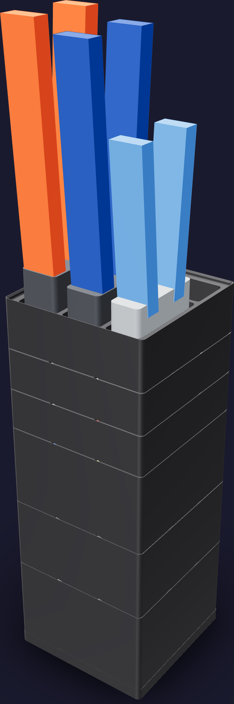
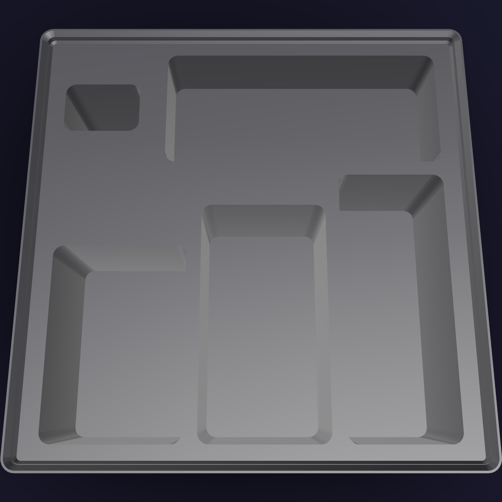

# Harness kit



A job stack, because a harness is built in campaigns: the storeys come off the column
onto the bench, every assembly in the schedule is cut, stripped, terminated, sleeved and
tested out of them, and they go back. Its footprint is
[126 mm x 126 mm](FOOTPRINT) — one 3 x 3 Gridfinity module. The printed column reaches
[327.8 mm](PRINTED_HEIGHT) to the rack's top reference; the Preciva crimper's handles
set the populated height at [534.2 mm](POPULATED_HEIGHT).

The job is [`cable-assemblies.md`](../../../assembly/cable-assemblies.md) and the bench is
[`cr-crimp-bench.html`](../../../assembly/cards/tools/cr-crimp-bench.html). Bottom to top the
storeys run from the stock a build touches twice to the stock it touches at every
conductor, and the rack closes the column.

1. **Lever nuts** ([11U](LEVERS_HEIGHT)) — three full-width compartments, one per WAGO 221
   size. The deepest storey, and the one a build reaches into least: ten lever nuts land
   per machine.
2. **Zip ties** ([9U](TIES_HEIGHT)) — three full-width compartments, one per length.
3. **Push-ons and rings** ([10U](TERMINALS_HEIGHT)) — six compartments by termination
   type. The Baomain single-gauge packs and the smseace rings keep their own
   compartments; the three mixed-size kits decant into the type beside them.
4. **Ferrules** ([5U](FERRULES_HEIGHT)) — six compartments by cross-section. The two the
   machine lands, 0.34 mm² on 22 AWG and 1.5 mm² on 16 AWG, take the front-left and
   front-middle compartments and 500 of the Preciva kit's 950 pieces.
5. **Heat-shrink** ([5U](SHRINK_HEIGHT)) — six compartments, the assortment decanted by
   diameter. A [44.5 mm](SHRINK_CUT) cut length lies along the compartment's long axis.
6. **The job rack** ([6U](RACK_HEIGHT)) — a lipped blank with four head-down tool sockets
   and one open parts well.

Every compartment's contents are modelled as the heap the pack makes: one piece's
envelope from public dimensions, times the pack count, over the
[0.62](HEAP_PACKING) of the space a poured heap of loose parts fills. A heap keeps
[1.5 mm](HEAP_CLEAR) to its compartment's walls and steps back under the label ledge,
which leans into the +Y end of every compartment.

## Printed parts

| Output | Quantity | Print orientation | Envelope |
|---|---:|---|---:|
| `harness-levers.step` | 1 | Gridfinity feet on the bed, compartments up | [125.5 x 125.5 x 80.8 mm](LEVERS_ENVELOPE) |
| `harness-ties.step` | 1 | Gridfinity feet on the bed, compartments up | [125.5 x 125.5 x 66.8 mm](TIES_ENVELOPE) |
| `harness-terminals.step` | 1 | Gridfinity feet on the bed, compartments up | [125.5 x 125.5 x 73.8 mm](TERMINALS_ENVELOPE) |
| `harness-ferrules.step` | 1 | Gridfinity feet on the bed, compartments up | [125.5 x 125.5 x 38.8 mm](FERRULES_ENVELOPE) |
| `harness-shrink.step` | 1 | Gridfinity feet on the bed, compartments up | [125.5 x 125.5 x 38.8 mm](SHRINK_ENVELOPE) |
| `harness-rack.step` | 1 | Gridfinity feet on the bed, sockets up | [125.5 x 125.5 x 45.8 mm](RACK_ENVELOPE) |
| `harness-dock.step` | 1 | Slab on the bed, baseplate recesses up | [126.0 x 126.0 x 10.8 mm](DOCK_ENVELOPE) |

Every part fits the H2C left-nozzle [325 x 320 x 320 mm](H2C_ENVELOPE) envelope;
`harness-levers` at [80.8 mm](TALLEST_PART) is the tallest single print. The rack is a
solid blank in CAD and prints at the slicer's infill.


## Contents map

Compartments are named from the operator's side: the front row is +Y, and rows read left
to right.

### `harness-levers` — [123.5 mm x 40.4 mm](LEVERS_CELL) per compartment

| Row | Contents | Count |
|---|---|---:|
| Front | WAGO 221-413, 3-conductor ([B07W7W91FX](https://www.amazon.com/dp/B07W7W91FX)) | 50 |
| Middle | WAGO 221-415, 5-conductor ([B0107SYYGU](https://www.amazon.com/dp/B0107SYYGU)) | 25 |
| Back | WAGO 221-420, 10-conductor ([B0H1MW1LCX](https://www.amazon.com/dp/B0H1MW1LCX)) | 15 |

### `harness-ties` — [123.5 mm x 40.4 mm](TIES_CELL) per compartment

| Row | Contents | Count |
|---|---|---:|
| Front | 4" zip tie, 18 lb, [2.5 mm](TIE_NARROW_WIDTH) strap ([B0BC1VH4XB](https://www.amazon.com/dp/B0BC1VH4XB)) | 200 |
| Middle | 6" zip tie, 18 lb, [2.5 mm](TIE_NARROW_WIDTH) strap ([B0DR8KSVQD](https://www.amazon.com/dp/B0DR8KSVQD)) | 100 |
| Back | 8" zip tie, 50 lb, [4.8 mm](TIE_WIDE_WIDTH) strap ([B08BKSHJ93](https://www.amazon.com/dp/B08BKSHJ93)) | 100 |

A 4" tie lies straight across the compartment. A [152.4 mm](TIE_6_LENGTH) 6" and a
[203.2 mm](TIE_8_LENGTH) 8" are longer than it, so they lie doubled back, which is how
their envelopes are modelled.

### `harness-terminals` — [40.4 mm x 61.1 mm](TERMINALS_CELL) per compartment

| Row | Left | Middle | Right |
|---|---|---|---|
| Front | 6.3 mm female, red — Baomain 100 ([B01G408A4M](https://www.amazon.com/dp/B01G408A4M)) | 4.8 mm female, red — Baomain 100 ([B01N5APVEE](https://www.amazon.com/dp/B01N5APVEE)) | #4 ring, red — smseace 150 ([B08B5VS8ZR](https://www.amazon.com/dp/B08B5VS8ZR)) |
| Back | 6.3 mm female, assorted — 123 | 4.8 mm female, assorted — 123 | 2.8 mm male — 214 |

The three assorted compartments are the decant of three mixed kits: the Feggizuli 280-pc
([B0B4H54KPS](https://www.amazon.com/dp/B0B4H54KPS)), the 60-pc female spade kit
([B0B9MZJ2ML](https://www.amazon.com/dp/B0B9MZJ2ML)) and the Twidec 20-pc
([B08F784R9W](https://www.amazon.com/dp/B08F784R9W)), plus the Baomain 0.11" male
100-pack ([B01MZZGAJP](https://www.amazon.com/dp/B01MZZGAJP)) in the 2.8 mm compartment.
The Feggizuli case is 168 mm across and the 60-pc kit's is 200 mm; neither enters the
footprint.

### `harness-ferrules` — [40.4 mm x 61.1 mm](FERRULES_CELL) per compartment

| Row | Left | Middle | Right |
|---|---|---|---|
| Front | 0.34 mm² — 22 AWG, turquoise collar, 250 | 1.5 mm² — 16 AWG, black collar, 250 | 0.5 mm² — white, 150 |
| Back | 0.75 mm² — grey, 100 | 1.0 mm² — red, 100 | 2.5 mm² — blue, 100 |

All 950 come from the Preciva kit ([B0DS622GKN](https://www.amazon.com/dp/B0DS622GKN)).
Its 4 mm² and larger ferrules stay in the kit's own case: the machine's largest conductor
is 16 AWG.

### `harness-shrink` — [40.4 mm x 61.1 mm](SHRINK_CELL) per compartment

| Row | Left | Middle | Right |
|---|---|---|---|
| Front | 2.4 mm, 250 | 3.2 mm, 110 | 4.8 mm, 60 |
| Back | 6.4 mm, 40 | 9.5 mm, 25 | 12.7 mm, 15 |

The assortment is one 2:1 kit ([B0FRNMXN6Q](https://www.amazon.com/dp/B0FRNMXN6Q))
decanted by diameter.

### `harness-rack`



| Position | Socket | Tool |
|---|---|---|
| Back left | head-down | Preciva ferrule crimper, AWG 28–5 ([B0DS622GKN](https://www.amazon.com/dp/B0DS622GKN)) |
| Back middle | head-down | haisstronica HS-9327 ratchet crimper, AWG 22–10 ([B08F3JKDD3](https://www.amazon.com/dp/B08F3JKDD3)) |
| Back right | head-down | Klein 11063W self-adjusting stripper ([B00CXKOEQ6](https://www.amazon.com/dp/B00CXKOEQ6)) — second home; the first is the [JST tower](../jst-crimping/README.md) |
| Front left | head-down | KATA micro flush cutter ([B0BBML9M2V](https://www.amazon.com/dp/B0BBML9M2V)) — second home |
| Front right | open well | active parts: the contacts, ferrules and lugs in play during one assembly |

Each socket is [2.5 mm](SOCKET_CLEAR) larger than its tool's envelope per side and
[34.0 mm](SOCKET_DEPTH) deep, with its floor [8 mm](SOCKET_FLOOR) above the storey
below.

## Geometry sources

The exact on-hand inventory is [`purchases.md`](../../../ledger/purchases.md) §9 and §14,
and the per-build allocation is [`bom.md`](../../../ledger/bom.md) §11.

- The 42 x 42 x 7 mm module, the base profile, the stacking lip and the 12 mm label ledge
  are the [Gridfinity specification](https://github.com/gridfinity-unofficial/specification),
  rendered by the MIT-licensed [`cq-gridfinity`](https://github.com/michaelgale/cq-gridfinity)
  through [`_kit.py`](../_kit.py).
- **WAGO 221 lever nuts** — [`hardware/reference/wago-221/`](../../../reference/wago-221/README.md)
  carries the datasheet geometry this kit imports: 221-413 [18.8 x 18.6 x 8.4 mm](WAGO_413),
  221-415 [30.0 x 18.6 x 8.4 mm](WAGO_415), 221-420 [29.8 x 18.3 x 15.8 mm](WAGO_420),
  width x depth x height. The reference solid is the connector body with its levers closed.
- **Bootlace ferrules** — collar outside diameter and total length per cross-section from
  the DIN 46228-4 table in the
  [American Electrical ferrule catalogue](https://assets.rs-online.com/image/upload/v1698723007/Datasheets/6d85482abd8b972aae6aadb8193739ef.pdf):
  0.34 mm² [collar 2.0 mm over 12.5 mm](FERRULE_22AWG) and 1.5 mm²
  [collar 3.4 mm over 14.5 mm](FERRULE_16AWG). The collar colours in the contents map
  are that standard's.
- **Zip ties** — the TANTTI and HS listings state the length and the strap width (0.1" on
  the 4" and 6", 0.19" on the 8"); neither states a strap thickness, so
  [1.0 mm and 1.1 mm](TIE_THICKNESS) are generous figures for those widths.
- **Crimp terminals** — the Baomain listings state an item length (20.1 mm on the 6.3 mm
  female, 19.05 mm on the 4.8 mm, 16.0 mm on the 0.11" male); no listing states an
  insulation barrel diameter, so each terminal is modelled as a generous sleeve cylinder
  and the head it lands on. The smseace ring is the RV1.25-3 part its listing names.
- **Heat-shrink** — the kit's piece count and per-size split are not published
  ([`bom.md`](../../../ledger/bom.md) §11 records the same), so the six compartments carry
  a generous 500-piece assortment over the diameters a 2:1 kit of this class supplies, at
  a [44.5 mm](SHRINK_CUT) cut length.
- **Preciva ferrule crimper** — the kit listing's [240 x 48 mm](PRECIVA_ENVELOPE) tool.
  Its head thickness and the head's share of the length are not published; both are
  generous.
- **haisstronica HS-9327** — [230.1 x 59.9 mm](HAISSTRONICA_ENVELOPE) on the listing;
  head thickness generous.
- **Klein 11063W** — [167.5 mm](KLEIN_LENGTH) on
  [Klein's datasheet](https://data.kleintools.com/sites/all/product_assets/documents/brochures/klein/kleintools_datasheet_11063w.pdf).
  Its head is the same loose public-photo envelope the [JST tower](../jst-crimping/README.md)
  cuts for.
- **KATA micro flush cutter** — [127 mm](KATA_LENGTH) from the listing's own name; head
  generous.

No caliper measurements are inputs. The tool witnesses are public-envelope fit
references, not cosmetic replicas.

### Not in this kit

- **Bulk wire.** The BNTECHGO 16 AWG five-colour kit
  ([B06Y557TCL](https://www.amazon.com/dp/B06Y557TCL)) ships as a
  [317 x 184 x 77 mm](WIRE_KIT_PACKAGE) package, past the footprint in two axes, and
  neither it nor the 18 AWG red/black pair
  ([B07HGTKQ89](https://www.amazon.com/dp/B07HGTKQ89)) publishes a spool diameter. Bulk
  wire stays on the bench; the 22 AWG black spool has its own cradle in the
  [JST tower](../jst-crimping/README.md).
- **Braided sleeve.** Reels, out of scope for the footprint.
- **The iCrimp SN-2549 and the XH housings.** They live in the
  [JST tower](../jst-crimping/README.md), which is the board-end half of the same job.

## Build and print

Generate the STEP parts, the two presentation assemblies and this README's figures from
the repository root:

```sh
tools/cad-venv/bin/python hardware/printed-parts/shop-storage/harness/harness_kit.py
```

The kit prints in Bambu PETG Basic black from the AMS 2 Pro on the H2C's right hotend,
like every kit in [`shop-storage/`](../README.md). Keep the exported orientations and
leave supports off: every storey is a stock cq-gridfinity body printed base down, and the
rack's sockets open upward. The label ledges take 12 mm tape; the contents map above is
what goes on it.

## CAD status

The generator asserts one solid per printed part, the H2C build envelope, all six seated
interfaces of the column, that every heap and its witness piece lies inside its own
compartment void, that every tool envelope clears the rack, and that every socket and the
parts well stay inside the rack's plateau. STL tessellations of all seven parts lint
clean of `ceiling`, `step` and `slope` findings. The `sliver` findings on the five bin
storeys are the library's own [1.2 mm](DIVIDER_WALL) divider and wall crowns at the top
reference — the seat the storey above stands on — plus degenerate facets in the
tessellated lip profile.
The rack and the dock return no findings. Physical fit has not yet been print-verified.

## Sources
[value](NAME) texts are updated by:
- `/hardware/printed-parts/shop-storage/harness/harness_kit.py`
