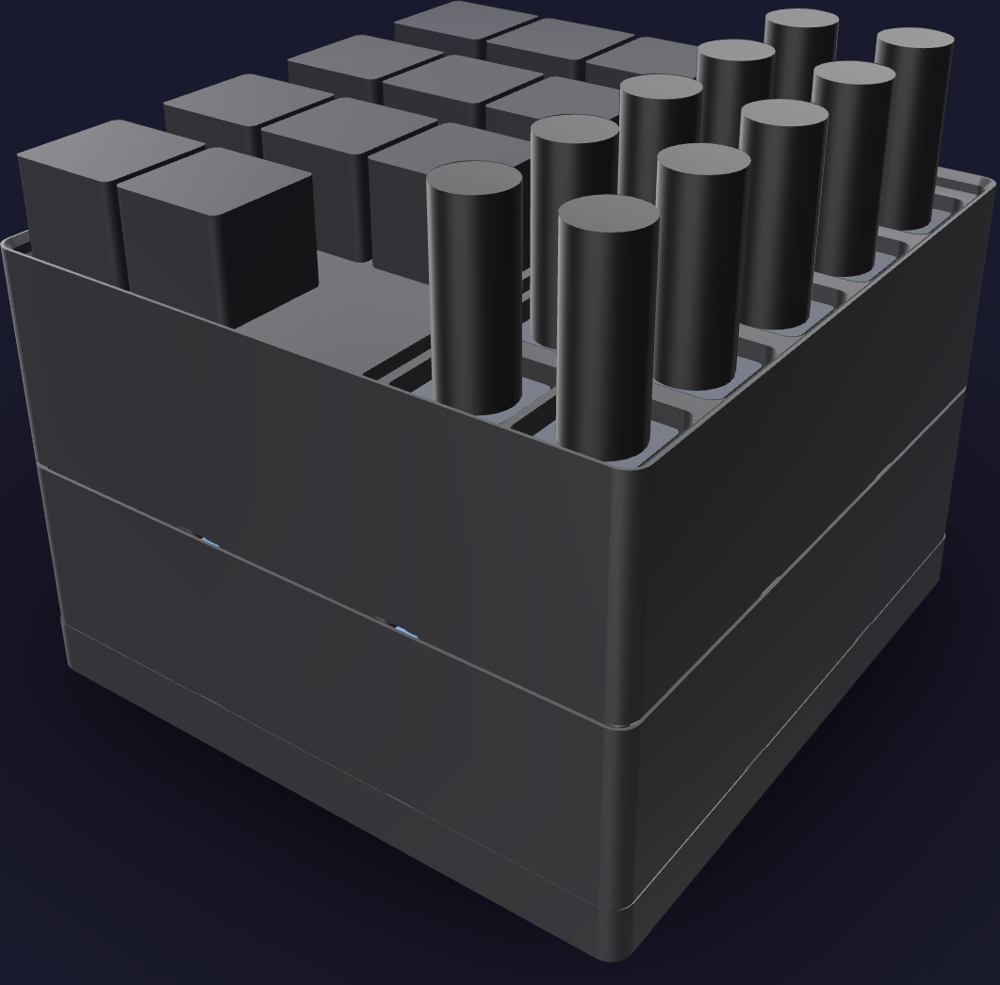
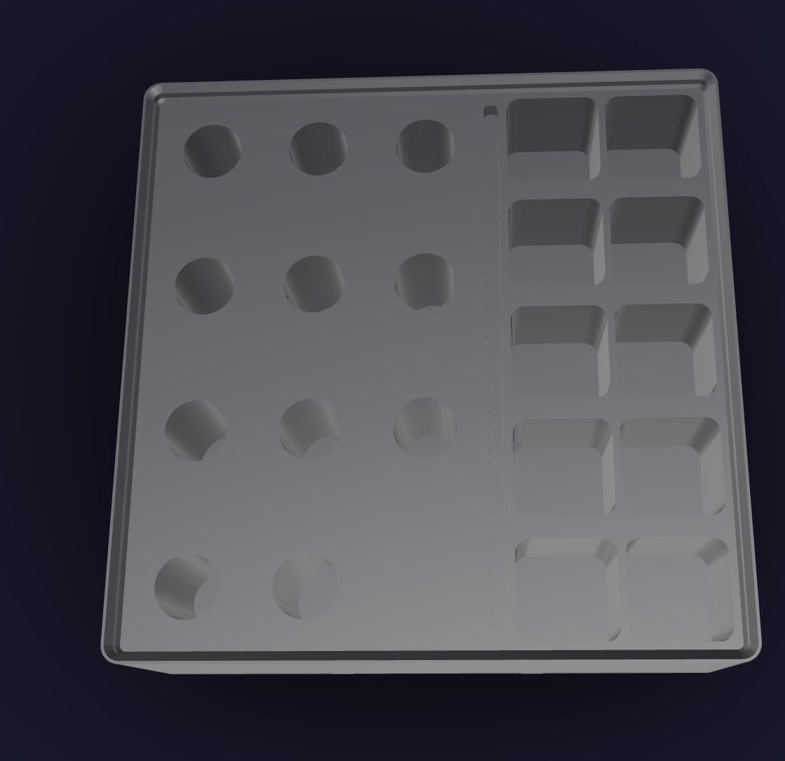
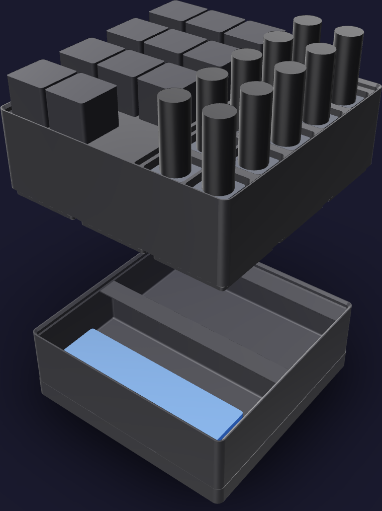

# Hotend job kit



A job stack, because the hotend swap happens at the printers and not at a bench: the
rack lifts off its bin and rides to the machine in one hand, and the kit is one column
the rest of the time. The footprint is [126 mm x 126 mm](FOOTPRINT), one 3 x 3
Gridfinity module. The printed stack reaches [86.6 mm](PRINTED_HEIGHT); the induction
hotends standing nozzle-up set the populated height at [114.0 mm](POPULATED_HEIGHT).

The kit is two storeys:

1. **`hotends-swap`** — an open bin divided front to back. Behind the divider the
   silicone socks the DUROZZLE units ship with; in front of it the swap well, where a
   hotend pulled off a printer lies while its replacement goes in.
2. **`hotends-rack`** — the index, [21](SOCKET_COUNT) sockets on one plateau, split
   into the only two families that matter. The operator's left is standard, the
   H2D hotend the H2C's lifting nozzle takes; the operator's right is induction, the
   quick-swap hotend that fits an H2C's right nozzle and nothing else. A part for one
   is never a part for the other
   ([tools.md](../../../ledger/tools.md#which-hotends-fit-an-h2c)).



The two zones hold their hotends differently, so the split reads at arm's length and a
hotend put in the wrong zone does not sit. A standard hotend's finned heatsink is more
than twice the width of the shank under it, so it **hangs**: the shank drops into a
[13 mm x 32.1 mm](STANDARD_BORE) bore and the heatsink lands on the plateau. An
induction hotend has no such shoulder — its coil bracket is barely wider than the
nozzle boss below it — so it **stands** head-down in a
[20 x 20 x 25 mm](INDUCTION_POCKET) pocket with its barrel and nozzle
[31.2 mm](INDUCTION_STANDS_PROUD) in the air. Round bores on the left, square pockets
on the right, and a [3 mm x 4 mm](SPLIT_GROOVE) groove down the line between them.

Within each zone the sockets run smallest nozzle at the front to largest at the back.
Nozzle size is the label tape's job, not the plastic's.

## Printed parts

| Output | Quantity | Print orientation | Envelope |
|---|---:|---|---:|
| `hotends-dock.step` | 1 | Slab on the bed, baseplate recesses up | [126.0 x 126.0 x 10.8 mm](DOCK_ENVELOPE) |
| `hotends-swap.step` | 1 | Gridfinity feet on the bed, compartments up | [125.5 x 125.5 x 38.8 mm](SWAP_ENVELOPE) |
| `hotends-rack.step` | 1 | Gridfinity feet on the bed, sockets up | [125.5 x 125.5 x 45.8 mm](RACK_ENVELOPE) |

The rack is the tallest single print at [45.8 mm](TALLEST_PART), and every part is
inside the H2C left-nozzle [325 x 320 x 320 mm](H2C_ENVELOPE) envelope. Nothing on
either storey overhangs: every socket is a vertical cut opening upward, and the
Gridfinity base and lip come from the library's printable profiles.

## Contents map

The rack's plateau is [120.3 mm x 120.3 mm](RACK_PLATEAU). Every socket is
[2.0 mm](SOCKET_CLEARANCE) wider than the envelope it holds, on every side.

**Left zone — standard, [11](STANDARD_COUNT) sockets**, three to a row, front row
first. The back row is short by one: eleven hotends in twelve places.

| Row | Left | Middle | Right |
|---|---|---|---|
| Front | 0.4 TC (Bambu) | 0.4 HS (Bambu) | 0.4 HS (Bambu) |
| | 0.4 HF (ENOMAKER) | 0.6 TC SF (Bambu) | 0.6 TC (DUROZZLE) |
| | 0.6 PCD (DUROZZLE) | 0.8 PCD (DUROZZLE) | 0.8 PCD (DUROZZLE) |
| Back | 0.8 HF (ENOMAKER) | 0.8 TC HF (Bambu) | — |

**Right zone — induction, [10](INDUCTION_COUNT) sockets**, two to a row, front row
first. All ten are the Bambu H2C Induction Hotend (Right), store SKU FAH050 — the
3DPP431 family [`tools.md`](../../../ledger/tools.md) names.

| Row | Left | Right |
|---|---|---|
| Front | 0.2 SS | 0.2 SS |
| | 0.2 SS | 0.4 HS |
| | 0.4 HS | 0.4 HS |
| | 0.4 HS | 0.6 HS |
| Back | 0.8 HS | 0.8 HF HS |

Four of the twenty-one are installed in the two H2Cs at any moment, so four sockets
stand empty during a job. The rack is cut for all twenty-one.

**Swap storey**, two compartments, each [123.5 x 61.1 x 28.0 mm](SWAP_CELL):

| Compartment | Holds |
|---|---|
| Back | [8](SOCK_COUNT) DUROZZLE silicone socks, two with each of the four L-side hotends |
| Front — the swap well | up to [4](IN_PLAY_COUNT) hotends lying down, what a swap of both printers pulls |

Both compartments carry the library's label ledge on their +Y end, which is what the
storey above seats on.

## Geometry sources

The on-hand hotends are [`tools.md`](../../../ledger/tools.md) "Hotend stock", bought
on the orders in [`purchases.md`](../../../ledger/purchases.md) §13 and §15. The
matching station card is
[`pr-printers.html`](../../../assembly/cards/tools/pr-printers.html). No tool in this
kit has a home in another kit.

- The 42 x 42 x 7 mm module, the base profile, the stacking lip and the label ledge
  follow the
  [Gridfinity specification](https://github.com/gridfinity-unofficial/specification)
  through the MIT-licensed
  [`cq-gridfinity`](https://github.com/michaelgale/cq-gridfinity) CadQuery library.
- **Standard hotend, [49.2 mm](STANDARD_LENGTH) long.** Bambu's
  [Bambu Hotend — H2/P2S](https://us.store.bambulab.com/products/bambu-hotend-h2-p2s)
  page publishes `Length 49.2 mm` and `Packaging Size 60*60*30 mm`, and nothing else.
  The DUROZZLE and ENOMAKER hotends are sold against the same H2D/H2S/A1 fit
  ([B0GWDL57FK](https://www.amazon.com/dp/B0GWDL57FK),
  [B0GWDDKG47](https://www.amazon.com/dp/B0GWDDKG47),
  [B0GWDBQW4G](https://www.amazon.com/dp/B0GWDBQW4G),
  [B0FQPGLRQJ](https://www.amazon.com/dp/B0FQPGLRQJ),
  [B0FQPGDD49](https://www.amazon.com/dp/B0FQPGDD49)) and are held by the same socket.
- **Induction hotend, [56.2 mm](INDUCTION_LENGTH) long.** Bambu's
  [H2C Induction Hotend (Right)](https://us.store.bambulab.com/products/h2c-induction-hotend-right)
  page publishes `Length 56.2 mm`, `Packaging Size 60*60*30 mm` and `SKU FAH050`.
- **Both cross-sections are generous envelopes.** No maker publishes a hotend's width
  or the height of its head, so both are read off Bambu's own product photograph
  scaled by the published length and rounded up: the standard hotend as
  [22 x 22 x 49.2 mm](STANDARD_ENVELOPE) with a [19.1 mm](STANDARD_HEAD) heatsink over
  a 9 mm shank, the induction hotend as [16 x 16 x 56.2 mm](INDUCTION_ENVELOPE) with a
  [23.0 mm](INDUCTION_HEAD) knob-and-bracket head over a 13 mm barrel. The photographs
  are Bambu's, at
  [hotend-1.png](https://store.bblcdn.com/s7/default/e7253f40ef9140d4b4956cc15f5839b5/hotend-1.png)
  and
  [FAH050.png](https://store.bblcdn.com/s7/default/a9699c86decd442fa88b3113653e121f/FAH050.png).
- **Which zone a hotend belongs to** is
  [`tools.md`](../../../ledger/tools.md#which-hotends-fit-an-h2c): the left nozzle is
  mechanically the H2D's, so anything sold for the H2D / H2S / A1 line drops in; the
  right is induction, quick-swap, and exists on no other machine.
- **Silicone socks.** The ledger records two socks with each 0.8 mm PCD unit
  ([B0GWDL57FK](https://www.amazon.com/dp/B0GWDL57FK)), and the 0.6 mm tungsten
  carbide listing ([B0GWDDKG47](https://www.amazon.com/dp/B0GWDDKG47)) states
  `Silicone Cover Sock * 2` in the box: eight socks across the four DUROZZLE units. No
  dimension of a sock is public, so one is a generous
  [26 x 16 x 16 mm](SOCK_ENVELOPE) envelope and the compartment's fill is the eight of
  them in one layer.

No caliper measurements are inputs to this model. The hotend witnesses are
public-envelope fit references, not replicas.

## Build and print

Generate the STEP parts and rerun every fit check from the repository root:

```sh
tools/cad-venv/bin/python \
  hardware/printed-parts/shop-storage/hotends/hotends_kit.py
```

Every storey prints in Bambu PETG Basic black from the AMS 2 Pro on the H2C's right
hotend, like the rest of [`shop-storage/`](../README.md) — on one of the induction
hotends this kit indexes. Keep the exported orientations, print base down, and leave
supports off.



## CAD status

The generator asserts one solid per printed part, the H2C build envelope, both seated
interfaces of the column, all twenty-one hotend envelopes clear of the rack, the
nozzle clearance over each bore floor, the induction head sitting under the plateau,
the wall left over the Gridfinity base under every socket, the plastic either side of
the split groove, socket-to-socket gaps in both zones, both zones inside the plateau,
the two bin compartments containing the socks and the four hotends a swap pulls, and
both of those standing clear of the label ledge that roofs their +Y end.

STL tessellations of the dock and the rack — the part every socket is cut into —
return no geometry-lint findings. The swap storey returns nine, all of them in stock
`cq-gridfinity` geometry that this kit does not touch: three 1.2 mm strips along the
top of the stacking lip, and six degenerate facets where the divider wall meets the
outer wall — the pinholes the closed picture shows on the bin's side. Physical fit has
not yet been print-verified.

## Sources
[value](NAME) texts are updated by:
- `/hardware/printed-parts/shop-storage/hotends/hotends_kit.py`
