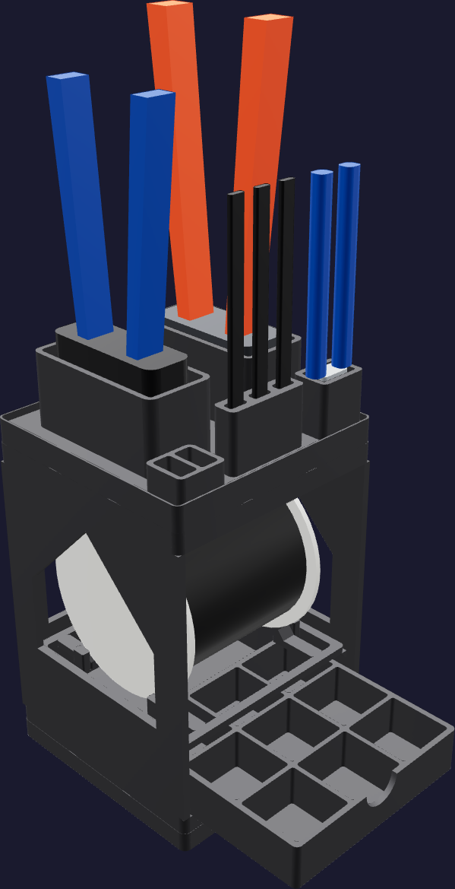
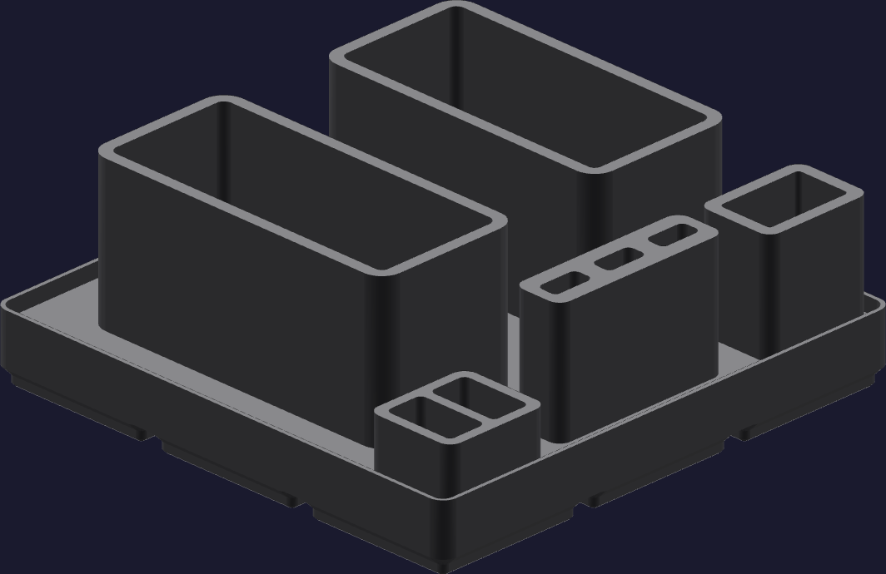
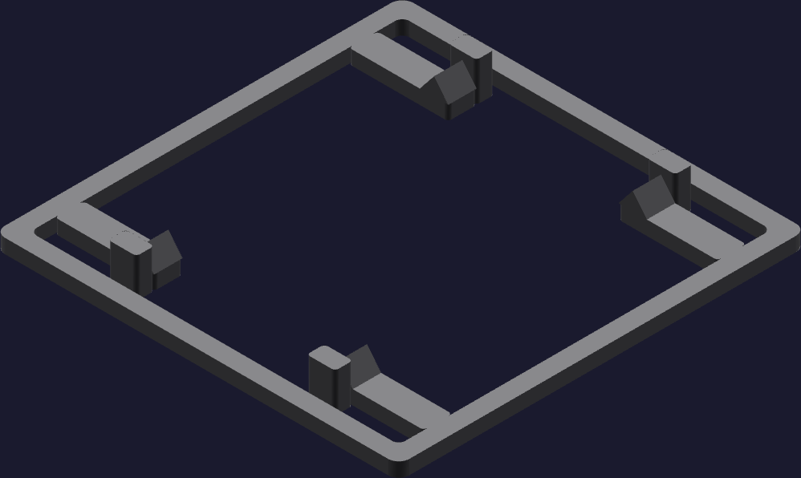

# JST crimping job tower



This is a narrow, vertical workstation for the JST XH crimping job. Its closed
footprint is [126 mm x 126 mm](FOOTPRINT): one 3 x 3 Gridfinity module. The
printed tower reaches [221.5 mm](PRINTED_TOWER_HEIGHT); the SN-2549 handles set
the populated height at [367.0 mm](POPULATED_HEIGHT).

The job lives in three storeys:

1. A nine-cell drawer holds the contacts, pre-crimp leads, and 3/4/5/6/7/9/10P
   XH housings.
2. The BNTECHGO 22 AWG spool stands with its flanges vertical and its axis
   left-to-right, so a forward wire pull turns it. Four 45-degree rests carry
   the outer rim, so spool-hub geometry is irrelevant. Axial guides leave 2 mm
   over the public spool width.
3. A removable Gridfinity shelf carries the job rack. The SN-2549 and Klein
   11063W stand head-down in loose sockets; the front row holds one KATA micro
   flush cutter, all three iFixit tweezers, and separate active-part and reject
   wells.

The large gabled openings in the carcass have 45-degree roofs. They expose the
spool, reduce PET-GF, and print upright without support.

## Printed parts

| Output | Quantity | Print orientation | Envelope |
|---|---:|---|---:|
| `tower-base.step` | 1 | Gridfinity feet on the bed; front opening toward the operator | 125.5 x 125.5 x [161.2 mm](TALLEST_PART) |
| `consumables-drawer.step` | 1 | Cells up | 115 x 114 x 24 mm |
| `spool-shelf.step` | 1 | Flat frame on the bed | 115 x 114 x 11 mm |
| `gridfinity-shelf.step` | 1 | Flat face on the bed; Gridfinity recesses up | 126 x 126 x 10.8 mm |
| `tool-rack.step` | 1 | Gridfinity feet on the bed; sockets up | 125.5 x 125.5 x 52 mm |

Print a second `gridfinity-shelf.step` as the bench dock when the installation
does not already have a 3 x 3 Gridfinity baseplate. Its four underside sockets
are inert in that use. Every part fits the H2C left-nozzle
[325 x 320 x 320 mm](H2C_ENVELOPE) envelope; the tower-base is the tallest
single print.



From the operator-facing edge, the rack reads left to right as flush cutter,
three tweezers, and the two small work wells. The two large rear sockets are the
iCrimp SN-2549 and Klein 11063W. The wells are intentionally unlabeled in the
plastic: left is active parts and right is rejects.



The shelf accepts the listing envelope
[diameter 99.1 mm x 88.9 mm](SPOOL_ENVELOPE). The open center lets the rim sit
below the shelf deck while the four gabled pads touch it at y = +/-28 mm. The
spool has [9.3 mm](SPOOL_DRAWER_CLEAR) clearance over the closed drawer and
[11.6 mm](SPOOL_TOP_CLEAR) below the removable top shelf.

## Consumables map

Each drawer cell is [34.7 mm x 34.4 mm](DRAWER_CELL). Viewed from the open front:

| Rear row | 7P | 9P | 10P |
|---|---:|---:|---:|
| Middle row | 4P | 5P | 6P |
| Front row | contacts | pre-crimp leads | 3P |

The active-part and reject wells on the rack keep loose contacts out of the
stock drawer during a job.

## Geometry sources

The exact on-hand inventory is recorded in
[`purchases.md`](../../../ledger/purchases.md): iCrimp SN-2549 B01N4L8QMW,
Klein 11063W B00CXKOEQ6, iFixit B079K874CQ, KATA B0BBML9M2V, BNTECHGO
B06Y2PNW41, and the CQRobot XH kits. The matching bench card is
[`cr-crimp-bench.html`](../../../assembly/cards/tools/cr-crimp-bench.html).

- The 42 x 42 x 7 mm modular interface follows the
  [Gridfinity specification](https://github.com/gridfinity-unofficial/specification)
  through the MIT-licensed
  [`cq-gridfinity`](https://github.com/michaelgale/cq-gridfinity) CadQuery
  library.
- The [IWISS SN-2549 product page](https://www.iwiss.com/ko/products/sn-2549-ratchet-crimping-tools-for-0-08-1-0-mm-awg28-18)
  supplies its 190 mm length; its published 190 x 65 x 27.9 mm product envelope
  sets the larger socket.
- The [Klein 11063W specification](https://www.kleintools.com/catalog/combination-cutting-tools/katapult-wire-stripper-and-cutter-solid-and-stranded-wire)
  supplies the 167 mm overall length. Its socket is a loose rectangular head
  receiver rather than a fitted contour.
- The [iFixit set specification](https://www.ifixit.com/products/precision-tweezers-set)
  supplies the 127 mm tweezer length.
- The BNTECHGO purchase listing supplies the spool's 3.9 x 3.9 x 3.5 inch
  envelope. The cradle never reads its bore.

No caliper measurements are inputs to this model. The tool witnesses are
public-envelope fit references, not cosmetic replicas.

## Build and print

Generate the STEP parts and rerun all fit checks from the repository root:

```sh
tools/cad-venv/bin/python \
  hardware/printed-parts/shop-storage/jst-crimping/jst_crimping_tower.py
```

Use Polymaker Fiberon PET-GF15 with the project's calibrated H2C PET-GF profile
and an abrasion-rated left hotend. Keep the exported orientations and leave
supports off. The carcass windows and spool rests are limited to 45-degree
overhangs; the Gridfinity features come from the library's printable profiles.

Assembly order is drawer, spool shelf, spool, removable top shelf, then tool
rack. The top shelf lifts off with the rack to change the spool. The tool rack
and tower both dock at the Gridfinity fit supplied by the same library; the
generator asserts zero overlap and zero gap at those seated interfaces.

## CAD status

The generator asserts one solid per printed part, the H2C build envelope, all
five seated interfaces, the public tool-envelope clearances, the full spool
envelope, the drawer's pull path, and the drawer/spool/top-shelf vertical
clearances. STL tessellations of all five parts return no open geometry-lint
findings. Physical fit has not yet been print-verified.

## Sources
[value](NAME) texts are updated by:
- `/hardware/printed-parts/shop-storage/jst-crimping/jst_crimping_tower.py`
