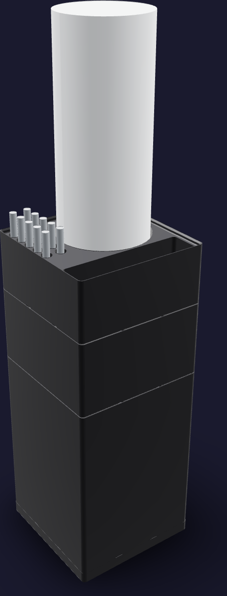
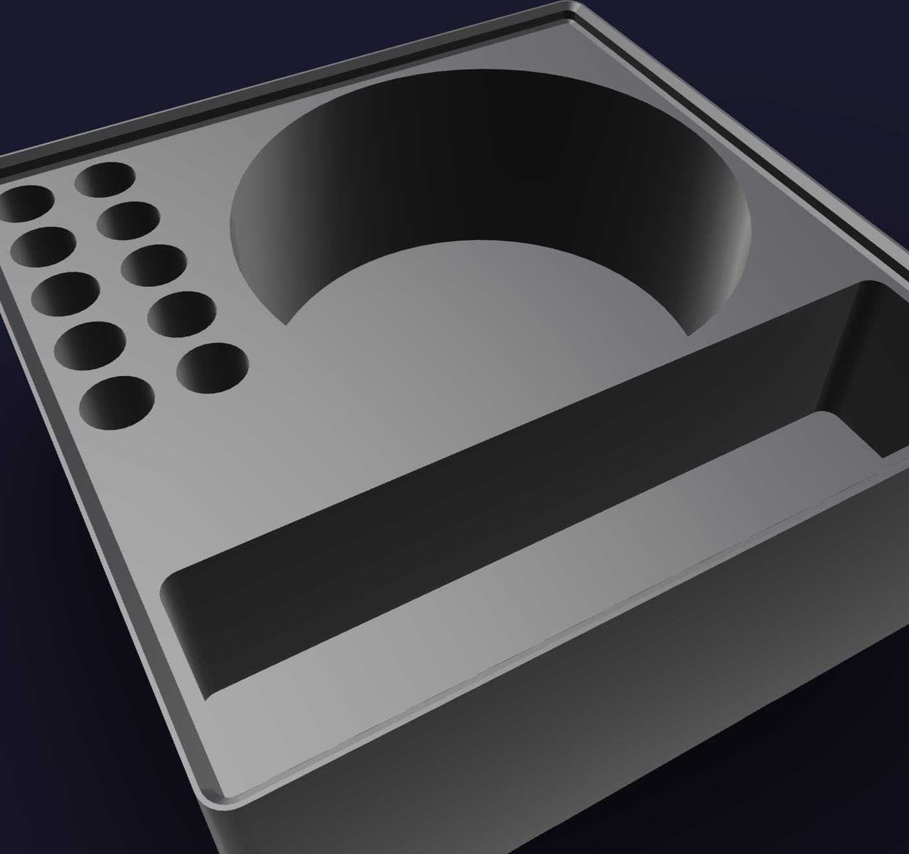
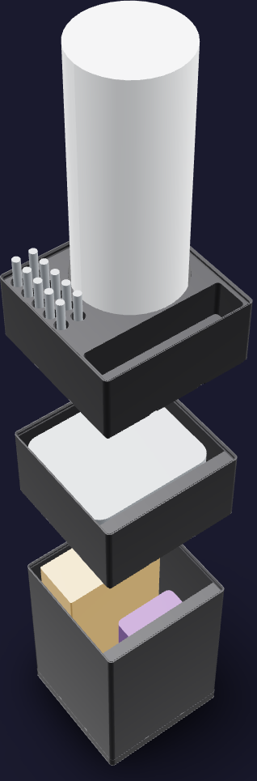

# Pour job kit



A job stack, because the pour runs in campaigns — mix, pour, wait out a cure,
demold — and the storeys come off onto the pour bench and go back. Its footprint
is [126 mm x 126 mm](FOOTPRINT): one 3 x 3 Gridfinity module. The printed stack
reaches [310.6 mm](PRINTED_HEIGHT); the cup column standing in the rack sets the
populated height at [491.8 mm](POPULATED_HEIGHT).

The job lives in three storeys:

1. **`pour-mix`**, [175 mm](MIX_HEIGHT) — the stirring stock. A hundred 6"
   tongue depressors stand on end as one bundle across the bin's -Y half; the
   black silicone pigment stands in the +Y half, at -X.
2. **`pour-gauge`**, [70 mm](GAUGE_HEIGHT) — the oven thermometer, lying flat
   with its dial up. It reads the post-cure cavity rather than the oven's dial.
3. **`pour-rack`**, [56 mm](RACK_HEIGHT) — the job rack. The 50-cup nested
   column of 5 oz mixing cups stands in a round well and is pulled off the top
   one cup at a time; the ten ground mould rods stand in an index down the +X
   edge; an open well across the +Y edge takes the parts in play.



Seen from the operator's side, the rack is the cup well in the far corner, the
two-column rod index down the +X edge, and the active-parts well across the +Y
edge the operator stands at.

## Printed parts

| Output | Quantity | Print orientation | Envelope |
|---|---:|---|---:|
| `pour-mix.step` | 1 | Gridfinity feet on the bed; open cell up | [125.5 x 125.5 x 178.8 mm](MIX_ENVELOPE) |
| `pour-gauge.step` | 1 | Gridfinity feet on the bed; open cell up | [125.5 x 125.5 x 73.8 mm](GAUGE_ENVELOPE) |
| `pour-rack.step` | 1 | Gridfinity feet on the bed; wells up | [125.5 x 125.5 x 59.8 mm](RACK_ENVELOPE) |
| `pour-dock.step` | 1 | Baseplate recesses up | [126.0 x 126.0 x 10.8 mm](DOCK_ENVELOPE) |

Every part fits the H2C's [325 x 320 x 320 mm](H2C_ENVELOPE) envelope;
`pour-mix` is the tallest single print. Any 3 x 3 Gridfinity baseplate docks the
kit, so `pour-dock.step` is only printed where the bench has none.

## Contents map

A bin cavity is [123.5 mm x 123.5 mm](BIN_CAVITY) over its floor; the rack's
plateau, inside the lip, is [120.3 mm x 120.3 mm](PLATEAU). Every stored thing
keeps at least [1 mm](CONTENT_WALL_CLEARANCE) to a wall and
[2 mm](CONTENT_GAP) to its neighbour, and every rack well is
[2.0 mm](SOCKET_CLEARANCE) larger than its content on each side.

| Storey | Compartment | Holds | Envelope |
|---|---|---|---|
| `pour-mix` | -Y half | JMU 6" tongue depressors, [100](DEPRESSOR_COUNT), standing [5 x 20](DEPRESSOR_GRID) | [99.8 x 48.0 x 160.4 mm](DEPRESSOR_BUNDLE) |
| `pour-mix` | +Y half, -X | BBDINO black silicone pigment, 150 g | [63.5 x 63.5 x 88.9 mm](PIGMENT_ENVELOPE) |
| `pour-gauge` | the cell | Rubbermaid Commercial oven thermometer, 60–580 °F | [115.6 x 100.0 x 50.8 mm](THERMOMETER_ENVELOPE) |
| `pour-rack` | cup well, [diameter 86.0 mm x 42 mm](CUP_WELL) | Pouring Masters 5 oz mixing cups, [50](CUP_COUNT), nested | [diameter 82.0 mm x 227.1 mm](CUP_COLUMN) |
| `pour-rack` | rod index, ten x [diameter 10.35 mm x 30 mm](ROD_HOLE) | POWERTEC 71476 ground dowel pins, [10](DOWEL_COUNT) | [diameter 6.35 mm x 50.8 mm](DOWEL_ENVELOPE) |
| `pour-rack` | active-parts well | the wetted stick and the rod in play | [116.3 x 28.3 x 30 mm](PARTS_WELL) |

The cup column stands [185.1 mm](CUP_PROUD) proud of the rack and the rods
[20.8 mm](DOWEL_PROUD), so both are pulled without opening a storey.

Six of the pour bench's items are wider than the footprint, and the generator
asserts each of them over it rather than leaving the omission to prose. They
stay at the bench:

| Stays at the bench | Public envelope | Over the footprint by |
|---|---|---|
| TCP Global 32 oz mixing cups, 25 ([B08HNCGY4N](https://www.amazon.com/dp/B08HNCGY4N)) | box of 25, [344.9 x 142.0 x 134.1 mm](BATCH_CUP_PACK) | the cup is [134.1 mm](BATCH_CUP_DIAMETER) across a [121.5 mm](CAVITY_SPAN) cavity, and the nested column is [344.9 mm](BATCH_CUP_COLUMN) |
| BBDINO 40A silicone kit, two bottles ([B0FHHBGSQK](https://www.amazon.com/dp/B0FHHBGSQK)) | [209.5 x 110.0 x 140.0 mm](SILICONE_KIT_PACK) | the pair is [209.5 mm](SILICONE_KIT_WIDTH) across |
| 2 lb PU foam quart kit, two cans ([B08R7TX8QJ](https://www.amazon.com/dp/B08R7TX8QJ)) | one pint each, [diameter 87.3 mm x 98.4 mm](FOAM_CAN) | the pair is [40.9 mm](FOAM_PAIR_OVER) over the cavity diagonal |
| Mann Ease Release 200 ([B002YEBO1O](https://www.amazon.com/dp/B002YEBO1O)) | [diameter 69.8 mm x 215.9 mm](RELEASE_CAN) | with the Krylon, [6.5 mm](AEROSOL_PAIR_OVER) over the cavity diagonal |
| Krylon K01303 ([B00023JE7K](https://www.amazon.com/dp/B00023JE7K)) | [diameter 76.2 mm x 203.2 mm](CLEAR_CAN) | the same pair |
| Smart Weigh Pro pocket scale ([B00IZ1YHZK](https://www.amazon.com/dp/B00IZ1YHZK)) | [127.0 x 101.6 x 15.2 mm](SCALE_ENVELOPE) | [127.0 mm](SCALE_LENGTH) long; its home is the refrigerant bench |

Nitrile gloves stay in their box. The 5-gal vacuum chamber, the convection oven
and the Orion pump stay on the bench.

## Geometry sources

The on-hand inventory is [`purchases.md`](../../../ledger/purchases.md) §21 and
§6; the tools are [`tools.md`](../../../ledger/tools.md); the bench card is
[`pc-pour-cure.html`](../../../assembly/cards/tools/pc-pour-cure.html) and the
two foam pours are cards
[CC-06](../../../assembly/cards/cc-06-pour-cap-foam.html) and
[CC-14](../../../assembly/cards/cc-14-pour-body-foam.html). The mould rod's duty
is [`funnel-mold/README.md`](../../zone-c/funnel-mold/README.md).

- The 42 x 42 x 7 mm modular interface, the base profile, the stacking lip and
  the 12 mm label ledge follow the
  [Gridfinity specification](https://github.com/gridfinity-unofficial/specification)
  through the MIT-licensed
  [`cq-gridfinity`](https://github.com/michaelgale/cq-gridfinity) CadQuery
  library. Every storey body here is one of its stock bodies.
- **5 oz mixing cups.** The
  [50-pack listing](https://www.amazon.com/dp/B08JHH1DBF) ships at
  [227.1 x 141.0 x 82.0 mm](CUP_PACK). The pack is one nested column beside the
  25 mixing sticks it includes: the pack's height is the column's diameter and
  the pack's length is the column's length, which is the
  [diameter 82.0 mm x 227.1 mm](CUP_COLUMN) the well is cut to.
- **Tongue depressors.** [JMU's listing](https://www.amazon.com/dp/B09H6ZP447)
  gives 6" blades, individually wrapped;
  [Hardy Diagnostics](https://hardydiagnostics.com/25705) publishes the senior
  blade as 6 x 11/16 inches. The sleeve is what stacks, so the bundle is the
  blade plus a generous [2.5 mm](SLEEVE_MARGIN_ACROSS) of wrapper across and
  [8 mm](SLEEVE_MARGIN_ALONG) along, at [2.4 mm](SLEEVE_THICKNESS) a wrapped
  blade.
- **Silicone pigment.** The
  [BBDINO listing](https://www.amazon.com/dp/B0BVR3R58V) gives the 150 g pump
  bottle as 2.5 x 2.5 x 3.5 inches.
- **Oven thermometer.** The
  [Rubbermaid FGTHO550](https://www.rubbermaidcommercial.com/foodservice/monitoring/oven-thermometer-60-580-f/)
  is published at 2 in deep by 4.55 in across dial and hanging hook. Its dial
  width is not published, so [100.0 mm](THERMOMETER_DIAL) is a generous envelope
  across it.
- **Mould rods.** [POWERTEC 71476](https://www.amazon.com/dp/B086DCHYQK) are
  1/4" x 2" ground dowel pins, ten to a pack; one is the funnel mould's spout
  bore.
- **What stays at the bench.** These are their listings' own package
  envelopes, and a package is the generous envelope for what it holds: no
  listing publishes a cup, a bottle or a can on its own. The PU foam quart kit
  states one pint of A and one pint of B and publishes no can dimension at all,
  so a US 1-pint round can is the generous envelope for each.

No caliper measurements are inputs to this model. The content witnesses are
public-envelope fit references, not cosmetic replicas.



## Build and print

Generate the STEP parts, the presentation assemblies, this README's figures and
the pictures from the repository root:

```sh
tools/cad-venv/bin/python hardware/printed-parts/shop-storage/pour/pour_kit.py
```

`--no-pictures` skips the render pass and leaves the STEP and the figures.

The kit prints in Bambu PETG Basic black from the AMS 2 Pro on the H2C's right
hotend, like every kit in [`shop-storage/`](../README.md). Keep the exported
orientations and leave supports off: the base and lip profiles are the library's
own, and the rack's three wells are flat-floored and open straight up.

Label tape goes on the two bins' ledges. The rack carries no lettering — its
wells are told apart by their shape.

## CAD status

The generator asserts one solid per printed part, the H2C build envelope, that
the cavity wall and floor it places contents against are the library's own, that
its own seat anchors agree with `stack_seats`, all three seated interfaces, the
containment of every bin content in its compartment, the clearance of the cup
column and all ten rods in the rack, the depressor bundle's capacity, the rod
index's count, both proud heights, and that each of the six bench items is over
the footprint.

STL tessellations of `pour-rack` and `pour-dock` return no geometry-lint
findings. Each bin returns three `sliver` findings, one per wall that carries no
label ledge: the [1.2 mm](LIP_RISER) vertical riser of cq-gridfinity's stacking
lip, standing on the lip-inset plane and topping out at the storey's own top
reference. It is the face the storey above seats against, it is the library's
stock profile on every Gridfinity bin, and it prints as a wall. Physical fit has
not yet been print-verified.

## Sources
[value](NAME) texts are updated by:
- `/hardware/printed-parts/shop-storage/pour/pour_kit.py`
