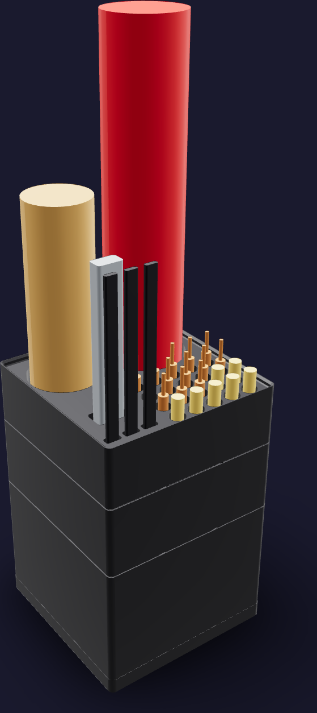
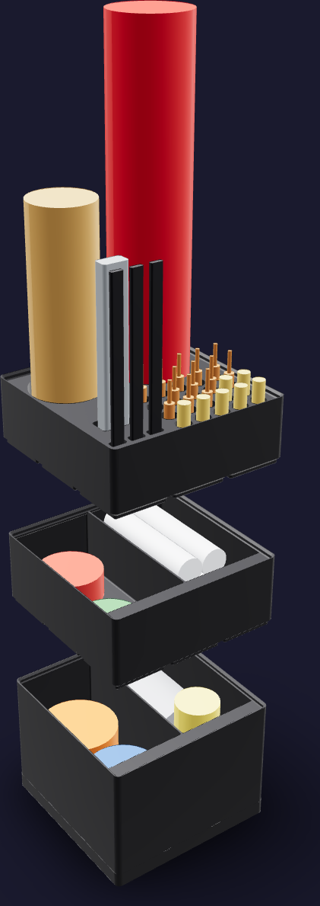
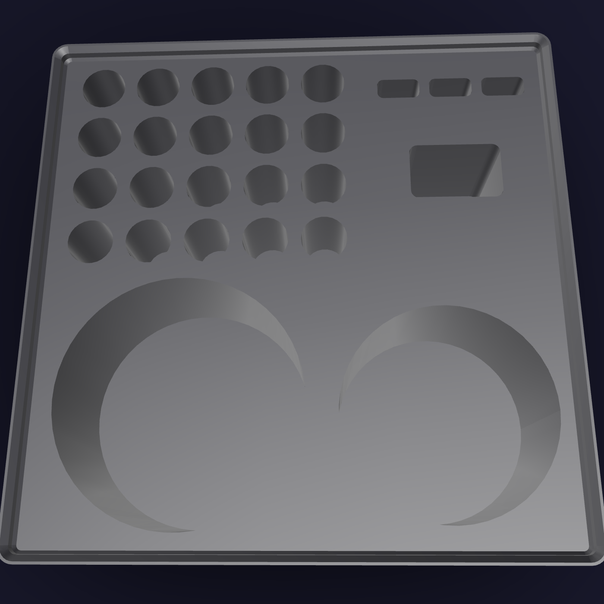

# Solder kit



A job stack, because the solder bench runs in campaigns — every insert in the
foam shell in one sitting, both reed columns in the next — so the storeys come
off the column and sit on the mat while the job runs. Its footprint is
[126 mm x 126 mm](FOOTPRINT): one 3 x 3 Gridfinity module. The printed stack
reaches [184.6 mm](PRINTED_HEIGHT) on its dock; the QWORK heat gun standing
nozzle-down in the rack sets the populated height at
[397.2 mm](POPULATED_HEIGHT).

Three storeys, bottom to top:

1. `solder-stock`, [84 mm](STOCK_STOREY) tall, one divider and a label ledge
   over each cell. The bench's bulk stock takes the
   [77 mm](STOCK_CELL_DEPTH) of cell depth: the 1 lb Kester roll on its rim,
   the polyimide tape, the flux paste jar, and the liquid flux bottle upright
   on its base the way a dropper bottle is kept.
2. `solder-rework`, [49 mm](REWORK_STOREY) tall, on the same divider and
   ledges. The fine consumables lie flat in a [42 mm](REWORK_CELL_DEPTH) deep
   cell: four flux syringes, the 0.020 in pocket pack, the desoldering braid.
3. `solder-tips`, [42 mm](RACK_STOREY) tall, the job rack. Its plateau is a
   tip index — [20](TIP_SOCKET_COUNT) sockets on a [14 mm](TIP_PITCH) grid,
   every tip standing point-up — with the tools that share this bench around
   it and the two tall ones set behind, clear of the reach to the tips.



## Printed parts

| Output | Quantity | Print orientation | Envelope |
|---|---:|---|---:|
| `solder-dock.step` | 1 | Flat face on the bed; baseplate recesses up | 126 x 126 x [10.8 mm](DOCK_HEIGHT) |
| `solder-stock.step` | 1 | Gridfinity feet on the bed; cells up | 125.5 x 125.5 x [87.8 mm](TALLEST_PART) |
| `solder-rework.step` | 1 | Gridfinity feet on the bed; cells up | 125.5 x 125.5 x 52.8 mm |
| `solder-tips.step` | 1 | Gridfinity feet on the bed; sockets up | 125.5 x 125.5 x 45.8 mm |

Every part fits the H2C left-nozzle [325 x 320 x 320 mm](H2C_ENVELOPE)
envelope; `solder-stock` is the tallest single print. Any 3 x 3 Gridfinity
baseplate docks the kit, so `solder-dock.step` is only printed where the
installation does not already have one.



## Contents map

**`solder-tips`** — the rack. Every tip socket is a [11 mm](TIP_SOCKET) bore
[22 mm](TIP_SOCKET_DEPTH) deep: one hole for all twenty tips, so this table is
what tells them apart.

| Row, front to back | Left to right |
|---|---|
| 1 | heat-set insert tips M2, M2.5, M3, M4, M5 |
| 2 | heat-set insert tips M6 and M8; Hakko T18-D08, T18-D12, T18-D16 |
| 3 | VECO-T T18-LB, T18-BR02, T18-D16, T18-D32, T18-B |
| 4 | VECO-T T18-K, T18-C2, T18-C5, T18-I, T18-S3 |

Right of the index, front to back: three slots for the iFixit precision
tweezers (a second home; the first is the JST tower), then the KATA micro flush
cutter head-down in its socket (a third home, after the JST tower and the
harness kit). Behind the index stand the two tall tools, clear of the reach to
the tips: the QWORK mini heat gun nozzle-down on the left in a
[57.1 mm](HEAT_GUN_WELL) well [35 mm](HEAT_GUN_WELL_DEPTH) deep, and the 36
flux brushes on the right in a [48 mm](BRUSH_QUIVER) quiver.

**`solder-rework`** — two cells, each [61.15 mm x 123.5 mm](CELL).

| Cell | Holds |
|---|---|
| left (-X) | four 10 cc no-clean flux syringes, two across in two layers |
| right (+X) | the Kester 44 0.020 in 3/4 oz pocket pack; the Chemtronics Soder-Wick bobbin |

**`solder-stock`** — two cells on the same plan.

| Cell | Holds |
|---|---|
| left (-X) | the Kester 24-6337-0027 0.031 in 1 lb roll, on its rim with its axis front to back; the BEEYUIHF 30 mL flux bottle standing in front of it |
| right (+X) | the four ELEGOO polyimide tape rolls, stacked widest first; the MG Chemicals 8341 49 g flux jar |

The label ledge over the +Y end of each cell takes 12 mm label tape. Nothing
is lettered in the plastic.

Not in this kit: the Hakko FX-888D and FR-301, the KOTTO fume extractor, the
Kaisi mat and the AORAEM helping hands, which stay on the bench; the ruthex
inserts and the M3 screws, which are the fastener kit's; and two things that do
not fit a [126 mm x 126 mm](FOOTPRINT) footprint. The 3M Virtua CCS glasses are
[138 mm](GLASSES_WIDTH) across the frame and the FAST CHIP removal alloy comes
in [165.1 mm](ALLOY_PIECE) pieces, both longer than a cell's
[135 mm](CELL_DIAGONAL) diagonal. Laid on the diagonal of an undivided 3 x 3
cavity the glasses would need to fold to a depth under
[34 mm](GLASSES_DEPTH_BUDGET), and 3M publishes frame width, temple length and
lens height only — so the kit does not assume one. Both stay on the bench, and
the generator asserts they still do not fit.

## Geometry sources

The on-hand inventory is [`purchases.md`](../../../ledger/purchases.md) §14 and
[`tools.md`](../../../ledger/tools.md); the bench is
[`so-solder-bench.html`](../../../assembly/cards/tools/so-solder-bench.html),
whose operations are cards CC-05/06/07/09, PC-01/03, EN-01, CA-01 and GT-05.

- The 42 x 42 x 7 mm module, the base profile, the stacking lip and the 12 mm
  label ledge follow the
  [Gridfinity specification](https://github.com/gridfinity-unofficial/specification)
  through the MIT-licensed
  [`cq-gridfinity`](https://github.com/michaelgale/cq-gridfinity) CadQuery
  library, by way of [`_kit.py`](../_kit.py).
- **T18 tips**, [6.5 mm x 44 mm](T18_BARREL). The
  [FX-8801 / FX-8805 tip series](http://www.hakko.com/english/products/hakko_fx8801_8805_tips.html)
  is the T18; a T18 barrel is the 900M-T format,
  [4.1 mm ID, 6.5 mm OD, 40 to 44 mm long](https://kunkune.co.uk/shop/soldering-iron-tips/900m-t-series-soldering-iron-tips/).
  The working face is the one dimension each tip's own listing gives — 0.8 x
  14.5 mm on the [T18-D08](https://www.amazon.com/dp/B004ORB8GK), 1.6 x 14.5 mm
  on the [T18-D16](https://www.pololu.com/product/2785) — and it is the top
  14.5 mm of the model. [T18-D12](https://www.amazon.com/dp/B004OR6BU8) and the
  ten-tip [VECO-T assortment](https://www.amazon.com/dp/B0FWKGXFK7) are the
  same barrel.
- **Heat-set insert tips**, [8 mm x 35 mm](INSERT_TIP) — generous. The
  [seven-piece kit](https://www.amazon.com/dp/B0CS662NVK) publishes only its
  35 x 35 x 20 mm package; an 8 mm cylinder 35 mm long is under a seventh of
  that box, so seven of them fit what the seven ship in.
- **iFixit precision tweezers**, 127 mm, from the
  [set's specification](https://www.ifixit.com/products/precision-tweezers-set)
  — the same figure the JST tower reads.
- **KATA micro flush cutter**, 127 mm: the
  [listing](https://www.amazon.com/dp/B0BBML9M2V) sells it as a 5-inch cutter.
  Its socket is a loose rectangular head receiver, not a fitted contour.
- **QWORK mini heat gun**, [52.1 mm x 251.0 mm](HEAT_GUN). The
  [listing's](https://www.amazon.com/dp/B09NDCCW29) 9.88 x 3.39 x 2.05 in
  package bounds the tool: nothing in a box is longer than its long side or
  fatter than its short one, so the kit stands a 2.05 in barrel 9.88 in tall.
- **Flux brushes**, a [43 mm x 152.4 mm](BRUSH_BUNDLE) bundle — generous. The
  [listing](https://www.amazon.com/dp/B07PHG2DQY) gives 36 brushes, a 6 in
  handle and a 3/8 in ferrule; standing on end, 36 ferrules of 3/8 in x 3 mm
  fill seven tenths of the circle the kit gives them.
- **Kester 24-6337-0027**, [58.4 mm x 63.5 mm](SPOOL_ENVELOPE): the
  [listing's](https://www.amazon.com/dp/B0149K4JTY) 2.5 x 2.3 x 2.3 in package,
  read as a roll of the box's short side lying on its rim.
- **Kester 44 0.020 in pocket pack**, [45 mm x 20 mm](FINE_SOLDER_PACK) —
  generous. The [listing](https://www.amazon.com/dp/B00AYJ0B7Y) gives 48 ft of
  0.020 in wire, which is 3.0 cm^3 of solder: a 31 mm coil on a 25 mm core, and
  the pack around it gets the rest.
- **Chemtronics Soder-Wick**, [44.4 mm x 6.35 mm](BRAID_BOBBIN): the
  [listing's](https://www.amazon.com/dp/B01I7Q2ULA) 1.75 x 1.75 x 0.25 in
  product dimensions, which are the ESD bobbin.
- **ELEGOO polyimide tape**, [56 mm](TAPE_ROLL) rolls, [47.6 mm](TAPE_STACK)
  stacked. The [listing](https://www.amazon.com/dp/B072Z92QZ2) gives four rolls
  1/8, 1/4, 1/2 and 1 in wide, each 108 ft of 0.05 mm film — 1646 mm^2 of wound
  section, a 52.4 mm roll on a 1 in core. The core is the one dimension nobody
  publishes; the kit assumes the 1 in core and takes 56 mm as the roll.
- **MG Chemicals 8341**, [52 mm x 45 mm](FLUX_JAR), and the **BEEYUIHF flux
  bottle**, [32 mm x 75 mm](FLUX_BOTTLE) — both generous. The
  [jar](https://www.amazon.com/dp/B09FWB6L5L) publishes 49 g in a 50 mL jar and
  the [bottle](https://www.amazon.com/dp/B0G2G6WFPZ) a 30 mL squeeze bottle
  with two tips and a cap; neither maker publishes a size.
- **Flux syringes**, [20 mm x 85 mm](FLUX_SYRINGE) each — generous. The
  [listing](https://www.amazon.com/dp/B0GGQNNF98) publishes four 10 cc
  syringes, not a size.
- **3M Virtua CCS**, 138 mm frame width, 127 mm temple, 43 mm lens height, from
  the [product measurements](https://safetyglassesusa.com/products/3m-virtua-ccs-safety-glasses-with-blue-temples-foam-gasket-and-clear-anti-fog-lens).
- **FAST CHIP removal alloy**, 6.5 in pieces, from the
  [listing](https://www.amazon.com/dp/B00OOBIJ6I).

No caliper measurement is an input to this model. Every content is a
public-envelope fit reference, not a replica.

## Build and print

Generate the STEP parts, the presentation assemblies and this README's figures
from the repository root:

```sh
tools/cad-venv/bin/python \
  hardware/printed-parts/shop-storage/solder/solder_kit.py
```

The kit prints in Bambu PETG Basic black from the AMS 2 Pro on the H2C's right
hotend, like every kit in [`shop-storage/`](../README.md). Print every part
base down with supports off: the bins and the rack are the library's own
printable base and lip profiles, and every socket in the rack is a straight
prismatic cut that opens upward.

Nothing fastens to anything. The storeys stack on the library's lip, the rack
closes the column, and any Gridfinity baseplate takes the stack.

## CAD status

The generator asserts one solid per printed part, the H2C build envelope, all
three seated interfaces of the column, and every content in its place: seven
rack clearances against the printed rack, and seven bin contents each grown
[1 mm](CONTENT_CLEARANCE) on every side but its floor and then asserted wholly
inside the cavity of the bin that holds it — so every stored thing keeps a
millimetre to the wall, the divider and the label ledge beside it. Each tool
socket is [2.5 mm](SOCKET_CLEARANCE) larger than its tool's public envelope per
side, and every socket is asserted to stay inside the
[60.15 mm](PLATEAU_REACH) plateau half-span the rack may cut. Two exclusions
are asserted as exclusions.

STL tessellations of all four parts return no open geometry-lint findings. The
dock and the rack are clean; each bin answers four sliver findings in
`solder-stock.lint-answers` and `solder-rework.lint-answers` — all four are the
1.2 mm vertical land of the library's stacking lip, the surface the storey
above seats against, which every Gridfinity bin carries. Physical fit has not
yet been print-verified.

## Sources
[value](NAME) texts are updated by:
- `/hardware/printed-parts/shop-storage/solder/solder_kit.py`
