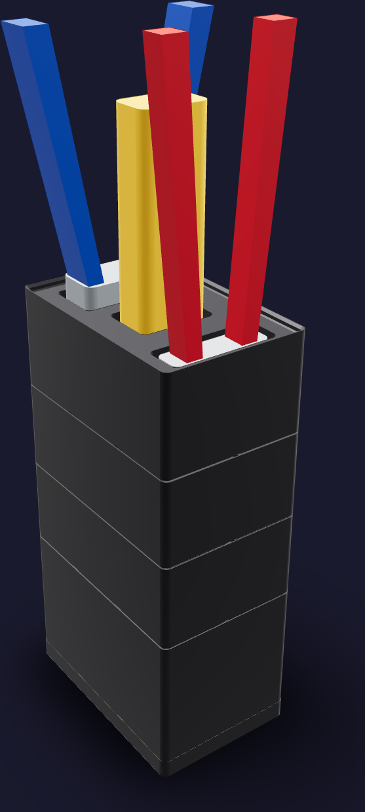
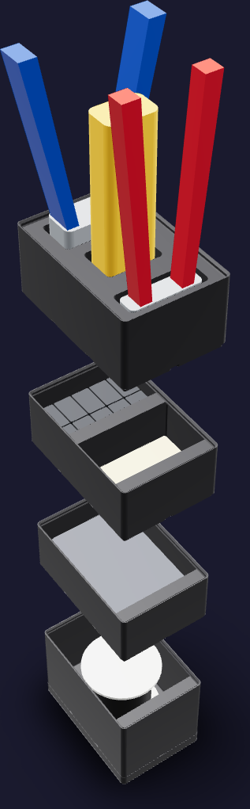
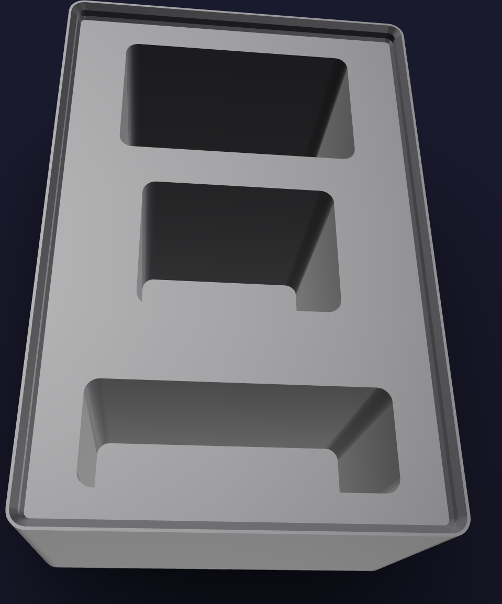

# Umbilical job kit



A job stack, because the umbilical is terminated in campaigns: the storeys come
apart onto the bench for a run of cables and go back together as one column
between runs. The closed footprint is [84 mm x 126 mm](FOOTPRINT) — a 2 x 3
Gridfinity module, all the depth two hands need for a 6P4C plug and none of the
width a wider kit would take. The printed stack reaches
[240.6 mm](PRINTED_HEIGHT); the Klein 11057 standing in the rack sets the
populated height at [379.8 mm](POPULATED_HEIGHT).

The job is `assembly/faucet-and-umbilical.md` §2 — the EZYUMM 6P4C plug crimped
onto the BNTECHGO ribbon — and `assembly/wiring.md` — the J3 loom punched onto
the RiteAV keystone's 110 IDC. Card [GT-05](../../../assembly/cards/gt-05-heat-shrink-sleeve.html)
is the technique. Four storeys, bottom to top:

1. **Ribbon.** One deep compartment, the BNTECHGO 28 AWG 4-conductor reel lying
   flange down. The kit reserves the listing's whole parcel,
   [77 x 81 x 68 mm](RIBBON_PARCEL), in a compartment [70 mm](RIBBON_CAVITY)
   deep, and draws a [diameter 72 mm x 63 mm](REEL_ENVELOPE) reel inside it.
2. **Stand.** One shallow compartment the length of the Cable Matters 180056
   keystone punch-down stand, [68.6 x 109.2 x 27.9 mm](STAND_ENVELOPE). Nothing
   else fits beside it: the stand is 109 mm on a 123.5 mm floor.
3. **Terminations.** Two compartments across the depth, [61.2 mm](CELL_DEPTH)
   each. Ten RiteAV keystone jacks stand in the rear one, ports up; twenty
   EZYUMM 6P4C plugs lie loose in the front one.
4. **Rack.** A lipped blank with three head-down sockets down its centre line,
   [48 mm](SOCKET_DEPTH) deep over [8 mm](SOCKET_FLOOR) of solid floor. Back to
   front: the VCE modular crimper, the Klein VDV427-300 impact punchdown, the
   Klein 11057 stripper.

Nothing in the kit needs a mechanism the library does not already draw. The
three bins are stock `GridfinityBox` bodies with the library's own label ledge
and one divider; the rack is a stock lipped blank with three pockets cut from
its plateau; the bench dock is the library's baseplate on a 6 mm slab.

## Printed parts

| Output | Quantity | Print orientation | Envelope |
|---|---:|---|---:|
| `umbilical-ribbon.step` | 1 | Gridfinity feet on the bed, compartment up | [83.5 x 125.5 x 80.8 mm](RIBBON_PART) |
| `umbilical-stand.step` | 1 | Gridfinity feet on the bed, compartment up | [83.5 x 125.5 x 52.8 mm](STAND_PART) |
| `umbilical-terminations.step` | 1 | Gridfinity feet on the bed, compartments up | [83.5 x 125.5 x 52.8 mm](TERMINATIONS_PART) |
| `umbilical-rack.step` | 1 | Gridfinity feet on the bed, sockets up | [83.5 x 125.5 x 59.8 mm](RACK_PART) |
| `umbilical-dock.step` | 1 | Flat slab on the bed, baseplate recesses up | [84.0 x 126.0 x 10.8 mm](DOCK_PART) |

Every part fits the H2C's [325 x 320 x 320 mm](H2C_ENVELOPE) envelope; the
ribbon storey is the tallest single print at [80.8 mm](TALLEST_PART). Any 2 x 3
Gridfinity baseplate docks the kit, so `umbilical-dock.step` is only printed
where the bench does not already carry one.



## Contents map

| Storey | Compartment | What goes in it | Count |
|---|---|---|---:|
| `umbilical-ribbon` | the whole floor | BNTECHGO 28 AWG 4-conductor silicone ribbon, 50 ft, on its reel | 1 |
| `umbilical-stand` | the whole floor | Cable Matters 180056 keystone punch-down stand | 1 |
| `umbilical-terminations` | rear (−Y) | RiteAV RJ11 6P4C black punchdown keystone jacks, standing on their IDC blocks in a [78.5 mm x 49.8 mm](JACK_ARRAY) layer | 10 |
| `umbilical-terminations` | front (+Y) | EZYUMM RJ11 6P4C 3-prong modular plugs, loose | 20 |
| `umbilical-rack` | rear socket | VCE GJ668BL modular crimper, head down | 1 |
| `umbilical-rack` | middle socket | Klein VDV427-300 impact punchdown, blade down | 1 |
| `umbilical-rack` | front socket | Klein 11057 wire stripper, head down | 1 |

The label ledge takes 12 mm tape; the storeys carry no lettering in the plastic.



Each socket stands [2.5 mm](SOCKET_SLIP) off its tool on every side — a
receiver, not a fit, so a tool drops in one-handed. The Klein 11057's head is
buried in its socket and only the Kurve grips stand out; the crimper's die head
and the punchdown's barrel stand proud.

## Geometry sources

The on-hand inventory is [`purchases.md`](../../../ledger/purchases.md) §9 and
[`tools.md`](../../../ledger/tools.md) "Soldering & electronics bench"; the
consumable side is [`bom.md`](../../../ledger/bom.md) §11.

- The 42 x 42 x 7 mm module, the base profile, the stacking lip and the 12 mm
  label ledge are the
  [Gridfinity specification](https://github.com/gridfinity-unofficial/specification),
  rendered by the MIT-licensed
  [`cq-gridfinity`](https://github.com/michaelgale/cq-gridfinity).
- **BNTECHGO 28 AWG 4-conductor ribbon, 50 ft** ([B07PNPHWMG](https://www.amazon.com/dp/B07PNPHWMG)).
  BNTECHGO's [product page](https://bntechgo.com/bntechgo-28-gauge-silicone-ribbon-cable-copper-wire-4p-flat-cable-28-awg-flexible-soft-silicone-rubber-parallel-wire-stranded-tinned-copper-wire-4-pin-black-50-ft/)
  states the cable's 1.2 x 4 mm section and nothing about the reel. **The
  [77 x 81 x 68 mm](RIBBON_PARCEL) envelope is generous**: it is the listing's
  own parcel, 8.1 x 7.7 x 6.8 cm at 173 g, and the reel is inside it by whatever
  the packer padded. The drawn reel is the wind's own volume — 15.24 m of a
  1.2 x 4 mm section — on a 30 mm hub between two flanges.
- **RiteAV RJ11 6P4C punchdown keystone jack**
  ([riteav.com](https://www.riteav.com/products/riteav-rj11-phone-black-punchdown-type-keystone-jack-10-pack), 10-pack).
  The [14.9 x 24.4 x 30 mm](JACK_ENVELOPE) envelope is the keystone module
  standard's 14.5 x 16.0 mm face, the body a 110-punchdown jack carries behind
  it, and a 30 mm face-to-IDC depth — the same figures
  [`reference/riteav-keystone/`](../../../reference/riteav-keystone/riteav_keystone.py)
  cuts the +Y wall of back-top's receptacle against. **The depth is estimated
  there and generous here.**
- **EZYUMM RJ11 6P4C modular plug, 3-prong** ([B0DK4V733Q](https://www.amazon.com/dp/B0DK4V733Q), 20-pack).
  [9.65 x 10.2 x 13.54 mm](PLUG_ENVELOPE) is the 6P4C modular-plug standard —
  a 9.65 mm face on a 6.6-7.0 mm body, plus its latch. Twenty of them are one
  fill block of [48.5 cm^3](PLUG_FILL): their own volume at the packing loose
  mouldings take.
- **Cable Matters 180056 keystone punch-down stand** ([B00MHWRYMQ](https://www.amazon.com/dp/B00MHWRYMQ)).
  [68.6 x 109.2 x 27.9 mm](STAND_ENVELOPE) is the listing's stated product
  dimensions, 4.3 x 2.7 x 1.1 in.
- **VCE modular crimper** ([B07XD98YYT](https://www.amazon.com/dp/B07XD98YYT), model GJ668BL).
  VCELINK's [product page](https://www.vcelink.com/products/all-in-one-rj45-crimper)
  states [184.9 mm x 104.9 mm](CRIMPER_ENVELOPE) over the whole tool, 7.28 x
  4.13 in at 315 g. **No source states the die head's section**, so the socket
  reads a generous 50 x 26 mm head, and the grips are drawn splaying to the
  stated open width.
- **Klein VDV427-300 impact punchdown** ([B08J2DN6HC](https://www.amazon.com/dp/B08J2DN6HC)).
  Klein's [specification](https://www.kleintools.com/catalog/punchdown-tools/impact-punchdown-tool-66110-blade)
  states [152.4 x 38.1 x 25.4 mm](PUNCHDOWN_ENVELOPE), 6 x 1.5 x 1 in at 8 oz.
  The barrel holds that section its whole length, so the tool is its own
  envelope and the socket is drawn straight off it.
- **Klein 11057 wire stripper** ([B000XEUPMQ](https://www.amazon.com/dp/B000XEUPMQ)).
  Klein's [specification](https://www.kleintools.com/catalog/combination-cutting-tools/klein-kurve-wire-stripper-and-cutter)
  states [190.5 mm](STRIPPER_ENVELOPE) overall, 7.5 in at 5.1 oz, and no
  section. **The 56 x 16 mm head and the 70 mm grip span are generous
  references.**

No caliper measurement is an input to this model. Every content is a
public-envelope fit reference, not a cosmetic replica.

Every tool and every consumable above has this kit as its only home: no other
kit in [`shop-storage/`](../README.md) carries a modular crimper, an impact
punchdown, a 20-30 AWG stripper, a keystone jack or a 6P4C plug. What the job
borrows, it borrows from a neighbour — the 2:1 heat-shrink that shims the last
15 mm of ribbon under the plug's strain-relief bar is the harness kit's, and the
braid the finished umbilical wears is in no kit, because a 1 in PET reel does
not fit one.

## Build and print

Generate the STEP parts, the two presentation assemblies and this file's
figures from the repository root:

```sh
tools/cad-venv/bin/python \
  hardware/printed-parts/shop-storage/umbilical/umbilical_kit.py
```

The kit prints in Bambu PETG Basic black from the AMS 2 Pro on the H2C's right
hotend, like every kit in [`shop-storage/`](../README.md). Every part goes on
the bed in the orientation it is exported in, base down, and none of them needs
support: the library's base and lip profiles are printable as drawn and all
three rack sockets open upward.

Assembly is stacking: ribbon, stand, terminations, rack. Each storey seats on
the top reference of the one below — the label ledge and the divider both rise
to it — and the rack keeps its lip, so a second kit stacks on this one.

## CAD status

The generator asserts one solid per printed part, the H2C build envelope, all
four seated interfaces, the four compartment envelopes with their wall
clearances and their room under the label ledge, each rack socket's place
inside the blank's plateau, each socket's slip over its tool, and zero body
overlap for all three tools.

STL tessellations return no findings on the two bodies this kit shapes —
`umbilical-rack` and `umbilical-dock`. The three bin storeys report the
stacking lip's own 1.2 mm outer band as a sliver; a stock `GridfinityBox` of
the same size and features reports exactly the same band, so it is the
library's printable lip profile rather than anything this kit cuts. Physical
fit has not yet been print-verified.

## Sources
[value](NAME) texts are updated by:
- `/hardware/printed-parts/shop-storage/umbilical/umbilical_kit.py`
