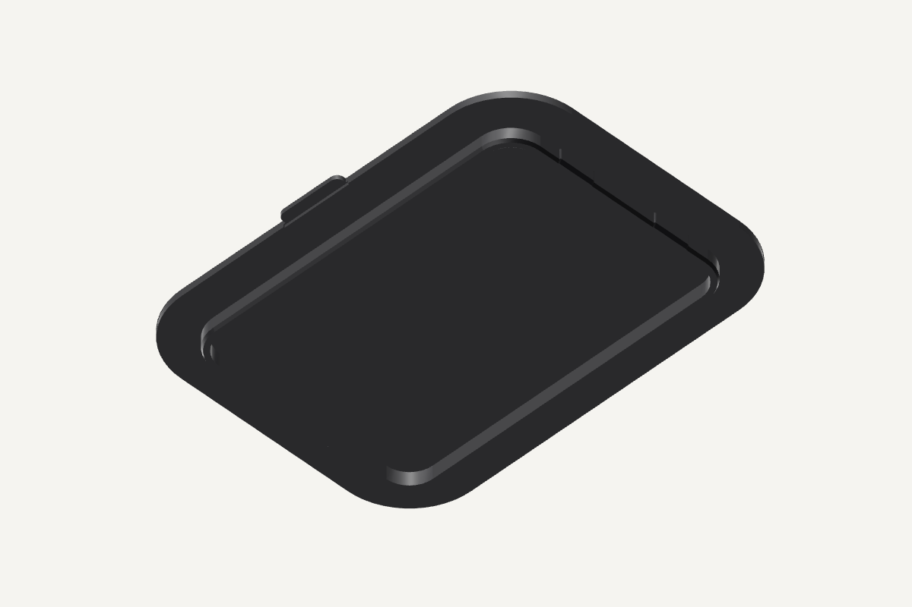

# Funnel cover

The black PETG cover closes the silicone funnel between fills. Its solid plate
sits on the brim, adding [3 mm](PLATE) above the roof. A [6 mm](SKIRT) locating
skirt enters the existing mouth; four broad pads have [0.15 mm](PAD) nominal
interference with the silicone. The skirt opposes sideways displacement, and
the pads provide a provisional friction grip. Lift the broad front edge to remove it
before pouring or lifting the silicone out for cleaning. Press it down until
the plate rests evenly on the brim after the fill is complete.



The plate is [182 mm](WIDTH) across and [138.683 mm](DEPTH) front to back.
Its entire front edge extends [4 mm](FRONT_EXTENSION) toward the display,
beyond the [1.5 mm](OVERHANG) brim overlap. A shallow
[1.2 mm](FRONT_RELIEF) recess under that edge provides lifting access.
The skirt has [3 mm](WALL) walls and
[0.25 mm](AIR) nominal running air except at the pads. Its lead-in and the
pads' lower ramps enter without a sharp outward step. The plate has no holes;
the lifting recess opens only underneath the extended front edge.

The cover lifts off vertically, so the refill does not require a horizontal
slide or a hinge swing under the sink bowl. Its removed height does not enter
the bottle's filling envelope. The funnel, mold, roof ledge and frame retain
their geometry.

## Water and cleaning

Direct overhead drips and debris meet the plate instead of the open bowl.
Runoff leaves at the plate perimeter onto the surrounding roof. This cover
does not establish a watertight brim seal or a protected path past the
front/back roof lap to the electrical bay. Those remain open in the
[concerns register](/hardware/concerns.md). Remove external water and debris
before opening it, and clean both faces separately from the funnel.

Plain PETG is used for this part's underside and mouth-contacting skirt.
The print and material have no food-contact qualification. Prusa's
[PETG guidance](https://help.prusa3d.com/article/petg_2059) identifies the
cleaning limits of layered prints; the resin name alone does not qualify the
finished surface. Installed retention, drip exclusion, cleaning and repeated
removal remain physical observations, not results of the CAD checks.

## Manufacture and evidence

The print STEP and STL place the complete flat exterior on the bed, with the
skirt growing upward. The part is [9 mm](PRINT_HEIGHT) tall in that pose.
Use plain black PETG, a 0.20 mm first layer, 0.24 mm layers, three walls and
100% infill; no supports touch the underside or skirt. Keep the plate solid.
The front recess prints as a thinner strip of the bed-facing plate; inspect
that accessible dry face after printing.

The [saved PETG project](funnel-cover-petg.3mf) and
[native slice review](native-slice-review.json) record the separate cover
slice with no support paths. It has not been submitted to a printer. The
review identifies the material preset, source hashes, solid infill and
toolpaths; physical fit and drip exclusion remain unqualified.

The [native check](geometry-check.json) binds the exact cover, funnel and
assembly exports. It checks the solid plate, intended silicone-pad contact,
surrounding hardware clearance and vertical removal. It does not measure
friction, silicone distortion, deposited watertightness or lifetime.

The post-publication geometry lint has one intentional finding, the lifting
recess's short vertical back wall, recorded in the
[lint answers](funnel-cover-print.lint-answers). The recess retains a continuous
plate above it and stays outside the mouth.

```sh
tools/cad-venv/bin/python hardware/printed-parts/zone-c/funnel-cover/funnel_cover.py
tools/cad-venv/bin/python hardware/printed-parts/zone-c/funnel-cover/check_cover.py
```

`funnel-cover.step` and `funnel-cover.stl` use the assembled seating datum.
`funnel-cover-print.step` and `funnel-cover-print.stl` use the flat exterior bed face. The appliance places
the cover on the same roof and plan center as the silicone brim.

## Sources
[value](NAME) texts are updated by:
- `/hardware/printed-parts/zone-c/funnel-cover/funnel_cover.py`
