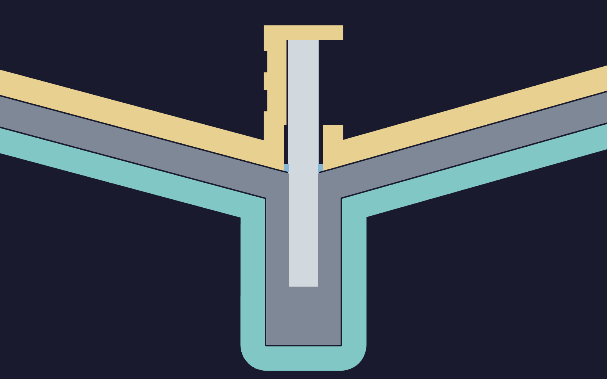

# Funnel mold

Two PETG shells follow the [funnel](../funnel/README.md), with
[5 mm](SKIN) minimum forming walls and [5 mm](FLANGE) clamping flanges. The cavity
stands on three small feet. The core has a [142.4 × 128.4 mm](DRY_MOUTH) rounded rectangular opening
in its dry back. Both halves print with automatic normal supports in Snug style.


Eight [5 mm](BOLT_D) through-holes take M4 × 20 bolts, 9 mm OD washers and nuts.
Small clamps can also reach the flat flange backs. Tighten opposite stations
incrementally until the bare parting lands meet. The two short locating pegs
are [3 mm](LOCATOR_HEIGHT) tall, with [0.60 mm](LOCATOR_CLEARANCE) radial
clearance; one mating hole is slotted in X to accommodate spacing error.
Their asymmetric positions set the drain's orientation. Four edge notches
admit a blunt opening tool.


## Forming surfaces and fit

The nominal silicone ramp, brim and collar are 6 mm thick. Ramp thickness is
measured perpendicular to its surface, with a locally thicker rounded throat.
The outlet wall is 4.5 mm radially.
[Wall measurements](../funnel/wall-review.json) record the geometry.

Both forming faces reserve [0.30 mm](FINISH) of net finishing growth, including
primer, sealer and release. Sand and coat a sample with the actual finishing
stack, then measure its net growth. Mask the parting lands, locating pegs and
holes, clamp holes, rod passage, V cradle and rod stop. The finishing allowance belongs to
the silicone-forming surfaces; the bare lands establish closure height.

The [6.35 mm](ROD_D) × [50.8 mm](ROD_LEN) steel dowel passes freely through an
[8.35 mm](ROD_GUIDE_D) opening, with [2 mm](ROD_CLEARANCE) diametral clearance.
An open V cradle on the dry back centres it. Its upper end meets a visible
stop; two zip ties in [4.4 mm](ROD_TIE_WIDTH) grooves hold it in the cradle.
Engagement is [26.5 mm](ROD_ENGAGEMENT), leaving [24.25 mm](ROD_EXPOSED) below the
core's neck. The rod stays clear of the cavity during closure.

Pack a small removable seal around the rod at the forming-face entry, flush
with the adjacent surface. The illustrated seal is [2 mm](ROD_SEAL_DEPTH) deep.
Prove the mold-sealing clay's compatibility with the actual
[platinum-cure silicone](silicone.md) on a sample before using it in the mold.
The cradle holds the rod; the seal
closes the annular passage into the dry back. Smooth-On's
[sealer reference](https://www.smooth-on.com/page/sealers-releases/) distinguishes
sulfur-free modeling clay from sulfur-bearing clay for platinum silicone.

The finished outlet has a [4.5 mm](SPOUT_WALL) nominal wall and
[15.35 mm](SPOUT_OD) outside diameter around the [6.35 mm](ROD_D) bore. Its
[12 mm](SPOUT_LAND) clamp land takes the 1/4-inch LLDPE stub and the recorded
10–16 mm worm clamp. A full-diameter [18 mm](TIP_LENGTH) sacrificial extension
leaves [12 mm](TIP_CAP) beneath the rod end. Mark the trim plane
[18 mm](TIP_LENGTH) from the casting's closed end and cut square after demolding.

[design.json](design.json) checks simultaneous [1.5 mm](ROD_OFFSET) lateral
offset, [2°](ROD_TILT) tilt and axial error in eight directions. The rod may
project [6 mm](ROD_EXTRA) farther when not fully seated, or [3 mm](ROD_AXIAL)
less than nominal. The minimum depth beneath its tip in these cases is
[5.90 mm](ROD_MIN_END).
The minimum silicone clearance in that envelope is [2.16 mm](ROD_MIN_WALL),
including the sacrificial end. These checks describe geometry; the first
physical trial establishes retention, sealing and casting quality.




Teal is the cavity, gold the core, grey the nominal silicone, light grey the
steel dowel and blue the removable entry seal. The nominal casting, including its sacrificial spout tip, is
[244 mL](CAST_VOLUME). The two halves fit inside a [278.5 mm](ENVELOPE) circle,
leaving [10.6 mm](CHAMBER_GAP) radial clearance in the recorded chamber. Check
the actual opening, clamp/bolt envelope and catch tray before pouring.

## Load and vacuum

The complete mold sits inside the vacuum chamber. Its fill hole, five casting
vents and both dry backs communicate with that chamber.
Pressure equalizes through these openings; the silicone's weight remains a
load on the forming skins. Keep the passages open, evacuate and vent slowly,
and perform any filled-mold cycle while the silicone is fluid. Cure at ambient
pressure with the flanges held together. The tooling is not rated for a sealed
one-atmosphere differential or pressure injection.

[design.json](design.json) records a sizing calculation: a simply supported
[165 mm](LOAD_SPAN) flat square, [5 mm](SKIN) thick, under a uniform
[1.00 kPa](LOAD_PRESSURE), using an assumed PETG modulus of
[1000 MPa](LOAD_MODULUS) and Poisson ratio 0.4. Its calculated deflection is
[0.243 mm](LOAD_DEFLECTION); the maximum static silicone head is
[0.831 kPa](HEAD_PRESSURE). This flat-plate model is a screening approximation;
it does not establish the printed shell's stiffness, creep, release force or
transient pressure during degassing.

Bambu reports PETG Translucent bending moduli of 1610 MPa in XY and 1520 MPa in
Z on conditioned test specimens. The sizing assumption is lower; the actual
print still needs its own dry-fit and vacuum trial.
[Material data sheet](https://store.bblcdn.eu/s8/default/71ca815e70e74afc96ff5883f003235f/Bambu_PETG_Translucent_Technical_Data_Sheet.pdf).

## Geometry verification

The cavity is a continuous cup from the brim to the blind spout. Each offset
face, rounded edge and corner is contained in the finished shell envelope.
Before the flange and mouth trim, the minimum distance between the complete
forming and backing boundaries is checked against the 5 mm shell thickness;
[design.json](design.json) records that measurement.
The generator checks that the capped cavity and the assembled mold each retain
the complete casting in one enclosed liquid region, separate from outside air.
The assembled check uses the modeled rod-entry seal and caps the fill and vent
mouths.

[containment-review.json](containment-review.json) records independent checks of
the exported STEP and STL, including their file hashes. These checks use the
complete surfaces and the whole casting, including openings smaller than a print
layer. The assembled STEP uses the exact entry seal; the assembled STL gives
that soft seal 0.02 mm contact overlap along each axis at the independently
tessellated surfaces. Coating
porosity, flange sealing and the first casting remain physical checks.

## Print

[Saved Bambu Studio project](funnel-mold.3mf)

The saved project contains two plates: the cavity upright and the core inverted.
It selects these presets:

- Process: **0.24mm Standard @BBL H2C funnel mold**
- Filament: **Funnel mold PETG Translucent - 0.4 Standard - flow 0.88**
- Printer: **Bambu Lab H2C 0.4 Standard +0.18 Z trim**

The project selects 0.4 mm Standard nozzles. It uses 0.24 mm layers, a 0.20 mm
first layer, Textured PEI,
two wall loops, 100% zig-zag infill and automatic normal supports in Snug style.
Support top and bottom Z distances are 0.20 mm; first-layer gap and object XY
distance are 0.48 mm. Top surfaces use monotonic lines and bottom surfaces
use monotonic fill. The active Standard filament flow ratio is 0.88. Maximum volumetric speed
is 5.61702 mm³/s and infill/wall overlap is 15%. Nozzle temperature is 250 °C on the
first layer and 245 °C afterward.

The startup code applies a +0.18 mm Z trim in addition to the plate correction.
With the 0.4 mm nozzle and Textured PEI, the emitted command is `G29.1 Z0.16`.

Open and slice this project in Bambu Studio for the current
toolpaths, print time and material estimate; the saved project contains no G-code.

The core's envelope is [211 × 211 × 38.3 mm](CORE_DIMS); the cavity is
[211 × 211 × 78.9 mm](CAVITY_DIMS). Supports are accessible from the dry backs.
Inspect and remove every branch before finishing. Sand and finish the layer
steps on the forming slopes before casting.

The [print log](print-log.md) records physical observations with their known
provenance. [print-jobs.json](print-jobs.json) records submitted files, settings
and printer responses. Coated closure, vacuum cycling, support removal and
casting are untested for these shells.

## Cast and open

1. Remove supports and brim, including branches inside the open rod cradle.
   Slide the rod through the loose passage, bring its end to the visible stop
   and secure it in the V with two zip ties. Dry-fit the two halves.
   Check the lands with a light behind the seam; use the flange bolts or clamps
   to close slight bow. Confirm that the coated halves still meet on those lands.
2. Prove the PETG, finishing stack, release, entry-seal clay and
   [silicone](silicone.md) on a sample. Pack the rod-entry seal flush with the
   forming face. Degas the mixed silicone in a separate container with expansion room.
   [Smooth-On's degassing example](https://www.smooth-on.com/tutorials/making-piece-cut-block-mold/vacuum-de-gassing/)
   shows the required headroom above the liquid.
3. Fill the open cavity, including the blind spout pocket. Lower the core slowly
   with its dowel installed. Seat and hold the flanges evenly. Top up through the
   [11 mm](FILL_D) fill hole; the five [4 mm](VENT_D) vents remain open.
4. For a filled-mold vacuum cycle, use a catch tray and keep overflow clear of the
   dry-back openings. Vent slowly, recheck the fill level and top up while fluid.
   Hold the flanges through the silicone's room-temperature cure.
5. Trim overflow at the port mouths and cut the rod's zip ties. Open in small alternating movements at
   opposite notches. Peel the accessible silicone brim to admit air, lift the
   core straight off the rod, peel the casting from the cavity, withdraw the
   dowel and cut off the marked sacrificial extension. Remove the entry seal
   and clean the passage before the next cast.

## Regenerate

```sh
tools/cad-venv/bin/python hardware/printed-parts/zone-c/funnel-mold/funnel_mold.py
```

After changing geometry, reload the cavity and core STLs in the saved Bambu
Studio project, retain their print orientations and review the slice before
saving.

After publication, run [review_geometry.py](/tools/funnel-mold-print/review_geometry.py)
with this models directory. Geometry lint reports overhangs in the print
orientations. Review support coverage and removal access in Bambu Studio.

## Sources
[value](NAME) texts are updated by:
- `/tools/funnel-mold-print/verify_print.py`
