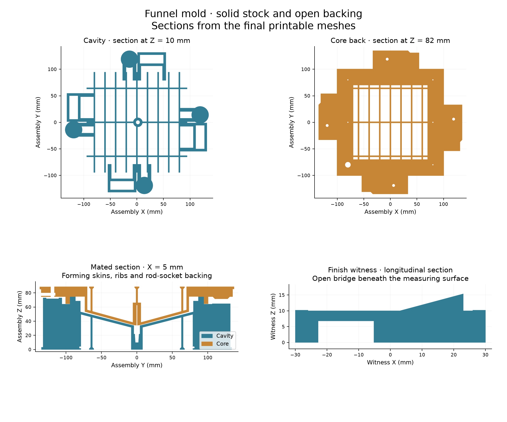
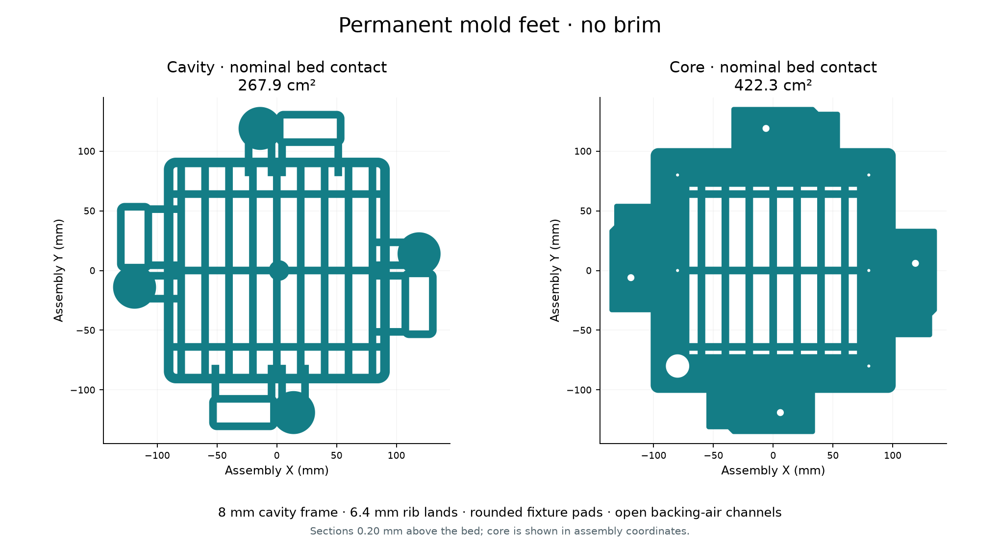

# Funnel silicone mold

Two printed PETG halves cast the Zone C [funnel](../funnel/README.md) around a
[6.35 mm](ROD_D) × [50.8 mm](ROD_LEN) ground steel dowel. The finished funnel is
nominally a [6 mm](SIL_WALL) shell; the pour, including the sacrificial tip, is
about [135 mL](SIL_VOLUME). `funnel.build_solids()` owns its finished geometry.

The printed forming surfaces reserve [0.20 mm](FINISH_ALLOWANCE) of **net
finishing growth**. Both halves require finishing before casting to nominal
size. Net growth is the dry coating left after finishing, minus the PETG removed
by sanding. It is a target to measure, not a measured property of a particular
coating, spray count, or printer.

## Structure and vacuum paths

- **Cavity:** [274.0 × 274.0 × 74.6 mm](CAVITY_DIMS), opening upward. Its forming
  skin is [3.2 mm](FORMING_SKIN), carried by [2.4 mm](RIB_THK) ribs on
  [20 mm](RIB_PITCH) centres and three cross ribs. The registration band extends
  [8 mm](MOLD_WALL) outside the nominal brim. Its feet stand [10 mm](MOLD_BASE)
  below the nominal blind tip floor. A pedestal carries that closed floor to the
  bed. A 45° corbel carries the registration band outward from the collar. The
  spaces between ribs open underneath. Each washer rests on a solid 32 mm column reaching the bed. Paired 6.4 mm
  full-height walls connect each bearing column and guide tower to the cavity
  ribs. The broad guide towers have an open relieved bore below the 14 mm
  bearing length, and a 3 mm side air exit at their feet.
- **Core:** [274.0 × 274.0 × 68.0 mm](CORE_DIMS), printed upside down, with the
  forming plug upward. Its back opens between the ribs. A [14 mm](PLATE_THK)
  perimeter plate forms the brim and carries the pour and silicone vents; its
  skirt registers over the cavity for [10 mm](LIP_H). A continuous skin and boss
  surround the rod socket, including its blind end. Four 66 mm wide × 14 mm thick arms carry steel square
  nuts beneath 8.4 mm bearing roofs; four integral 12 × 40 mm guide blades point down into matching guides on
  the cavity. Each blade has a 6 mm flared root shoulder and prints upward with
  the inverted core.
- **Backing air:** transverse [3 mm](BACK_VENT_D) channels connect the rib bays
  to the outside. Cavity channels sit near the feet; core channels sit near its
  open back. They remain exposed with a flat chamber shelf under the cavity or
  a clamp board over the core. They must remain free of coating and silicone.
  They do not connect to the forming cavity, rod socket, pour port or silicone vents.
- **Bed contact:** permanent feet occupy the first [3.2 mm](FOOT_HEIGHT) of each
  print. The cavity frame is [8 mm](FOOT_FRAME) wide with [10 mm](FOOT_CORNER)
  outside corner radii. Rib bases are [6.4 mm](RIB_FOOT) wide for the first 1.2 mm,
  then taper inward at 45° into the ribs. Rounded pads extend
  [2 mm](FIXTURE_FOOT_MARGIN) around the jack columns, guide towers and core arms;
  the inverted core also has a rounded perimeter foot. These are solid mold
  material and remain attached. Air exits pass through the feet. No brim or
  skirt is generated by the print process.
- **Silicone air:** five [2.5 mm](MOLD_VENT_D) vents communicate with the brim.
  The [11 mm](FILL_D) pour throat opens through a [20 mm](FILL_DISH) dish.
  These passages remain open during casting and vacuum. Keep a catch tray under
  the mold for foam and overflow.

The print uses solid fill within the modeled skins and ribs. The large air
spaces are CAD features open to the chamber. Printed road-to-road porosity still
requires a continuous coating on **both** forming faces; ventilation alone does
not make a printed mold airtight. Backing channels equalize chamber pressure;
this tooling has no pressure-vessel rating.





[Foot verification](bed-foot-verification.json) records 267.9 cm² of nominal
cavity contact and 422.3 cm² of core contact, before slicer compensation. The
forming surfaces, registration and extraction fits lie beyond the changed
3.2 mm band and retain their exact CAD geometry.

## Print

[**funnel-mold-petg-hf08-variable-016-040.3mf**](funnel-mold-petg-hf08-variable-016-040.3mf)
contains separate plates for the small witnesses, cavity and core. Use the H2C's
left 0.8 mm High Flow nozzle and PETG Translucent. The shallow slopes use 0.16 mm
layers; straight structural sections use 0.40 mm. The default plate trim is
**+0.04 mm**. A fully sliced
[+0.18 mm version](funnel-mold-petg-hf08-variable-016-040-z018.3mf) and a
[bundle containing both printer trims, filament and process presets](funnel-mold-hf08-z-trim-presets.bbscfg)
are available. The trims are the user's build-plate calibrations, applicable across
nozzle and material changes.
[Print settings and inspection](print-profile.md) accompany the project.
Print all three small witnesses first: finish, hardware fits and guide pin. Each
large plate is an independent print job. Modifier volumes keep the forming skins,
rod boss, registration faces and hardware fits at 60 mm/s outer wall speed.
The high-flow filament cap is 18 mm³/s. The cavity estimates 23 h 23 min and the
core 18 h 39 min; these are slicer estimates. Both large plates exceed a 1 kg
spool. Arrange enough dry filament and compatible spool backup before starting.

[The recipe](print-recipe.json) names every intentional process and filament
override, the speed modifiers and the fine-layer bands. [The profile audit](profile-audit.md)
accounts for the complete saved configuration. The generator reads the current
STL files and Bambu's installed system presets.

The forming skins bridge the spaces between the ribs. Those bridge undersides
face the open backs; the silicone-facing surfaces grow above the full skin
thickness. Clear loose strings from the bays and every transverse air passage.
Let the parts cool on the bed before removal, then check that both registration
lands are flat and the skirt seats without rocking.

PETG Translucent is the specified room-temperature tooling material. The coating
provides the finished contact surface. Glass-filled PET would need its own
filament tuning and finishing trial; annealing would also require dimensional
checks against the nominal funnel.

## Measure the finish

The **finish witness** has a flat measuring strip, two end rails and a ramp at
the funnel's floor grade. Its underside includes the same 17.6 mm rib-to-rib
bridge span as the mold; inspect that roof for sound attachment at both ends.
Keep its underside and rails uncoated. The central flat
is modeled one finishing allowance below the rails; a straightedge across them
helps inspect the result. Layer quantization and first-layer error affect that
printed step: measure the actual coupon before relying on the rails as a gauge.

1. Measure and record the uncoated flat thickness at several marked stations with
   calipers or a micrometer. Check the actual rail step as well. Use the ramp to
   judge whether the same finishing process removes terraces without rounding
   its transitions.
2. Lightly abrade, clean and dry. Apply a sandable, fully cured sealing coat to
   the flat, ramp and vertical test face. Measure from the same uncoated datum
   after sanding and polishing. The flat should gain
   [0.20 mm](FINISH_ALLOWANCE); use ±0.05 mm as the finishing-process target.
   Measure the vertical face separately and inspect the ramp for pooling.
3. The owned Craft Resin Arts & Crafts epoxy and Krylon gloss acrylic are
   candidate coats for the measured trial. XTC-3D is a purpose-made leveling
   alternative. Follow its
   [technical instructions](https://www.smooth-on.com/products/xtc-3d/), fully
   cure it, then sand/polish to the measured target. The manufacturer describes
   coverage at roughly 0.4 mm applied thickness; that is not this mold's required
   finished film. Apply its specified release before molding silicone against it.

4. Test the **actual PETG, finishing coat, release and BBDINO batch** together.
   The sample must cure through, release cleanly and survive repeated demolding.
   Smooth-On's [compatibility tests](https://www.smooth-on.com/support/faq/210/)
   concern named materials and do not certify the BBDINO combination.
5. Apply the proven process to both forming faces. Keep the registration skirt,
   parting lands, rod socket, backing bays, air channels and port bores masked.
   Finish up to the forming-face edges without rounding the trim shoulder or
   leaving a coating bead on the parting land. Inspect the narrow spout pocket
   particularly carefully for pooling.

Before coating, record the cavity's collar width and the core's width at matching
stations. A [0.20 mm](FINISH_ALLOWANCE) net film reduces an internal width by
0.40 mm and increases an external width by 0.40 mm. Compare the finished faces
with the nominal funnel CAD, including the brim thickness and ramp transitions.
The coupon measures the finishing process; it does not establish uniform film
thickness over an entire mold. A first cast provides the final dimensional and
surface check.

Dry-run the empty assembled mold in the chamber, then inspect for distortion,
coating damage and obstructed channels. Use a small coated cavity patch under
silicone during the coupon trial to look for continuing bubbles from the print.
Fully cure and dry the coatings before that trial.

## Rod and trim shoulder

The [6.35 mm](SPOUT_BORE) bore is formed by the owned ground dowel, without a
printed slender core. Its socket is modeled at [6.45 mm](ROD_SOCKET_D), providing
[0.1 mm](ROD_FIT) diametral clearance. Fit the actual pin before finishing and
clear or ream the socket with a depth stop as necessary. It must slide freely and
bottom at [28.8 mm](ROD_SOCKET). Keep coating out of it.

The remaining [22.0 mm](ROD_BELOW) of rod stands in silicone. It stops
[2 mm](TIP_CAP) above the blind pocket floor. The spout casts
[12 mm](TIP_BUFFER) past its intended end; that extra tip closes around the rod.
A [1 mm](TIP_STEP) radial step at the nominal exit creates the blade's trim
shoulder. Cut there after demolding to expose the already formed bore. The tip
below the shoulder is scrap.

## Cast and extract

The silicone's own mixing, working-time and cure figures are [silicone.md](silicone.md),
with the two places its listing disagrees with itself and the post-cure it does not state.
Degas the mixed silicone in a separate container with ample expansion headspace.
Pour into the open cavity, filling the spout from below, then lower the core
slowly and let displaced air and excess silicone escape through the brim ports.
Top up the pour dish as necessary to keep the casting full.

A vacuum cycle on the filled mold requires room for foaming and open pour/vent
passages. Admit air slowly, inspect the fill level and top up while the silicone
is still workable. An underfilled mold does not become complete simply because
it has been degassed. Hold the core seated evenly until the silicone has fully
cured; keep backing-channel exits uncovered.

Demold in three independent movements:

1. Use the four screw jacks in equal quarter-turns, in opposite-side pairs, to
   raise the core 32 mm. The external guides retain 12 mm of engagement at that
   stroke, while the rod socket is 28.8 mm deep. Observe the rod: adhesion may
   lift it with the core. Continue straight upward by hand until the guides
   clear. Do not rock the core to release it.
2. Peel/lift the silicone funnel from the cavity, supporting its brim and spout.
3. Draw the rod axially from the silicone, gripping the exposed part without
   damaging its sealing surface. Trim the sacrificial tip and the pour/vent pips.

[Controlled extraction](extraction.md) gives the installed geometry, verified
hardware, fit checks and assembly procedure. Keep the nuts, guides and washer
seats uncoated. The screw jacks lift the core; the holding arrangement must keep
it seated during casting and cure.

Inspect the cast for voids, tacky areas, torn spout walls and dimensional fit.
Wash and post-cure the silicone according to the exact product's food-contact
instructions and the project's [wetted-surface qualification](../../cold-core/reservoir/wetted-surface-test.md).
Any specified hot post-cure applies to the demolded silicone; the PETG tooling
stays out of the oven. A coating/release coupon alone does not qualify the final
funnel for food contact.

## Regenerate

```sh
tools/cad-venv/bin/python hardware/printed-parts/zone-c/funnel-mold/funnel_mold.py
```

Outputs the cavity, core, finish witness, hardware witness and guide-pin
STEP/STL files and the assembled mold with its steel hardware. The two mold halves share the assembly frame; invert the core for print.
The print project also retains the printer's Z-trim profile; re-slice after changing
geometry, finishing allowance, material, nozzle or machine settings.
[prepare_print.py](/tools/funnel-mold-print/prepare_print.py) loads the generated body STLs and
their `surface-zone.stl` modifiers into three plates, retaining the named project's
machine and filament configuration. For example:

```sh
tools/cad-venv/bin/python tools/funnel-mold-print/prepare_print.py --output /tmp/funnel-mold-input.3mf
```

The prepared file is unsliced. Slice it in Bambu Studio and inspect its actual
paths and time estimates; the delivered 3MF already contains the verified slice.
[audit_profile.py](/tools/funnel-mold-print/audit_profile.py) reads that sliced project back into
[profile-audit.json](profile-audit.json).

## The print preparation runs by hand

Both scripts sit in [`tools/funnel-mold-print/`](/tools/funnel-mold-print/), beside
[`tools/funnel-mold-guide/`](/tools/funnel-mold-guide/) and
[`tools/weld-rotator-guide/`](/tools/weld-rotator-guide/). Two readings answer to that directory:
`tools/bazel/trace_inputs.py` names `tools/` in `ELSEWHERE`, so a full sweep traces neither into a
Bazel rule, and `affected.py`'s `artifact_unknown` answers no for a path under it, so an edit to
one leaves the artifact slice where it was rather than widening it to all 73 rules.

The slicer records they read and write — [print-recipe.json](print-recipe.json),
[print-profile.json](print-profile.json), [profile-audit.json](profile-audit.json),
[print-start-check.json](print-start-check.json) and the
[`.bbscfg` bundle](funnel-mold-hf08-z-trim-presets.bbscfg) — are named in
`tools/bazel/inventory.py`'s `build_inert`, which holds them outside every build action the way
it holds the `.3mf` projects beside them.

## Sources
[value](NAME) texts are updated by:
- `/<stdin>`
- `/hardware/printed-parts/zone-c/funnel-mold/funnel_mold.py`
