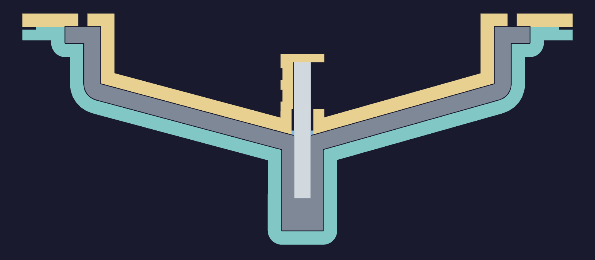
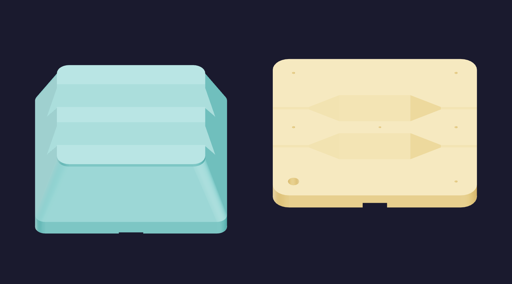

# Funnel mold

Two PETG bodies form the [funnel](../funnel/README.md): a cavity on a rounded
foot and a core that prints inverted on its flat back. Each body has two open
V channels through its print back. All remaining stock prints at 100% fill.
The forming geometry comes directly from `funnel.build_solids()`.


The cavity has a [146 mm](FOOT_WIDTH) foot. Its outer taper is at least
[60°](TAPER_ANGLE) above the print bed, including the rounded corners, advancing
outward by at most [0.23 mm](TAPER_GROWTH) per 0.40 mm layer. A
[6 mm](REGISTER) locating skirt and one broad key set the closing position.
Four opening notches expose solid bearing lands. The fill hole and five casting
vents pass straight through the core plate.

The [6.35 mm](ROD_D) × [50.8 mm](ROD_LEN) steel dowel forms the spout bore and
seats [28.8 mm](SOCKET) into the core. An offset vent connects the socket's
clearance to the dry back. Both forming faces reserve [0.20 mm](FINISH) of net
finishing growth. The casting, including the sacrificial spout tip, is
[135 mL](CAST_VOLUME).



Teal is the cavity, gold is the core, grey is silicone and light grey is steel.
The assembled mold fits inside a [271.0 mm](ENVELOPE) circle, with
[14.4 mm](CHAMBER_GAP) radial clearance to the recorded chamber diameter.
Fit through the actual opening and onto the catch tray is a bench check.

## Back channels



Each V channel opens through both sides above a flat shelf. The CAD checks a
clear 1 mm diameter passage along its length. The roofs are at least 59° to the
print bed, closing inward by at most 0.24 mm per side per 0.40 mm layer. The
pointed roof has no horizontal ceiling. Cavity channels are 28 mm deep; core
channels reach 32 mm and taper to 3 mm at their side mouths.


The closest channel-to-forming-face backing is 9.4 mm in the cavity and 6.8 mm
in the core. Each body is one connected solid. The cavity has
[113.8 cm²](CAVITY_BED_CONTACT) of bed contact and the core
[316.4 cm²](CORE_BED_CONTACT), each distributed over three strips.

The channels communicate with chamber air during evacuation. Keep their mouths
clear of coating, tape, silicone overflow and fixtures. The forming faces require
a continuous sealing finish. Physical printing, vacuum cycling and release with
the finishing stack remain to be verified for this geometry. The
[print log](print-log.md) records observed specimens and their source revisions.

## Print

[Default +0.04 trim](funnel-mold.3mf) · [Alternate +0.18 trim](funnel-mold-z018.3mf) ·
[Saved printer, filament and process presets](funnel-mold-presets.bbscfg)

| Body | Envelope | Estimated print | PETG |
| --- | --- | --- | --- |
| [Cavity](cavity.step) | [189 × 189 × 72.6 mm](CAVITY_DIMS) | [23 h 18 min](CAVITY_TIME) | [1534 g](CAVITY_MASS) |
| [Core](core.step) | [201 × 201 × 50.4 mm](CORE_DIMS) | [16 h 53 min](CORE_TIME) | [1117 g](CORE_MASS) |

Together the two plates use [2.65 kg](TOTAL_MASS) and take
[40 h 11 min](TOTAL_TIME). Each needs filament refill beyond a 1 kg spool.

The projects use the left 0.8 mm High Flow nozzle, translucent PETG at 255 °C,
an 18 mm³/s flow cap, 0.16 mm layers at forming slopes and fit details, and
0.40 mm through bulk stock. Outer perimeters are capped at 40 mm/s. Overhang
speeds are 30 / 30 / 25 / 10 mm/s, with 90% part cooling on all outer perimeters
after the first three layers. Conventional seams use the back position with
overhang avoidance; travel planning detours around perimeter walls where possible.
The slices contain no support, brim or skirt paths.

The [corner trial](corner-trial.3mf) is a full-height section of the current
cavity with the same presets and layer bands. It exercises the outer taper;
its smaller mass and shorter layer times do not reproduce the whole mold's
thermal conditions. Its [profile](corner-trial-profile.json) records the source
geometry, settings, G-code and estimate.

[design.json](design.json) records CAD measurements.
[print-profile.json](print-profile.json) records settings, estimates and checksums.
[layer-review.json](layer-review.json) checks model-section connectivity at the
actual layer heights. [toolpath-review.json](toolpath-review.json) records the
commanded outer-wall speeds, cooling and seam positions.

## Finish, cast and open

Prove the PETG, coating, release and [silicone](silicone.md) together on a finishing
sample. Measure the net finish; keep the parting lands, locating skirt, key and
bores bare.

1. Check the bare mold in the chamber. Dry-fit the key and skirt, and clear the
   dowel socket until the actual pin slides freely to its seat. Keep its vent open.
2. Degas mixed silicone in a separate container. Fill the open cavity, including
   the blind spout pocket. Align the key and lower the core slowly with the dowel
   installed. Seat the parting lands evenly and top up through the fill hole.
3. Keep fill and air passages open during a filled-mold vacuum cycle, with room
   for expansion and a catch tray. Return to ambient pressure slowly, check the
   fill level and top up while the silicone remains workable. Keep the core seated
   through cure.
4. Trim cured overflow flush with the port mouths. Begin opening in small,
   alternating movements at opposite notches with a blunt flat tool. Peel the
   accessible silicone brim to admit air, lift straight and follow the dowel's
   movement. Peel the casting from the tooling, withdraw the dowel axially and
   cut the sacrificial tip at its trim shoulder.

## Regenerate

Run [funnel_mold.py](funnel_mold.py) with the project's CadQuery Python:

```sh
tools/cad-venv/bin/python hardware/printed-parts/zone-c/funnel-mold/funnel_mold.py
tools/cad-venv/bin/python tools/funnel-mold-print/prepare_print.py --models hardware/printed-parts/zone-c/funnel-mold --output /tmp/funnel-mold-build/default-input.3mf
```

Prepare the alternate input with `--z-trim 0.18`. Slice both inputs in Bambu
Studio, then run [verify_print.py](/tools/funnel-mold-print/verify_print.py) with
this models directory and the slice directory. The hand-run tools are in
[tools/funnel-mold-print](/tools/funnel-mold-print/).

After publication, run [review_geometry.py](/tools/funnel-mold-print/review_geometry.py)
and [review_layers.py](/tools/funnel-mold-print/review_layers.py) with this models
directory. The layer review also takes `--project funnel-mold.3mf`.

[prepare_trial.py](/tools/funnel-mold-print/prepare_trial.py) extracts the corner
into a separate output directory. Prepare that directory with
`prepare_print.py --only cavity`, slice it, then audit with
`verify_print.py --single --project-stem corner-trial`.

## Sources
[value](NAME) texts are updated by:
- `/tools/funnel-mold-print/verify_print.py`
