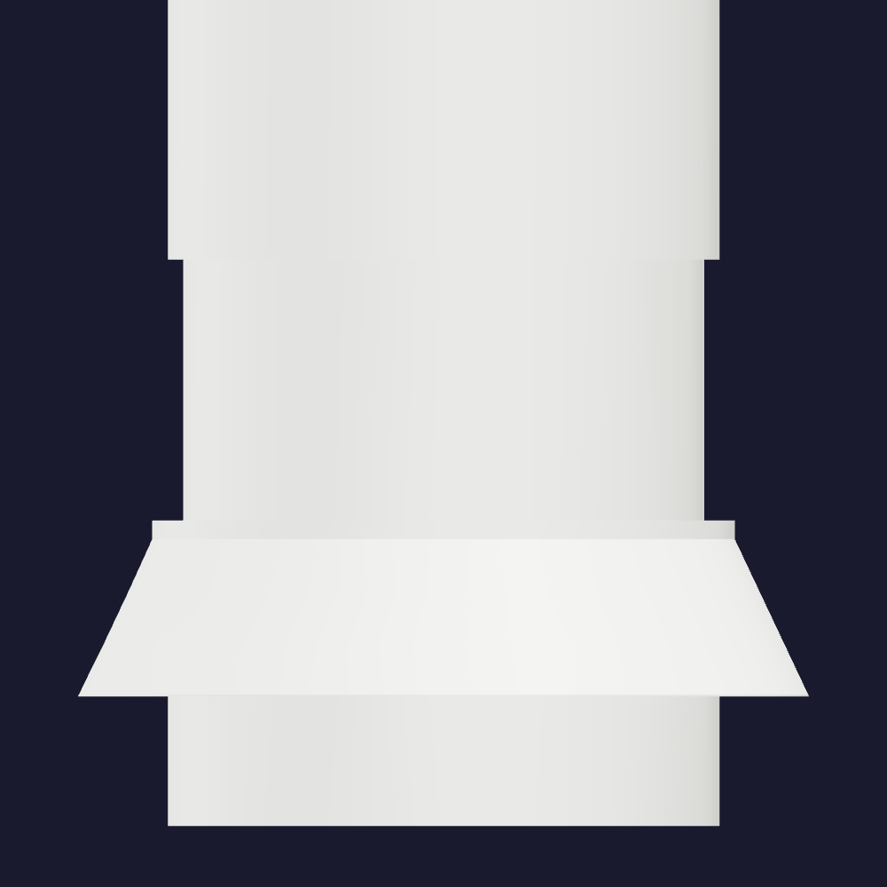
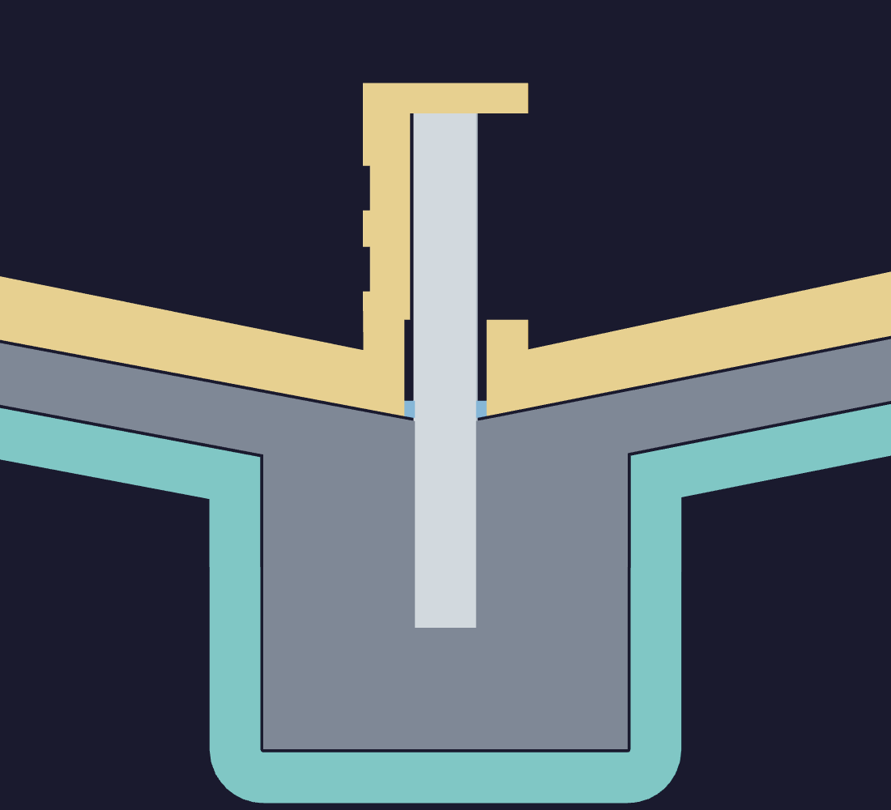

# Funnel mold

Two PETG shells and a short removable PETG forming pin cast the complete
[funnel](../funnel/README.md): rectangular block, flat bearing face and staged
8.4 mm entry, 6.7 mm relief and 6.0 mm by 3.0 mm sealing land.
The [Letter shop guide](../../../mold-guide/README.md) shows preparation,
finishing, pour, cure and opening. The pin is a separate tooling part.


The nominal silicone ramp, brim and collar are 6 mm thick. The
[funnel wall measurements](../funnel/wall-review.json) cover the complete native
surfaces. The two shells have [5 mm](SKIN) minimum ramp backing and
[5 mm](FLANGE) bare clamping flanges. The core's 0.30 mm brim finishing recess
leaves 4.70 mm behind that pocket. The lower blind seat has 5 mm radial backing and 5 mm floor stock. The
upper straight-seat dry boss has 5 mm radial stock and a 5 mm roof. Its
1 mm mouth chamfer reduces the nominal boss annulus to 4 mm at that opening;
the mouth also intersects the bowl-forming face. A solid geometry
check establishes stock, not printed stiffness or lifetime.

Eight [5 mm](BOLT_D) through-holes take M4 × 20 bolts, 9 mm OD washers and nuts.
Small clamps can reach the flat flange backs. Tighten opposite stations
incrementally until the bare parting lands meet. The two locating pegs are
[3 mm](LOCATOR_HEIGHT) tall, with [0.60 mm](LOCATOR_CLEARANCE) radial clearance;
one mating hole is slotted in X for spacing error. Asymmetric locations set
the drain orientation. Four edge notches admit a blunt opening tool.


## Finish the forming faces

Both shell forming faces reserve [0.30 mm](FINISH) of net finishing growth,
including primer, sealer and release. Sand and coat a same-stack witness,
then measure its net growth. Mask the bare lands, locating pegs and holes,
clamp holes, both blind pin seats and their stop faces. The bare lands set
closure height; the pin seats remain loose and uncoated.

The [raw pin](forming-mandrel.step) reserves 0.05 mm normal growth on its wet
profile. The [finished reference](forming-mandrel-finished.step) defines the
measured target. Mask the pilot's first millimetre and the upper dry shank from
print Z13.064821 to Z20.764821. The lower end is the axial datum. Inspect and
measure the full wet profile before casting.

| Wet feature | Raw tool | Finished target |
| --- | --- | --- |
| Entry | 0.05 mm normal reserve on lead and shoulder | 8.4 mm entry; 1.8 mm lead to 6.7 mm |
| Relief | 6.6 mm diameter × 0.164821 mm axial length | 6.7 mm diameter × 0.214821 mm axial length |
| Sealing land | 5.9 mm diameter × 3.0 mm axial length | 6.0 mm diameter × 3.0 mm axial length |
| Upper throat | 6.25 mm diameter on its reserved cylindrical zone | 6.35 mm diameter |

Measure net finishing growth on the actual PETG, abrasion, sealer and release
stack. Keep the tiny relief open and the entire 3 mm land cylindrical. Check the
relief and transition edges under magnification against the reference; a
coating assumption does not establish the target. The acquired acrylic sealer,
release and silicone are in the [purchases ledger](../../../ledger/purchases.md).
Prove cure, release and coating adhesion on a same-stack sample.
[Smooth-On's printed-mould guidance](https://www.smooth-on.com/support/faq/101/)
describes acrylic sealing and compatibility checks.



## Short pin and loose blind seats

The contoured pin is [20.7648 mm](ROD_LEN) long. Its [6.35 mm](ROD_D) dry zones
locate in [6.75 mm](ROD_GUIDE_D) blind seats with
[0.4 mm](ROD_CLEARANCE) diametral clearance. The lower seat is
[1.5 mm](SOCKET_DEPTH) deep below the block bottom. Its bare floor supports
the pin's flat pilot end and sets its axial position. The upper seat has
[7.7 mm](ROD_ENGAGEMENT) nominal engagement and [0.20 mm](ROD_ROOF_GAP) clearance
above the pin's upper end when the bare mold lands meet.

Place the finished pin in the lower cavity seat before filling. It rests on
the floor; lower the core over the short upper shank. Both seats locate its
axis. The upper pocket breathes through its annular entrance toward the bowl
as the core descends. It is closed toward the dry back, so silicone that enters
stays inside the mold. No external entry seal or pin fastener is required.

Use the seats as loose drop-in locations. Do not press the pin in or force the
mold closed. Remove supports and debris, inspect the bare short seats, and
finish binding high spots until the pin reaches the lower floor and the core
closes freely on the lands. Inspect the pin length and roof clearance if
closure binds. The documented [physical fit record](print-log.md#rod-fit--2026-09-13)
qualifies neither these seats nor the finished pin.

The [native check](forming-mandrel-check.json) screens simultaneous
[0.08 mm](ROD_OFFSET) lateral offset, [0.3°](ROD_TILT) tilt and up to
[0.1 mm](ROD_AXIAL) lift from lower-floor contact in eight directions. The
lower pilot's low rim establishes contact in tilted poses. All 72 poses clear
both shells, remain below the upper roof and keep the complete pilot end below
the block bottom. This is a combined positioning screen, not permission to
cast with deliberate misalignment or a physical fit allowance.

The plain acquired 6.35 mm steel dowel cannot directly form this funnel's
6.0 mm sealing land. The short contoured PETG pin supplies that profile; the
funnel's installed seal and mating hardware stay as defined in their sources.



## Pour, cure and open

1. Remove supports through the dry backs and short seat mouths. Finish and
   measure the shells and pin, protecting the bare registration zones. Dry-fit
   the pin on the cavity's lower floor, then lower the core. Confirm that the
   bare lands meet without pressing the pin. Check coated closure with a light
   behind the seam and hold the flanges evenly.
2. Prove the actual PETG, finishing, release and [silicone](silicone.md) stack
   on a same-stack cure and release sample. Degas mixed silicone in a separate
   container with expansion room.
   [Smooth-On's vacuum example](https://www.smooth-on.com/tutorials/making-piece-cut-block-mold/vacuum-de-gassing/)
   shows that headroom.
3. Stand the released pin in the lower seat. Fill the open cavity around it,
   keeping it on its floor. Lower the core slowly onto its upper shank. Seat
   and hold the flanges, then top up through the [11 mm](FILL_D) fill hole.
   Keep the five [4 mm](VENT_D) vents open.
4. For a filled-mold vacuum cycle, place the complete mold and catch tray inside
   the chamber. Keep the fill, vents and both dry backs open to that same
   chamber; evacuate and vent slowly while the silicone is fluid. Recheck fill
   level and top up. Cure at ambient pressure with the flanges held together.
5. Trim port overflow. Open opposite notches in small alternating movements.
   Peel the accessible brim to admit air and lift the core off the free pin.
   Peel the casting and pin together from the cavity.
6. Trim the thin annular flash and its tapered lip at the accessible bowl throat and the pilot collar flush
   with the block bottom, outside the sealing land. Withdraw the pin toward
   −Z. The 6.35 mm upper shank crosses the 6.0 mm land with 5.83% diametric
   silicone expansion. This uses silicone flexibility; release force, surface
   damage and coating retention are unqualified. Inspect and clean the seats
   and pin before another cast.


Teal is cavity, gold core, grey nominal silicone and light grey the finished
pin. Thin seat flash is additional trim stock, outside the nominal finished
casting. The casting is [219 mL](CAST_VOLUME); the block is
[36 × 41 mm](PLUG_BLANK). The two halves fit inside a
[278.5 mm](ENVELOPE) circle, with [10.6 mm](CHAMBER_GAP) nominal radial clearance
in the recorded chamber. Check the actual chamber mouth, bolts or clamps and
catch tray before pouring.

## Load and verification

The tooling is for equalized chamber pressure. It is not rated for a sealed
one-atmosphere pressure differential or pressure injection. Its open passages
allow pressure to equalize; silicone head and release forces remain loads.

[design.json](design.json) records a flat-plate screening approximation: a
simply supported [165 mm](LOAD_SPAN) PETG square, [5 mm](SKIN) thick, under
[1.00 kPa](LOAD_PRESSURE), assumed [1000 MPa](LOAD_MODULUS) modulus and
Poisson ratio 0.4. Calculated deflection is [0.243 mm](LOAD_DEFLECTION), against
[0.598 kPa](HEAD_PRESSURE) maximum static silicone head. This model does not
establish printed shell stiffness, creep, release force or vacuum transients.
The pin's separate [static head screen](forming-mandrel-check.json) carries
its own geometry and material assumptions.
Bambu's [PETG data sheet](https://store.bblcdn.eu/s8/default/71ca815e70e74afc96ff5883f003235f/Bambu_PETG_Translucent_Technical_Data_Sheet.pdf)
reports conditioned specimen properties; a saved profile is not a measured
allowable for this tooling.

The generator checks all forming/backing boundaries, closure, pin withdrawal,
combined pin positioning and complete nominal casting containment.
[containment-review.json](containment-review.json) independently checks the
exact STEP and STL complements with only intended fill and vent mouths
capped. The two native blind pin seats need no artificial entry seal.
[forming-mandrel-check.json](forming-mandrel-check.json) independently compares
the whole nominal finished casting with the current native funnel and source,
including every block, ramp, brim and collar surface and the staged bore.
Trim flash, coating porosity, finished fit and physical casting quality remain
physical checks.

## Print and regenerate

[Editable Bambu project](funnel-mold.3mf) ·
[Current native slice review](native-slice-reviews/2026-10-04-short-pin/README.md)

The two shell plates use PETG Translucent, left 0.4 mm Standard nozzle,
0.88 flow, 5.61702 mm³/s maximum volumetric speed, 0.20 mm first layer,
0.24 mm subsequent layers, two walls, 100% zig-zag fill and automatic
Snug normal supports. The +0.18 mm requested trim emits `G29.1 Z0.16` on
Textured PEI. The cavity prints upright and core inverted on its dry back.
The short pin prints pilot down with the separate recorded local fine bands.
No physical print is submitted by these preparation and review commands.

```sh
tools/cad-venv/bin/python hardware/printed-parts/zone-c/funnel-mold/forming_mandrel.py
tools/cad-venv/bin/python hardware/printed-parts/zone-c/funnel-mold/funnel_mold.py
tools/cad-venv/bin/python tools/funnel-mold-print/review_forming_mandrel.py
tools/cad-venv/bin/python tools/funnel-mold-print/review_containment.py \
  --output hardware/printed-parts/zone-c/funnel-mold/containment-review.json
```

The [print log](print-log.md), submitted [jobs](print-jobs.json) and dated
native slice receipts preserve the geometry and process hashes of their own
physical or offline observations. The current short-pin tooling has no
physical finished-pin, coated closure, vacuum-cycle, seal, release or casting
qualification. The accepted [v4 elbow-cradle trial](../funnel/cradle-trial/physical-acceptance.json)
retains its frozen print scope and 0.65 mm catch gap.

After publication, run [review_geometry.py](/tools/funnel-mold-print/review_geometry.py)
in the documented print orientations and answer intentional supported faces.

## Sources

[value](NAME) texts are updated by:
- `/tools/funnel-mold-print/verify_print.py`

## Sources
[value](NAME) texts are updated by:
- `/tools/funnel-mold-print/verify_print.py`
