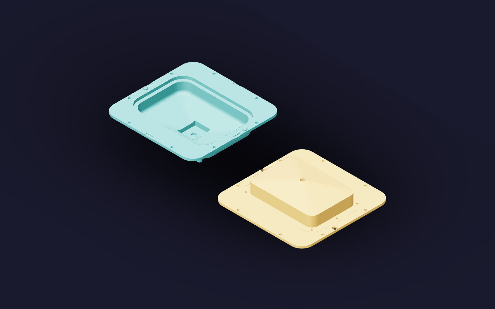
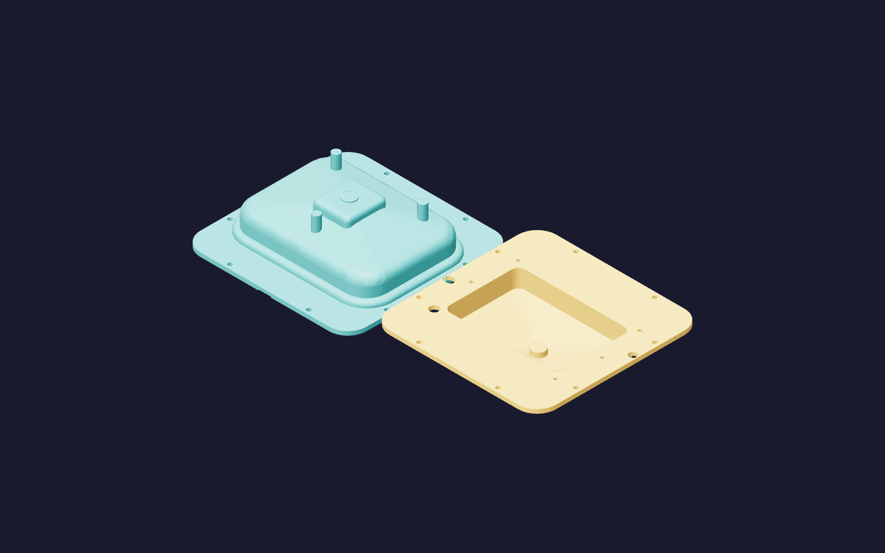
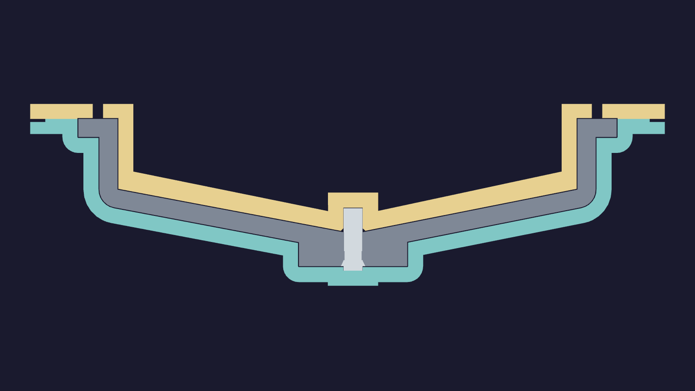

# Funnel mold

Two PETG pieces, **cavity and core**, and one **straight 6 × 25 mm stainless
steel rod** cast the complete removable [funnel](../funnel/README.md).
The rod forms a uniform 6 mm outlet. The silicone grips the 6.35 mm LLDPE
drain stub over its full 5.015 mm insertion depth; the funnel lifts off for cleaning.



The clamping flanges are **211 × 163.683 mm**, with 16 mm margin around the
179 × 131.683 mm silicone brim. The cavity has a flat 164.85 × 117.533 mm base and a **63.4° corbel**
supporting its flange. The core has a flat dry back and one **41.085 mm
circular tapered access hole** leading to the straight rod guide. Both bodies
retain at least 5 mm ramp backing and 5 mm flange thickness. The core's 0.30 mm brim-finishing pocket retains
4.70 mm backing. Eight 5 mm holes take M4 × 20 bolts, 9 mm OD washers and nuts;
Eight shallow pockets give side access to the cavity bolt heads. Their short
ceilings receive removable Snug support; the corbel and core access taper
print without support. Two locating pegs orient the halves.
Four edge notches admit a blunt opening tool.

## Rod and guides

Use a smooth [uxcell 6 × 25 mm 304 stainless dowel](https://www.amazon.com/dp/B07Z18CKCY).
The 25-piece pack was Prime-listed at $8.99 on 2026-10-05. This is reusable
shop tooling, supplied separately from the two prints. Its factory end chamfers
sit outside the silicone forming span.

The core has a straight **6.4 mm open guide**, 7.7 mm long after the shell's
finishing allowance. The cavity has a **6.4 mm lower seat**, 1.5 mm deep, with
5 mm floor backing. The rod rests on this floor and projects **4.235 mm** above
the guide. Close the empty mold and drop the rod through the open dry back.
It must reach the floor and lift out freely. Clear support residue or binding
high spots without enlarging the forming bore.

The open guide lets air and small amounts of silicone enter the accessible dry
back. Trim cured guide overflow at the bowl throat and lower-seat flash flush
with the block bottom. Keep the guide clear during filling and vacuum cycling.



## Finish and cast

1. Remove the accessible bolt-pocket supports. Drill two **1.5 mm infill
   breather holes** in each body's bare dry side, using a depth stop:
   cavity side walls at **X = ±82.425 mm, Y = ±30 mm, Z = 2.5 mm**,
   drilling **3.2 mm horizontally inward**; core flat back at
   **XY = (−40, −30) and (40, 30)**, drilling **1.8 mm inward**.
   XY is relative to the brim centre and Z is above the cavity bottom.
   The side entries keep cavity breathers clear of a flat tray. These holes
   pierce the six-wall or six-layer skins into the gyroid; leave them uncoated.
   Sand and seal the mold forming faces, using their 0.30 mm
   net finishing reserve. Keep the parting lands, locating features, clamp holes,
   rod guides and lower stop bare. Dry-close on the lands and check the rod's
   drop-in fit. Clean the steel rod; apply a light release film to it and both
   forming faces. Use the actual finishing/release stack on a same-stack cure
   and release sample before the full pour.
2. Mix the [BBDINO 40A silicone](silicone.md) at the container's ratio. The
   batch allocation follows [the generated casting volume](design.json), plus
   10% for mixing and port flash. Degas in a separate cup with expansion room.
3. Set the rod in the cavity's lower seat. Fill around it, then lower the core
   slowly over the rod until the bare lands meet. Tighten opposite flange
   stations gradually. Top up through the 11 mm fill hole; keep all five 4 mm
   vents and the open rod guide clear. Use a catch tray.
4. If vacuum cycling the filled mold, put the complete mold and tray inside the
   chamber. Keep fill, vents, rod guide and infill breathers connected to chamber air.
   Keep the side breathers clear of silicone overflow.
   Evacuate and vent slowly while the silicone is fluid, then top up and cure
   at ambient pressure. Follow the material record's five-hour demold hold and
   24-hour full-use hold at 23 °C, and the actual container instructions.
5. Remove the flange hardware. Open opposing notches a little at a time and peel
   the brim to admit air. Lift the core straight off the rod, then peel the
   casting and rod out of the cavity. Support the block and slide the released
   rod out along its axis. Trim seat, guide, fill and vent flash. Keep the 6 mm
   cylindrical bore and flat bearing face intact.
6. Clean the funnel and fit it over the drain stub until the brim and block are
   seated. Check the normal filling, lift-out and refitting operation. Clean
   the rod and tooling before another cast.



The [illustrated Letter guide](../../../mold-guide/README.md) follows this
procedure. The tooling uses equalized chamber pressure and gravity filling. The maximum
54 mm silicone head produces about **0.60 kPa**. The sparse interior breathes
through the drilled dry-side holes; wall count and infill percentage do not
establish a stiffness or lifetime rating. The [print log](print-log.md) records
a successful 15% infill mold with Snug supports on September 16.

The acquired [5-gallon chamber](../../../ledger/tools.md) is recorded with a
**299.72 mm interior diameter and height**. The rounded mold fits within a
**247.88 mm circle**, leaving **25.92 mm radial clearance**. With the specified
M4 × 20 closure hardware it is about **70.35 mm high**. Use a catch tray no
larger than 260 mm across and keep it clear of the breathers. The
[chamber check](chamber-check.json) binds these dimensions to the native parts
and the acquired chamber record; physical insertion is not recorded.

## Print files and checks

[Mark1 editable two-plate Bambu project](native-slice-reviews/2026-10-06-mark1-retry-v1/funnel-mold-mark1-retry.3mf) ·
[Cavity STL](cavity.stl) · [Core STL](core.stl) ·
[Current native slice and cavity retry](native-slice-reviews/2026-10-06-mark1-retry-v1/README.md)

PETG Translucent Clear through Mark1's AMS HT-A, right 0.4 mm Standard nozzle, 0.88 flow,
5.61702 mm³/s maximum volumetric speed, 0.20 mm first layer, 0.24 mm layers
above, **six walls, 15% gyroid infill, six top/bottom layers** and Snug normal
supports for the bolt pockets. The cavity
prints upright; the core prints inverted on its dry back. The Textured PEI
recipe uses the recorded +0.18 mm requested trim (`G29.1 Z0.16`). The native
slice estimates **28.99 hours and 589.79 g** for both pieces; the cavity is
**17 h 24 min / 356.56 g**. The core has no
supports; the cavity has eight accessible support columns at the bolt pockets.
First-layer walls/infill run at 20/30 mm/s with an 8 mm outer brim. The full
deposited footprint clears the usable bed edges by at least 45 mm on the
cavity and 39.565 mm on the core. Probing clump checks remain Off. The retry
launch plan requires Timelapse On and calibration for the replacement
assembly and new nozzle. The cavity is prepared; no retry start is authorized.

[Rod and casting check](rod-check.json) verifies the straight stock profile,
open guide, drop-in and withdrawal paths, and complete casting equality with
the native funnel. [Closure check](containment-review.json) caps the intended
fill, vent and rod-guide mouths only in its analysis and checks for other
escape paths. The guide is open in both the CAD and printed parts.
[Wall measurements](../funnel/wall-review.json) cover the funnel's surfaces.
The [physical print log](print-log.md) and dated slice receipts retain the
geometry and process scope of their recorded results.

```sh
tools/cad-venv/bin/python hardware/printed-parts/zone-c/funnel/funnel.py
tools/cad-venv/bin/python hardware/printed-parts/zone-c/funnel-mold/funnel_mold.py
tools/cad-venv/bin/python tools/funnel-mold-print/review_rod.py
tools/cad-venv/bin/python tools/funnel-mold-print/review_containment.py \
  --output hardware/printed-parts/zone-c/funnel-mold/containment-review.json
tools/cad-venv/bin/python tools/funnel-mold-print/review_chamber.py
```

After publication, run `tools/funnel-mold-print/review_geometry.py` in the
recorded print orientations and address its findings.

## Sources
[value](NAME) texts are updated by:
- `/tools/funnel-mold-print/verify_print.py`
