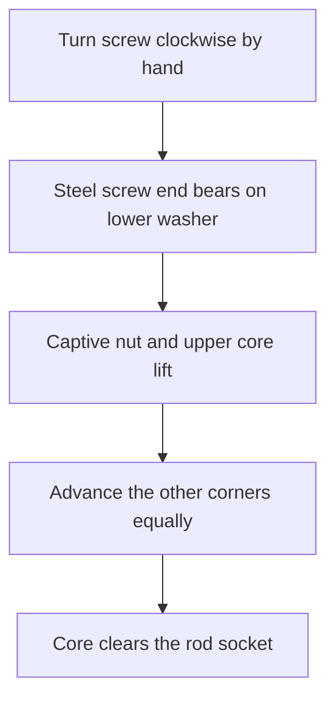

# Controlled core extraction

Four small screw jacks can lift the core straight off the steel rod. Each screw
passes through a captive steel nut in a reinforced ear on the core plate, and
its end rests on a steel washer in a locating pocket on the cavity. These ears
sit outside the silicone-forming faces.

When a screw turns clockwise, its thread tries to move its end downward through
the nut. The lower mold stops that motion. The reaction moves the nut and core
upward instead. Moving around the four corners in equal quarter-turns raises the
core in small, controlled increments. This provides control of displacement;
it does not automatically equalize force or guarantee that the rod stays still.

The proposed working travel is at least 30 mm. The existing skirt guides only
the first 10 mm, while the rod engages 28.8 mm into the core. Four external guide
features need to maintain alignment through the rest of that travel. A design
that merely pries the skirt loose still leaves most of the rod engaged.

## Hardware

Prime availability below was checked in the signed-in Chrome session on
2026-09-08. Quantities in this table are for one mold.

| Item | Needed | Where it comes from |
|---|---:|---|
| M5 × 0.8 × 50 mm fully threaded socket-head screws | 4 | [SVLING, 40-pack, $7.99](https://www.amazon.com/dp/B0GHNQFZYR). Prime delivery shown for September 10; 4 mm hex key included. |
| M5 × 0.8 square nuts, 8 mm square × 4 mm thick | 4 | [100-pack](https://www.amazon.com/dp/B0F6B5X6CX). The purchase ledger lists this pack as ordered September 3. Check the delivered stock before ordering more. |
| M5 × 25 mm OD steel fender washers | 4 | [The owned 60-pack](https://www.amazon.com/dp/B0GSMDY5GL), marked acquired in the ledger. |
| Core ears, captive-nut seats, washer pockets and guides | One set | Printed features designed around the mold. |

The long screws are the only likely new purchase. The existing M5 × 10 mm screws
are too short for the required travel. The ground spout rod remains the existing
¼-inch × 2-inch pin.

The jack bears on the **solid ring of the washer**, about 8 mm from its centre,
with its pocket preventing the washer from sliding. The end must not stand over
the washer's centre hole. The whole washer rests on a solid supported pad; its
thickness and screw-end contact are checked before setting the pocket depth.
A replaceable steel washer spreads the load and takes the screw's rotating contact.

A captive nut seats against a substantial printed roof in the core ear, putting
the nut into direct bearing as it lifts the core. The owned heat-set inserts can
be useful for fastenings; this axial extraction load is better carried by that
positive nut seat. Each ear also needs reinforcement back into the core frame,
and each lower pad needs a load path down to the cavity feet.

## Use and scope

After full cure, remove the holding clamps, bring all four jacks into gentle
contact, then advance each by a quarter-turn in a diagonal sequence. M5 × 0.8
threads advance **0.20 mm per quarter-turn**. Watch the gaps and rod, and stop if
one corner loads up while another releases. Drive them with a hand hex key, where
resistance is felt directly.

The ribs-and-finishing print project supplies the mold with manual extraction.
These jack ears and long-travel guides are a concrete proposed addition; they
are not represented as installed or tested in that file. Their final placement,
thread engagement, plate clearance and load-bearing dimensions must be resolved
together before adding the mechanism to a production print. It will require a
revised mold or a separately fitted extraction frame.

My recommendation is the combination of printed custom supports and steel
threads/bearing pads. Buying a generic puller would still require a fixture to
hold this broad square mold; printed screw threads would make the most heavily
loaded sliding surfaces part of the disposable tooling.
