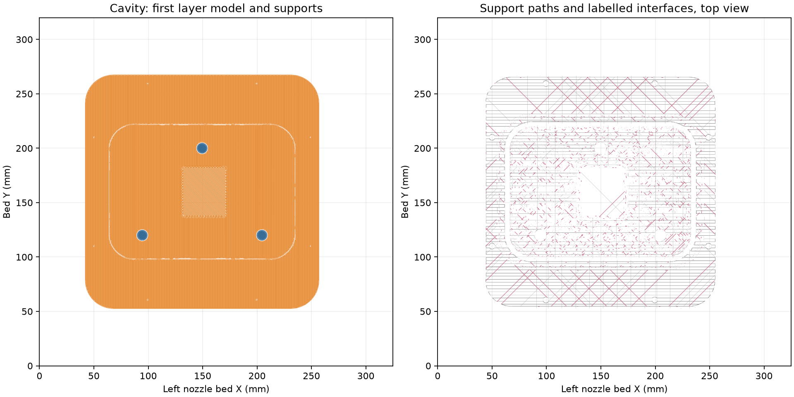
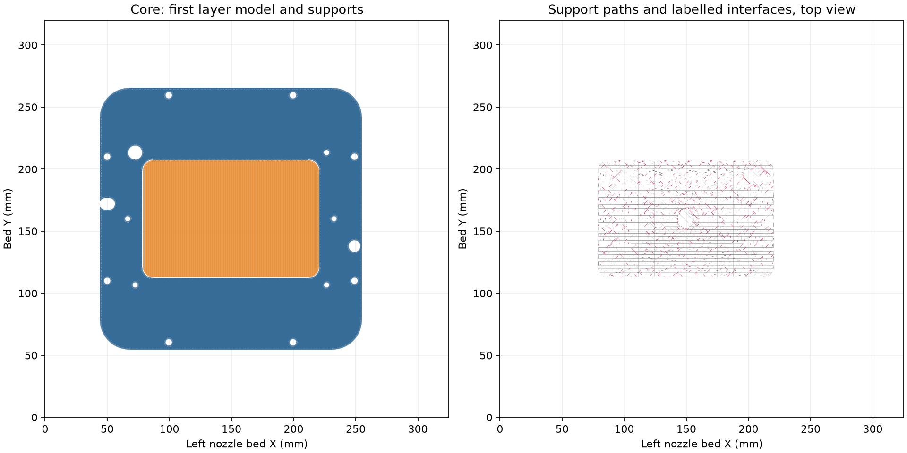

# Current mould native slice review

The current cavity and core STLs slice successfully on H2C with the documented
PETG recipe. Their exact STEP/STL hashes match the passing
[containment review](../../containment-review.json). Both embedded meshes match
the current STLs, including their faces. The
[review record](readiness-review.json) binds the native files, prepared project,
emitted G-code, recipe, support readings and post-publication geometry lint.

This tooling produces a rectangular plug blank with a straight 6.35 mm dowel
bore. It does not form the finished funnel's 8.4 mm entry, 6.7 mm relief or
6.0 mm sealing land. Native point probes and solid differences confirm that
limitation. Complete those forming features before preparing a finished-funnel
casting. No mould print was submitted in this review.

| Plate | Orientation | Layers | Estimated time | PETG | Minimum deposited-path bed margin |
| --- | --- | ---: | ---: | ---: | ---: |
| Cavity | Upright | 429 | 28 h 13 min | 559.86 g | 42.0 mm |
| Core | Inverted | 311 | 19 h 27 min | 385.14 g | 44.0 mm |

The separate current project retains the complete settings payload from the
documented September 18 print input: left 0.4 mm Standard nozzle, PETG
Translucent, 0.88 flow, 5.61702 mm³/s, 0.20 mm first layer, 0.24 mm subsequent
layers, two walls, 100% zig-zag fill and automatic Snug normal supports. The
emitted Textured PEI trim is `G29.1 Z0.16`. The slicer records its purge-volume
and unused-nozzle metadata normalizations separately. Frozen projects and
submitted-print records retain their own geometry scope.

The [cavity support record](cavity-support-topology.json) reads one bed-rooted
support group and four labelled interface regions. The
[core support record](core-support-topology.json) reads one bed-rooted group
and eight interface regions. These are quantized readings of every emitted
support path, rather than reconstructed solid support volumes. Cut and detach
support through the open dry backs, the exposed outer flanges and the open rod
cradle. Complete connected supports need not withdraw intact; physical cleanout
and clean release remain untested.

Post-publication lint has zero open findings on either mould half. The answered
features are the opening notches, finishing pocket and supported dry faces. The
rod-stop and brim-pocket planes differ by 0.05 mm but have zero actual projected
overlap; they do not create a thin shared ledge. The
[native face reading](readiness-review.json) binds that check to the current core.

The documented 0.88-flow print showed improved remaining roughness on its
square-mouth cavity. The current geometry has no physical print, coated closure,
vacuum-cycle, sealing or casting qualification.
