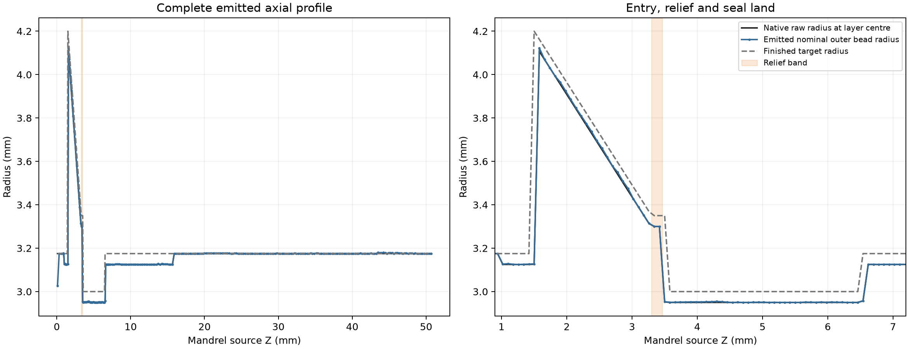
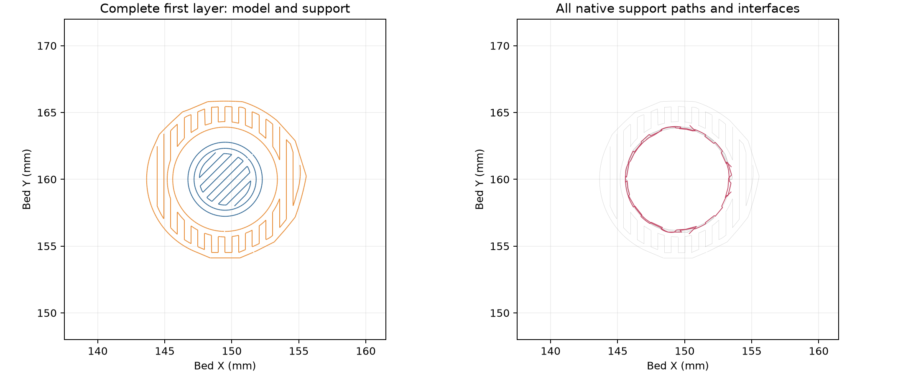

# Forming mandrel native slice review

The current native raw mandrel slices cleanly on H2C. The
[receipt](readiness-review.json) binds its exact STEP/STL, finished reference,
prepared project, native G-code, recipe and complete emitted support topology.
The estimate is **41 min 28 s and 1.823 g PETG**. The print orientation is socket
pilot down, with the axis upright and the native bottom at bed Z0.

The separate project retains the full saved mould settings payload: fixed left
0.4 mm Standard nozzle, PETG Translucent, 0.88 flow, 5.61702 mm³/s, two walls,
100% zig-zag fill and automatic Snug normal supports. The first bed layer remains
0.20 mm. The requested +0.18 mm trim emits `G29.1 Z0.16` on Textured PEI.

Local layers preserve the short relief. The range Z0.72–0.85 uses one 0.14 mm
layer through the dry socket pilot; Z0.85–7.12 uses 0.08 mm layers. That phase
places the entry shoulder and relief on their native axial stations. Normal
layers outside the local range remain 0.24 mm.

| Functional region | Native raw shape | Actual nominal emitted material |
| --- | --- | --- |
| Entry shoulder underside | Z1.540, exposed annulus 21.808 mm² | First expanded layer Z1.540–1.620; 0.050 mm axial reserve to the finished Z1.490 face |
| Relief | Ø6.600, Z3.300–3.464821 | Two 0.08 mm layers, Z3.300–3.460; nominal radial growth to target 0.04941–0.05817 mm |
| Seal land | Ø5.900 × 3.000, Z3.514821–6.514821 | 37 layers centred entirely in the land, depositing Z3.540–6.500; nominal radial growth to target 0.04572–0.06089 mm |

The receipt also records every adjacent transition layer and its radius against
the native and finished surfaces. The final dry-shank layer reaches Z50.820,
0.020 mm above the native 50.800 mm top. The first two model layers overlap by
28.657 mm² in their nominal bead footprints. Every emitted model, brim and
support path has at least 143.399 mm bed-edge margin.

The flat entry-shoulder underside at native print Z1.540 receives one bed-rooted
support group and one exposed annular interface. The interface is at
Z1.112–1.340, leaving the saved 0.200 mm gap below the emitted shoulder. Cut and
detach this support from the open radial sides. The
[support record](support-topology.json) includes every support path, including
bodies without interface labels; it is a quantized path reading rather than a
reconstructed support solid.

The raw print reserves stock for the separately measured finishing stack in
[the tool design](../../forming-mandrel-design.json). The finished target has
an 8.4 mm entry, 6.7 mm relief, 6.0 mm by 3.0 mm seal land and 6.35 mm throat.
Mask the specified bare registration zones and measure the finished profile
against the finished reference before casting. Finishing must retain the relief
and land transitions. Nominal emitted widths establish feature survival and
material placement; physical bead dimensions, adhesion, support removal,
finishing, release and casting remain unqualified.

The [complete tooling check](../../forming-mandrel-check.json) and
[shell review](../2026-10-03-centred-short-block/README.md) retain their own
geometry and print scopes. This isolated offline review submits no print.
