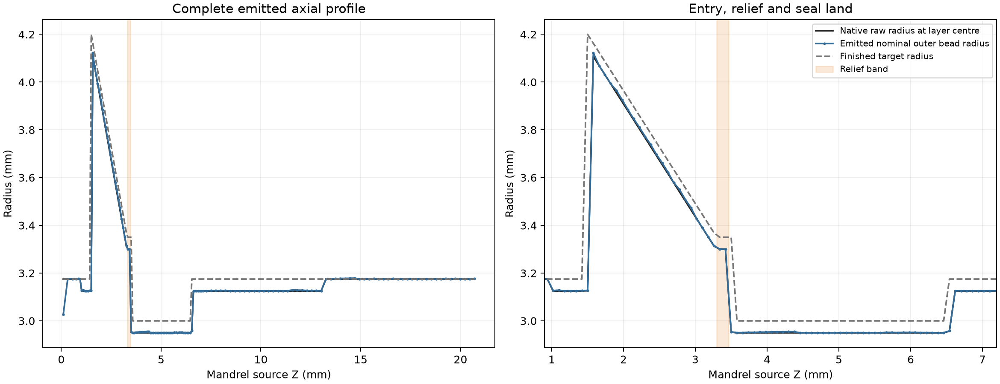
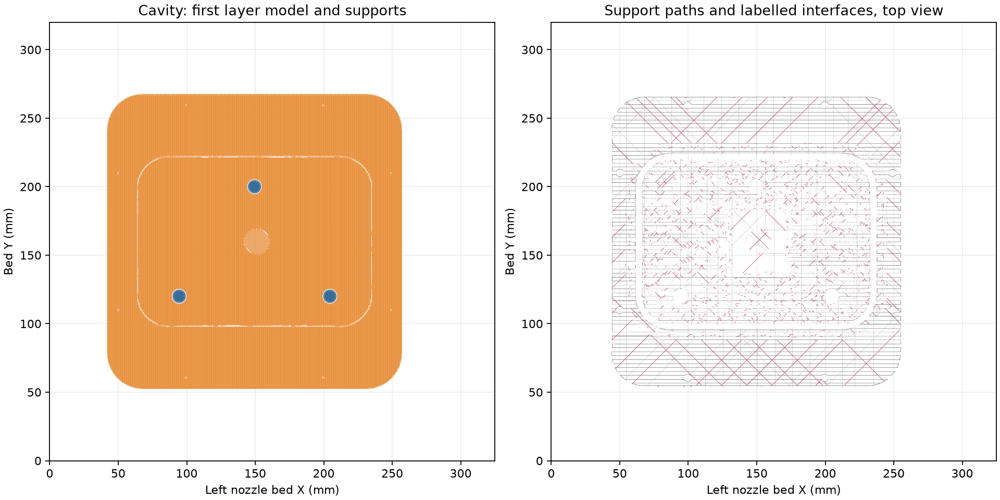
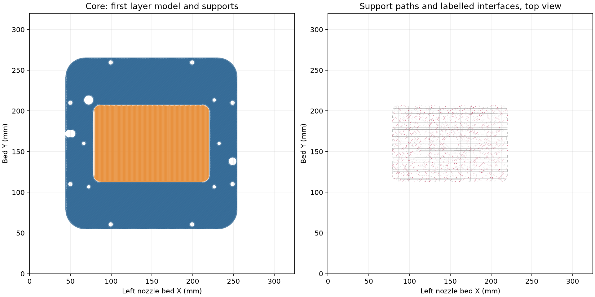
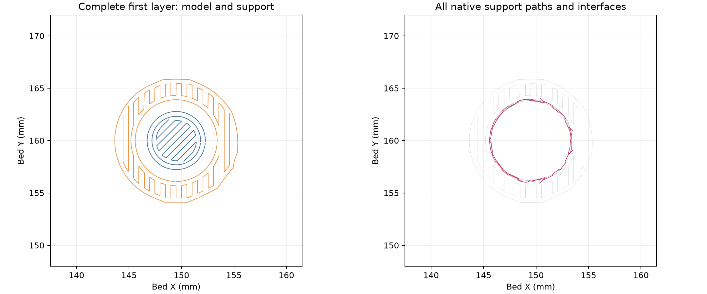

# Short-pin tooling native review

The two current PETG shell plates and the separate short forming pin slice
successfully with no plate warning. Their exact native STEP/STL, source,
editable project, G-code and settings hashes are bound in the
[shell receipt](shells/readiness-review.json) and
[pin receipt](pin/readiness-review.json). The committed editable projects are
[the two mold plates](../../funnel-mold.3mf) and
[the short pin](../../forming-mandrel.3mf).

| Part | Orientation | Layers | Estimated time | PETG | Minimum deposited-path bed margin |
| --- | --- | ---: | ---: | ---: | ---: |
| Cavity | Upright | 439 | 28 h 36 min 46 s | 568.53 g | 42.0 mm |
| Core | Inverted on dry back | 296 | 19 h 18 min 1 s | 383.04 g | 44.0 mm |
| Short pin | Pilot end down | 145 | 24 min 18 s | 0.780 g | 143.4 mm |

The global recipe is retained byte-exact in the preparation files: left
0.4 mm Standard nozzle, PETG Translucent, 0.88 flow, 5.61702 mm³/s maximum
volumetric speed, 0.20 mm first layer, 0.24 mm global subsequent layers,
two walls, 100% zig-zag fill and automatic Snug normal supports.
The requested +0.18 mm trim emits `G29.1 Z0.16` on Textured PEI.
Native output records the slicer's purge-volume and unused-nozzle metadata
normalizations. These are emitted settings and paths, not measured extrusion
quality or capacity.

The pin's local dry-pilot phase band uses one 0.14 mm layer over Z0.72–0.85,
then 0.08 mm layers over Z0.85–7.12. The short relief survives as two layers,
Z3.300–3.460, and the complete 3 mm sealing land is represented by the
fine-band material. The pin's raw top is Z20.764821; the last emitted model
layer reaches Z20.820, leaving 0.055179 mm to the measured length target.
The 0.20 mm core roof clearance is a geometric gap; inspect and finish the
bare end and dry zones to the measured reference before casting.



All three parts have one bed-rooted support group. The cavity has five labelled
interface regions, the core two and the pin one. The records read every emitted
support path, including bodies without interface labels. These quantized paths
identify support connectivity; they do not reconstruct solid supports or qualify
adhesion, clean removal or the physical forming finish.

The cavity's dry backing and feet are accessible from below. The core's dry
ramp and short blind-seat roof receive accessible support from its open back;
clear any support or brim residue from the short seat mouth before dry fitting.
The pin's exposed entry shoulder receives a bed-rooted annular interface,
with the retained 0.200 mm top gap. Cut that support from the open radial sides.
The blind seats locate the pin during normal closure; no press fit or exterior
entry seal is required.







The [complete forming-tool check](../../forming-mandrel-check.json) compares
the entire nominal finished casting to the current native funnel and complete
source CSG with zero solid difference in both directions. It records 72
combined seated poses, 160 upright full-lowering poses with 0–0.19 mm offset
and 88 positions along a feasible lead-in centering route. The route is a
geometric fit proof, not an operator alignment instruction or a contact-force
model. The [containment check](../../containment-review.json) includes all
native blind-seat volume and the tapered mouth, with only intended fill/vent
ports capped. Thin upper-seat flash and lower-pilot flash are accessible trim
stock outside the sealing land.

The [current review](../../current-slice-review.json) binds the committed shell
project; [toolpath-review.json](../../toolpath-review.json) records commanded
outer-wall speed, cooling and seams from this exact native slice.
The dated print log and prior slice receipts retain their own geometry scope.
This current offline review submits no print and supplies no physical pin fit,
finished profile, coated closure, vacuum-cycle, seal, release-force, lifetime
or finished-casting qualification.

The saved [shell preparation](shells/prepare.py) and [native review](shells/review.py),
and [pin preparation](pin/prepare.py) and [native review](pin/review.py), run
manually from the repository root. The full casting and closure checks use:

```sh
tools/cad-venv/bin/python tools/funnel-mold-print/review_forming_mandrel.py
tools/cad-venv/bin/python tools/funnel-mold-print/review_containment.py \
  --output hardware/printed-parts/zone-c/funnel-mold/containment-review.json
```
