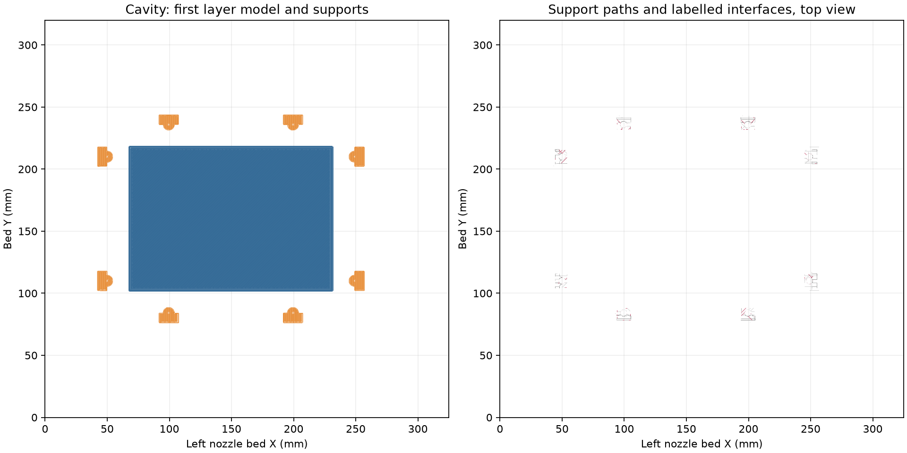
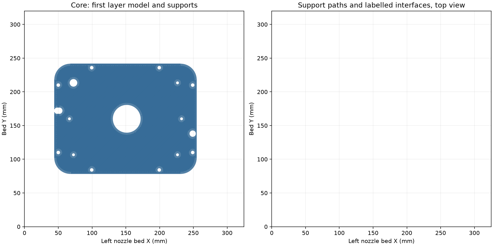

# Funnel mold native slice

Two PETG mold bodies and one stock straight 6 × 25 mm steel rod make the
complete tooling. The [editable two-plate project](../../funnel-mold.3mf)
contains the current [cavity](../../cavity.stl) upright on its flat base and
[core](../../core.stl) inverted on its flat dry back.

Both plates slice in Bambu Studio 02.08.02.61 without warnings. The
[native review](readiness-review.json) reads the embedded meshes, bed limits,
selected nozzle, Z trim and all emitted support bodies. The
[current receipt](../../current-slice-review.json) binds the editable project.

| Plate | Slicer time estimate | PETG estimate | Support bodies |
| --- | ---: | ---: | ---: |
| Cavity | 17 h 03 min | 355.61 g | 8 |
| Core | 11 h 05 min | 232.03 g | 0 |

Total: **28.14 hours / 587.65 g**. The core has no supports.
The cavity's eight bed-rooted support columns reach only its open bolt
pockets; their labelled interfaces extend to print Z50.88 mm. Cut and detach
the exposed columns before finishing. The 63.4° cavity corbel and tapered
core rod access need no supports.

The process is **six walls, 15% gyroid, six top/bottom layers**, PETG
Translucent, left 0.4 mm Standard nozzle, 0.88 flow, 5.61702 mm³/s maximum
volumetric speed, 0.20 mm first layer and 0.24 mm normal layers. Snug normal
supports retain the saved 0.20 mm top/bottom gaps and 0.48 mm XY gap. The
Textured PEI recipe uses the recorded +0.18 mm requested trim (`G29.1 Z0.16`).

The [cavity](cavity-support-topology.json) and
[core](core-support-topology.json) topology records read every emitted support
path, including bodies without interface labels. The drawings show complete
first-layer paths and sampled all-layer support paths.

The [bead review](bead-review.json) measures over 99.6% nominal first/second
layer overlap with 0.05 mm tolerance and about 71% outer-bead overlap through
the two steep transitions. It also finds open infill at all four specified
breather drill tips. Drill the 1.5 mm holes in the dry sides after printing,
using the depth stops and coordinates in the [mold procedure](../../README.md).
Keep them uncoated and open to chamber air.

The [chamber check](../../chamber-check.json) includes the M4 × 20 bolts,
washers and nuts. It gives a 247.88 mm enclosing diameter and 70.35 mm height
in the acquired chamber's recorded 299.72 mm diameter/height interior.
Nominal radial clearance is 25.92 mm. Silicone head is about 0.60 kPa;
slow cycling with open breathers equalizes the sparse interior's pressure.
These dimensions do not claim a physical insertion or measured stiffness.

The [post-publication geometry review](geometry-lint.json) anchors every
finding to the current opening notches, finishing pocket or accessible bolt
pocket ceiling. The [rod check](../../rod-check.json) reads the uniform steel
cylinder, open guide, free movement and complete casting equality. The
[closure check](../../containment-review.json) checks both STEP and STL liquid
spaces with only the intended fill, vent and rod-guide mouths capped in its
analysis. The silicone's finished bore remains cylindrical.

The [physical log](../../print-log.md) records a successful September 16
15% infill mold with Snug supports and the scope of the subsequent PETG flow
and nozzle results. The current geometry and six-wall gyroid process have a
complete native slice; print, finishing and casting results are observed in
use. No print was submitted.

`prepare.py` refreshes the meshes in the frozen PETG recipe and applies the
explicit wall/infill/skin fields. `review.py` reads its native slice;
`review_paths.py` reads bead overlap and breather windows. Their intermediates
live in `.cache/funnel-gyroid-2026-10-05/`. The CLI uses a basename with
`--export-3mf` inside that directory's `--outputdir slice`.
