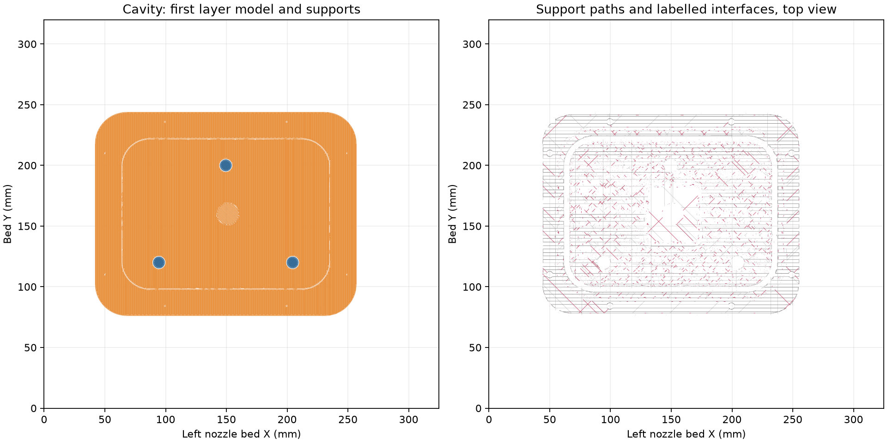
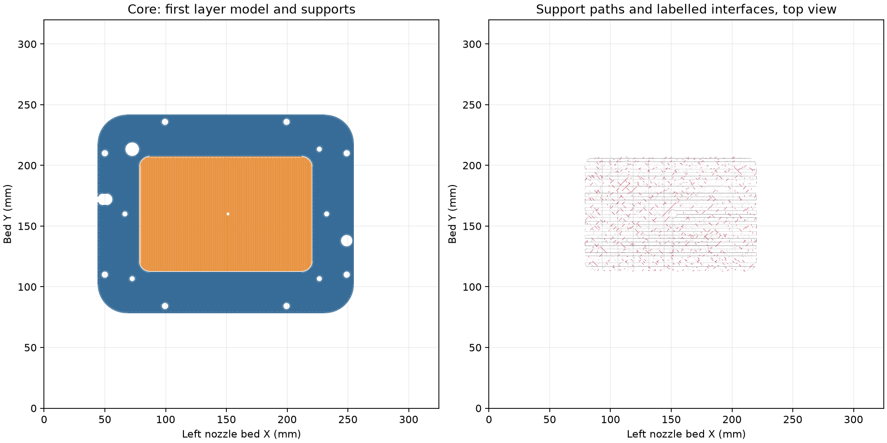

# Funnel mold native slice

The complete tooling is two PETG shells and one stock 6 × 25 mm steel rod.
The [editable two-plate project](../../funnel-mold.3mf) contains the current
[cavity](../../cavity.stl) and [core](../../core.stl) meshes, with the cavity
upright and the core inverted on its open dry back.

Both plates slice successfully in Bambu Studio 02.08.02.61 with no plate
warning. The [native review](readiness-review.json) checks the embedded meshes
against the current STLs, the deposited paths against the bed, the left
0.4 mm Standard nozzle, first-layer height, Z trim and support bodies.
The [current receipt](../../current-slice-review.json) binds the saved project.

| Plate | Slicer time estimate | PETG estimate | Support bodies |
| --- | ---: | ---: | ---: |
| Cavity | 22 h 47 min | 440.33 g | 1, bed-rooted |
| Core | 16 h 46 min | 326.95 g | 1, bed-rooted |

The project keeps the recorded PETG Translucent process: 0.88 flow,
5.61702 mm³/s maximum volumetric speed, 0.20 mm first layer, 0.24 mm normal
layers, two walls, 100% zig-zag infill, Snug normal supports and the requested
+0.18 mm trim (`G29.1 Z0.16`). The saved project settings match the September
18 physical print input byte for byte. The slicer adds purge-volume and
unused-nozzle metadata; those changes are recorded in the receipt.

The drawings show complete first-layer paths and sampled all-layer support
paths. The [cavity](cavity-support-topology.json) and
[core](core-support-topology.json) topology records read every emitted support
path. Supports are accessible from the open dry backs and outer flanges.

The [rod check](../../rod-check.json) reads the exported straight cylinder,
open guide, free axial movement, complete casting equality and installed
drain-tube contact. The [closure check](../../containment-review.json) caps
the intended fill, vent and rod-guide openings only for its analysis.
Native geometry and slice measurements describe the files; release and seal
behavior are physical outcomes. The [print log](../../print-log.md) preserves
the scope of accepted physical results. No print was submitted.

`prepare.py` refreshes only the two meshes in a copy of the saved recipe.
`review.py` reads its native slice. They use
`.cache/funnel-simple-2026-10-05/shells/` for the intermediate files.
