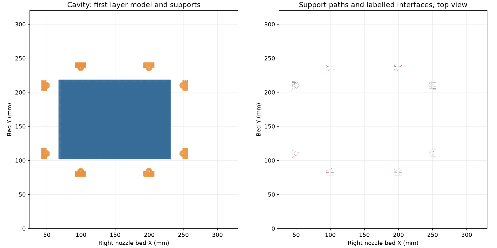
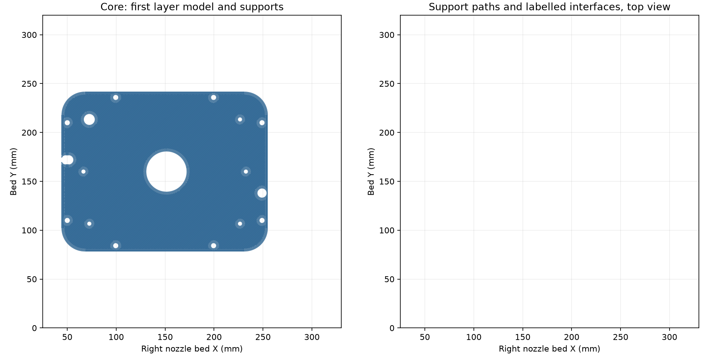

# H2C right-nozzle funnel mold

The [editable two-plate project](funnel-mold-h2c-right.3mf) selects the right
0.4 mm Standard nozzle for the current cavity and core. The process is six
walls, 15% gyroid, six top/bottom layers, PETG Translucent at 0.88 flow and
5.61702 mm³/s, with 0.20 mm first and 0.24 mm normal layers. Textured PEI uses
H2C's +0.18 mm requested trim, emitted as `G29.1 Z0.16`.

The [native review](readiness-review.json) verifies the embedded meshes,
right-nozzle bed limits, nozzle selection, trim and support topology. Bambu
Studio 02.08.02.61 slices both plates without warnings.

| Part | Native time estimate | PETG estimate | Support bodies |
| --- | ---: | ---: | ---: |
| Cavity | 17 h 03 min | 355.61 g | 8 bed-rooted |
| Core | 11 h 05 min | 232.03 g | 0 |

The [cavity launch receipt](launch.json) records H2C task 1313390974, AMS HT-A
PETG and induction rack slot 3. The [packaging receipt](packaging.json)
verifies that the submitted cavity-only archive retains every native G-code
byte and checksum. Printing, finishing and casting results are recorded in
the [physical log](../../print-log.md).




To repeat the native review from the repository root:

```sh
mkdir -p .cache/funnel-h2c-right-2026-10-06/slice-v3
/Applications/BambuStudio.app/Contents/MacOS/BambuStudio --slice 0 --arrange 0 --orient 0 --outputdir "$PWD/.cache/funnel-h2c-right-2026-10-06/slice-v3" --export-3mf 2026-10-06-funnel-cavity-h2c-right-z018-v3.gcode.3mf "$PWD/hardware/printed-parts/zone-c/funnel-mold/native-slice-reviews/2026-10-06-h2c-right-gyroid15/funnel-mold-h2c-right.3mf"
tools/cad-venv/bin/python hardware/printed-parts/zone-c/funnel-mold/native-slice-reviews/2026-10-06-h2c-right-gyroid15/review.py
```
