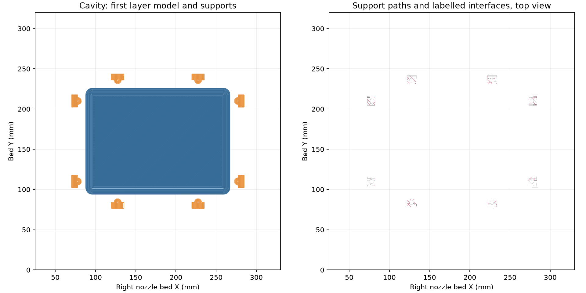

# Mark1 funnel cavity retry

The prepared cavity uses **Mark1**, a Bambu Lab H2C, with the **right 0.4 mm
Standard nozzle** and **AMS HT-A PETG Translucent Clear**. Derek reports a new
nozzle on the replacement induction heating assembly. The filament is drying.
This is preparation only; **no Send or start is authorized or performed**.

[Editable two-plate project](funnel-mold-mark1-retry.3mf) ·
[Native review](readiness-review.json) · [Launch plan](launch-plan.json) ·
[Preparation observations](preflight.json)

The single cavity archive is retained locally at
`.cache/funnel-retry-mark1-20261006/ready/2026-10-06-funnel-cavity-mark1-right-retry-v1.gcode.3mf`.
Its SHA-256 is
`f2d88a8a3fabf199defa37185d39fffe129936571aa72afbff637d85a0b8e02a`.
Its native G-code SHA-256 is
`e3b9ec793eef7b910244726f00a83d20bddd68b1401cd518dd6294724497e631`.
The [packaging receipt](packaging.json) verifies a single plate and unchanged
native G-code bytes. An inspection copy opens in Studio Preview with 404
layers, 356.56 g, 17 h 24 min and the right 0.4 mm Standard nozzle. The editable
project also retains the core for review.

## Failed-job settings

The [physical result](../2026-10-06-h2c-right-gyroid15/physical-result.json)
records Derek's report for task **1313390974**: the complete print was swept
onto the extruder, filament accumulated around it, and the induction heating
assembly was lost. The failure layer, failure time and initiating cause are
not independently recorded.

The [settings audit](failed-job-audit.json) binds the exact submitted archive
and G-code to the original launch receipt. **Timelapse was Off in the Send
options**. The sliced project contained Traditional timelapse camera blocks,
conditional on the runtime recording flag. Chamber auto-record was also
disabled in the preflight. A read-only video-directory inspection found no
new timelapse for that job and no chamber-recording clips. Timelapse records
images; it does not detect or stop a failure. The manufacturer's
[H2C manual](https://csm.bblcdn.com/hub/eff78da43720461787dc8bbe5fa0372d.pdf)
describes timelapse and chamber auto-record as separate controls.

The current Studio Print Options show spaghetti detection On/Low, purge
chute pile-up On/Medium, camera nozzle clumping Off and air printing On/Medium.
Those observations do not establish the detector state at the moment of the
failure. **Camera detection preferences are untouched. Nozzle Clumping
Detection by Probing remains Off**, at Derek's explicit direction.

## Prepared process

The customer outcome is a cavity that stays attached through the print,
with a video record for diagnosis. The first-layer changes increase the
available adhesion area and reduce deposition speed. They are an unprinted
candidate; they do not establish the cause of the failed job or guarantee a
completed mold.

| Setting | Submitted October 6 job | Prepared retry |
| --- | --- | --- |
| First-layer walls / solid infill | 50 / 105 mm/s | **20 / 30 mm/s** |
| Brim | Automatic, 5 mm | **Outer, 8 mm** |
| Minimum full deposited-footprint bed clearance | 17 mm | **45 mm** |
| Timelapse Send option | Off | **On required at authorized Send** |
| Leveling / flow dynamic / nozzle offset | On / Auto / Auto | **On / On / On required** |
| Probing clump checks | Off | **Off** |

The cavity and core meshes are byte-identical to the reviewed source. The
prepared recipe retains 0.88 flow, 5.61702 mm³/s, 250/245 °C nozzle, 70 °C bed,
0.20/0.24 mm layers, six walls, 15% gyroid, six top/bottom layers and Snug
normal supports. Textured PEI uses +0.18 mm requested trim, emitting
`G29.1 Z0.16`. The supports retain 0.20 mm top/bottom separation and 0.48 mm
XY separation. The brim gap is 0.10 mm.

The native slice passes with no slice warnings. Its complete deposited
footprint, including model, supports and brim, is X70–285 / Y76.159–243.842 mm,
inside the right-nozzle X25–330 / Y0–320 mm usable bed. All eight support bodies
root on the bed beneath accessible bolt pockets. The core has no supports.
There are **zero periodic bare G39 probing checks** in either plate; stock
G39.1 startup calibration remains. The review checks every emitted support
path, while the drawing below subsamples the all-layer path display.



| Plate | Layers | Native estimate | Filament |
| --- | ---: | ---: | ---: |
| Cavity | 404 | **17 h 24 min 14 s** | **356.56 g** |
| Core, review only | 176 | 11 h 35 min 11 s | 233.23 g |

The [physical recipe binding](physical-recipe-binding.json) preserves the
scope of earlier reported successful sparse molds and the 0.88-flow left
nozzle result. Neither qualifies this geometry, new right nozzle, replacement
assembly or first-layer candidate as a completed physical result.

## Authorized launch preparation

Complete the active drying cycle. Bambu's
[PETG Translucent guidance](https://us.store.bambulab.com/products/petg-translucent?id=42479468281992)
specifies 65 °C for eight hours, storage below 20% RH, and compatible adhesive
on the recommended plate. The current dryer is configured for a twelve-hour
cycle at 65 °C. Keep the Textured PEI plate clean and observe the actual first
layer and complete brim before leaving the print unattended.

The [launch plan](launch-plan.json) requires separate start authorization,
fresh readings of both printers, the exact archive and G-code hashes, correct
HT-A material mapping, no unresolved destination fault, and at least 180
seconds after Mark2's most recent accepted start or resume. Verify **Timelapse
On, Bed Leveling On, Flow Dynamic Calibration On and Nozzle Offset Calibration
On** at the final native Send dialog. Calibration is required for the
replacement assembly/new nozzle; it has not been run by this preparation.
After an authorized acceptance, check that runtime timelapse is enabled.
Scheduled monitors remain paused.

The HT-A feed requires native Studio/Connect mapping. The external-spool-only
`tools/bambu_print.py` sender is unsuitable for this prepared feed. No
external TPU spool substitution is allowed.

## Reproduce

`prepare.py` checks the original project hash, changes only the four listed
process settings and plate placement, and verifies unchanged embedded meshes.
`review.py` checks native slicing, source bindings, deposited bead edges,
nozzle/trim, emitted first-layer speeds, supports and probing state.
`package.py` retains the cavity plate and packages it without modifying its
G-code. Packaging requires absent output archives to protect existing files.

```sh
tools/cad-venv/bin/python hardware/printed-parts/zone-c/funnel-mold/native-slice-reviews/2026-10-06-mark1-retry-v1/prepare.py
/Applications/BambuStudio.app/Contents/MacOS/BambuStudio \
  --slice 0 --arrange 0 --orient 0 \
  --outputdir "$PWD/.cache/funnel-retry-mark1-20261006/slice" \
  --export-3mf 2026-10-06-funnel-cavity-mark1-right-retry-v1.gcode.3mf \
  "$PWD/hardware/printed-parts/zone-c/funnel-mold/native-slice-reviews/2026-10-06-mark1-retry-v1/funnel-mold-mark1-retry.3mf"
tools/cad-venv/bin/python hardware/printed-parts/zone-c/funnel-mold/native-slice-reviews/2026-10-06-mark1-retry-v1/review.py
tools/cad-venv/bin/python hardware/printed-parts/zone-c/funnel-mold/native-slice-reviews/2026-10-06-mark1-retry-v1/package.py
```
