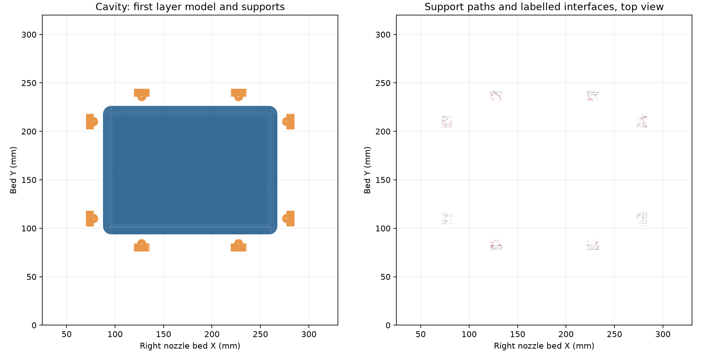

# Mark1 cavity retry at +0.04 mm trim

Mark1 accepted the **funnel mold cavity** at **15:03:59 CDT on October 6,
2026**, task **1315124888**, through one native Bambu Connect Send. The
acceptance is PREPARE without a print error or HMS alert; a later reading at
15:20:39 CDT reports RUNNING at layer 1/404 without a fault. Physical adhesion and completed mold or
casting results are pending.

[Editable two-plate project](funnel-mold-mark1-retry-z004.3mf) ·
[Native review](readiness-review.json) · [Preflight](preflight.json) ·
[Launch receipt](launch.json) · [Launch plan](launch-plan.json) ·
[Timelapse and storage inspection](timelapse-storage-review.json)

## Submitted recipe

The cavity uses Mark1's replacement induction heating assembly and new
**right 0.4 mm Standard nozzle**, **AMS HT-A PETG Translucent Clear** and
Textured PEI. The requested trim is **+0.04 mm**; native G-code clears the
trim with `G29.1 Z0` and applies **`G29.1 Z0.02`**. This is 0.14 mm below
the +0.18 requested / +0.16 emitted baseline. The first layer is 0.20 mm;
normal layers are 0.24 mm.

| Setting | Value |
| --- | --- |
| First-layer walls / solid infill | 20 / 30 mm/s |
| Brim | Outer, 8 mm; 0.10 mm gap |
| Flow / maximum volumetric speed | 0.88 / 5.61702 mm³/s |
| Nozzle temperature, first / later | 250 / 245 °C |
| Bed temperature | 70 °C |
| Walls / infill / top and bottom layers | Six / 15% gyroid / six |
| Support | Snug normal; 0.20 mm top/bottom gap, 0.48 mm XY gap |
| Timelapse Send option | On |
| Leveling / flow dynamic / nozzle offset calibration | On / On / On |
| Nozzle Clumping Detection by Probing | Off |

Camera AI preferences are untouched. There are zero executable periodic bare
G39 checks; stock G39.1 startup calibration remains. Timelapse does not stop
a print failure. The [launch receipt](launch.json) distinguishes the Send
setting from runtime camera observations. At 15:20:39 CDT the printer reports
timelapse disabled despite the Send option On. A remote camera-enable request
is rejected with `unsupport common`; Studio's custom Device toolbar cannot be
operated through the current UI tool. Recording is not confirmed.

Remote FTPS listings show 128 timelapses totaling 793.3 MB, four bytes in the
chamber-recording directory, and 328.7 MB of files in the drive root. The
printer reports normal storage state without a fault. Its current telemetry
and file service do not provide a free-space count, so exact remaining
capacity is unverified. The existing six-hour rotation retains up to 180 GB
of timelapses and currently archives no clip before deleting it.
The matching October 6 rotation retains all 128 clips and deletes none.
This inspection archives and deletes no files. Existing scheduled monitors
remain paused.

## Native checks and bindings

The project changes only the Z-trim expressions and printer preset name in
the [prepared v1 project](../2026-10-06-mark1-retry-v1/funnel-mold-mark1-retry.3mf).
All geometry, placement and other settings are byte-identical to that input.
The [preparation review](preparation-review.json) and
[physical recipe binding](physical-recipe-binding.json) preserve the scope of
earlier reported sparse-mold and left-nozzle flow results. They do not establish
the cause of the reported detachment or qualify this new right-nozzle retry.

The native slice passes without warnings. Its complete deposited footprint
is **X70–285 / Y76.159–243.842 mm**, leaving at least **45 mm** to the usable
right-nozzle bed edges. All eight supports root on the bed beneath open bolt
pockets. The core has no supports and is retained for review only.



| Plate | Layers | Native estimate | PETG |
| --- | ---: | ---: | ---: |
| Cavity, submitted | 404 | 17 h 24 min 27 s | 356.56 g |
| Core, review only | 176 | 11 h 35 min 11 s | 233.23 g |

The single-plate cavity archive is retained privately at
`.cache/funnel-retry-mark1-z004-20261006/ready/2026-10-06-funnel-cavity-mark1-right-z004-retry-v2.gcode.3mf`.
Its SHA-256 is
`4f0c0be666595f73d7e31042cd877da61e8503554f25cd143734bf1a86b8bfb1`;
its native G-code SHA-256 is
`a4c24daaf566e185dd8239e2e9beb7736f43cc23ea9d3db6e90419fe1c7136ba`.
The [packaging receipt](packaging.json) verifies unchanged native G-code bytes.
The separate native import copy matches the archive byte for byte.

The preflight freshly reads both printers, verifies Mark1 idle and fault-free,
the mounted right nozzle and HT-A PETG, exact hashes, and more than 180 seconds
after the peer's last accepted start. The Send attempt was durably recorded
before the single transaction. Further Send is disabled for this job.

## Reproduce preparation

`prepare.py` binds its v1 input hash and changes only the requested trim and
preset name. `review.py` reads native meshes, deposited paths, supports,
first-layer speeds, trim and probing state. `package.py` extracts one cavity
plate without changing native G-code. Preparation and packaging require absent
outputs and do not submit a print.

```sh
tools/cad-venv/bin/python hardware/printed-parts/zone-c/funnel-mold/native-slice-reviews/2026-10-06-mark1-retry-z004-v2/prepare.py
/Applications/BambuStudio.app/Contents/MacOS/BambuStudio \
  --slice 0 --arrange 0 --orient 0 \
  --outputdir "$PWD/.cache/funnel-retry-mark1-z004-20261006/slice" \
  --export-3mf 2026-10-06-funnel-cavity-mark1-right-z004-retry-v2.gcode.3mf \
  "$PWD/hardware/printed-parts/zone-c/funnel-mold/native-slice-reviews/2026-10-06-mark1-retry-z004-v2/funnel-mold-mark1-retry-z004.3mf"
tools/cad-venv/bin/python hardware/printed-parts/zone-c/funnel-mold/native-slice-reviews/2026-10-06-mark1-retry-z004-v2/review.py
tools/cad-venv/bin/python hardware/printed-parts/zone-c/funnel-mold/native-slice-reviews/2026-10-06-mark1-retry-z004-v2/package.py
```
