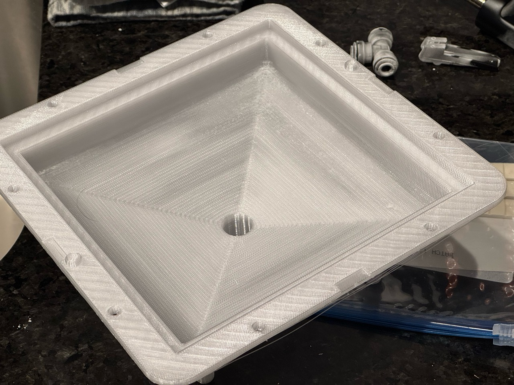

# Funnel mold print log

## 0.88-flow print result and 600 mL mold readiness — 2026-09-20

Derek reports: “Last print worked okay. Certainly less of ‘the problem’ that
I refer to as ‘overflow’.” He reports that it is still not perfect. The photos
show the complete-looking cavity, with remaining rough, irregular patches
near the upper ramp and a corner. Broad areas of the ramp have more regular
surface lines. No surface-height, density or strength measurements accompany
this report.

This result belongs to the square-mouth cavity submitted on September 18 as
`funnel-mold-04-standard-flow088-z018.gcode.3mf`, source commit `59e088d8d`.
The print used 0.88 flow and a 5.61702 mm³/s volumetric limit. Both settings
changed from the 0.94 trial, and the emitted speeds differed. The result
establishes an improvement for that combination; it does not isolate flow
from speed or establish the cause of the remaining defect.

[Corner view](print-photos/2026-09-20-flow088/photo-2.jpg) ·
[Close-up of remaining roughness](print-photos/2026-09-20-flow088/photo-1.jpg).
The original supplied JPEG bytes are preserved; their hashes are in
[print-jobs.json](print-jobs.json).

The saved [funnel-mold.3mf](funnel-mold.3mf) contains the current **600 mL**
rounded-mouth funnel's cavity and core from geometry commit `953dbfa68`.
The finished casting solid matches a fresh build of `../funnel/funnel.py`,
with zero symmetric-difference volume after trimming the sacrificial tip.
Both embedded meshes match the current STL files and retain their print
orientations. The complete process, filament and machine settings equal
those of the printed 0.88 project. Both plates freshly slice successfully;
[current-slice-review.json](current-slice-review.json) records hashes,
nozzle/flow/Z-trim checks and the estimates:

| Plate | Part | Layers | Estimated time | PETG |
| --- | --- | ---: | ---: | ---: |
| 1 | Cavity, upright | 623 | 35 h 29 min 44 s | 708.06 g |
| 2 | Core, inverted | 313 | 21 h 19 min 37 s | 420.97 g |

The project selects **PETG Translucent**, the **left 0.4 mm Standard nozzle**,
**0.88 flow**, **5.61702 mm³/s**, **100% infill**, Snug normal supports and
**+0.18 mm Z trim**. On Textured PEI the emitted trim is `G29.1 Z0.16`.
The current geometry's physical print and casting results are untested.
Derek is using PET-GF for other work; this mold project remains prepared for
PETG Translucent. No mold print was submitted in this update.

## Full cavity at 0.88 flow — 2026-09-18

Derek authorized the next full-size cavity attempt on H2C after the 0.94
trial failed at layer 375. He reports solid bed adhesion and no visible
lifting in the dismantled part. The working hypothesis for this attempt is
accumulating excess extrusion in the fully packed ramp, followed by nozzle
contact and buildup. This is a hypothesis, not a confirmed diagnosis or a
calibrated final flow value. The trial uses the complete cavity geometry.

The active Standard filament flow ratio is **0.88**, which commands **6.383%
less extrusion** than the submitted 0.94 trial. The maximum volumetric speed
is **5.61702 mm³/s** (`6 × 0.88 / 0.94`), reduced proportionally to the flow.
Configured movement speed limits are unchanged. Emitted movement speeds are
not identical: the slice takes longer, and the command comparison is recorded
in [flow-review.json](flow-review.json).

The left **0.4 mm Standard** nozzle, **+0.18 mm Z trim**, Textured PEI plate,
0.24/0.20 mm layer heights, 100% zig-zag infill, two walls, 15% infill/wall
overlap, 250/245 °C nozzle temperatures, 70 °C bed and Snug normal supports
are retained. The emitted Textured PEI compensation is `G29.1 Z0.16`.
The filament preset is **Funnel mold PETG Translucent - 0.4 Standard - flow 0.88**.
The project retains its cavity and core plates; plate 1 is the cavity trial.

The archive audit verifies byte-identical meshes and placement entries.
The emitted model extrusion is 0.93617 of the submitted 0.94 baseline across
all model feature types, including solid infill. The slice has 642 layers,
estimated at **34 h 32 min 9 s** and **673.53 g**. This validates the commanded
change, not its physical result.

Editable project SHA-256:
`2bc6a358dbfb74c94d9388bf4abd166ab243182298f45768c0dff9d928182c68`.
Sliced file SHA-256:
`796882c94d37bb7ba944b379d85366a163733cc72a22f4431045fbbf71a9fb45`.
Plate 1 G-code SHA-256:
`d982e579eed499cfb3c6a8396e7e79f9313840c727d71ca9e5bf2405c19f6d10`.
The exact slice is retained at
`.cache/prints/2026-09-18-funnel-next/full-cavity/funnel-mold-04-standard-flow088-z018.gcode.3mf`.

Bambu Connect submitted the cavity to **H2C**, serial **31B8AP612000452**,
using **AMS A2 PETG Translucent** (reported 72% remaining before submission).
Timelapse is off, bed leveling on, and flow dynamic/nozzle offset calibration
use Auto. At **2026-09-18 18:43:18 UTC** (13:43 CDT), the printer reports
**RUNNING**, the correct `funnel-mold-04-standard-flow088-z018.gcode.3mf`
filename, 642 layers, no print error and no HMS entry. Connect shows chamber
cooling and the left nozzle heating toward 165 °C. The saved source is commit
`59e088d8d`. The September 20 result is recorded above.

## Reduced-flow 0.4 mm Standard trial — 2026-09-17

Derek authorized a 0.94 filament flow ratio and requested the cavity print on
H2C with a +0.18 mm Z trim. The active Standard variant is 0.94, a 3.09%
reduction from the failed trial's 0.97. This reduces extrusion throughout the
solid layers beneath the rough surface as well as the exposed surfaces. It is
a physical trial, not a calibrated final flow value or a confirmed diagnosis.

The project uses **Funnel mold PETG Translucent - 0.4 Standard - flow 0.94**
and **Bambu Lab H2C 0.4 Standard +0.18 Z trim**. Layers remain 0.24 mm with
a 0.20 mm first layer, 100% zig-zag infill, two walls, 15% infill/wall overlap,
6 mm³/s maximum volumetric speed, 250/245 °C nozzle temperatures and Snug
normal supports. The meshes, placements and support settings are unchanged.
The global filament variant map is Standard, matching both plate assignments.
The other stored filament variants retain 0.97.

Fresh Bambu Studio 2.8.2.61 slices of the failed project in commit `9ccc619e7`
and this project each contain 642 layers. Layer 374 is Z47.24 mm in these
reconstructed slices; support and model layers interleave, so multiplying 374
by the nominal 0.24 mm layer height does not give its height. The original
failed print's submitted G-code is unavailable.

The new cavity slice reports a 0.94 flow ratio, the left 0.4 mm Standard
nozzle, and `G29.1 Z0.16` after the Textured PEI plate correction. Its estimate
is 32 h 54 min 35 s and 719.38 g. The editable project contains no G-code;
the sliced submission file is kept outside this folder.
The flow audit in commit `ca28e9a7a` records identical model extrusion paths
and the 3.09% reduction in model extrusion, including internal solid infill.

Editable project SHA-256:
`04216c993c00e70c7b35e552c4fdb228cbd110bc17804051c8ebeddc4f738f8f`.
Sliced file SHA-256:
`324efc0cbd3e15e58c83cf49f25847c347954165b7f240c359aea4c1731c0734`.
Plate 1 G-code SHA-256:
`e6b1c00ed8592b7616f95c793aae4fb4a1c96358b2a0953f851e6ecf87d9f110`.

Bambu Connect submitted plate 1 to **H2C**, serial **31B8AP612000452**, using
**AMS A2 PETG Translucent** (reported 100% remaining). Bed leveling is on,
timelapse off, and flow dynamic/nozzle offset calibration use Auto. At
**2026-09-18 00:01:04 UTC** (September 17, 19:01 CDT), the printer reports
RUNNING, 642 layers, no print error and no HMS entry. Connect shows toolhead
homing and the left nozzle heating. Derek reported this print failed and stopped it at layer 375 on September 18.
The same raised band, nozzle dragging, fuzz and blobs remained. Photos
`IMG_7803.jpeg` through `IMG_7806.jpeg` show four views of the same worst area.
He reports solid bed adhesion and no visible lifting after pulling the print
apart; he has not ruled lifting out. The bed is clean and H2C is ready for
the next authorized trial.
The exact submitted slice is retained at
`.cache/prints/2026-09-17-funnel-flow094-h2c/funnel-mold-04-standard-flow094-z018.gcode.3mf`.

## 0.4 mm Standard nozzle, stopped at layer 374 — 2026-09-17

Derek reports that the 0.4 mm regular-flow print developed the same raised,
rough solid-surface defect as the earlier 0.8 mm High Flow print. He stopped it
at layer 374, within an estimated few layers of the defects first becoming
easy to notice and measure. Photos `IMG_7798.jpeg` through `IMG_7801.jpeg` show
raised ridges and loose material in the broad funnel-forming region, with
regular, separated support walls outside it. The first defective layer is
not known exactly.

The saved project for this trial has 0.4 mm Standard nozzles selected, with
Standard assigned to both plates. Its flow ratio is 0.97 for all three stored
filament variants. The maximum volumetric speed is 6 mm³/s. It uses 0.24 mm
layers, a 0.20 mm first layer, 100% zig-zag infill, two walls, 15% infill/wall
overlap, 250 °C initially and 245 °C afterward. Snug normal supports have
0.20 mm top/bottom Z separation and 0.48 mm first-layer/XY gaps. The printer
profile is **Bambu Lab H2C 0.4 nozzle**, with its stock startup code and
Textured PEI. The process is **0.24mm Standard @BBL H2C funnel mold** and the
filament is **Bambu PETG Translucent @BBL H2C 0.4 nozzle**.

The saved archive contains no G-code. The stopped layer and physical behavior
are Derek's observations; the submitted toolpaths were not captured.

Failed-trial project SHA-256:
`1b5c186184b9ce714235dc059d6a66cff8e2295d3c3406e6402a560c009a7661`.

## 100% infill retry — 2026-09-16

Derek reports saving the project and starting a new print. The inspected
[funnel-mold.3mf](funnel-mold.3mf) contains these settings:

| Setting | Saved value |
| --- | --- |
| Process preset | 0.24mm Balanced Quality @BBL H2C 0.8 nozzle funnel mold |
| Filament preset | Bambu PETG Translucent @BBL H2C 0.8 nozzle 0 94 flow |
| Infill | 100%, zig-zag |
| Internal solid infill and top/bottom surface patterns | Zig-zag |
| Flow ratio — Direct Drive Standard | 0.94 |
| Flow ratio — Direct Drive High Flow | 0.97 |
| Maximum volumetric speed | 16 mm³/s |
| Infill/wall overlap | 15% |
| Layer height / first layer | 0.24 / 0.40 mm |
| Nozzle temperature / first layer | 245 / 250 °C |
| Supports | Normal (auto), Snug |
| Support top/bottom Z, first-layer and object XY gaps | 0.48 mm each |
| Arc fitting | Disabled |

The project selects the left 0.8 mm High Flow nozzle, Textured PEI and the
**Bambu Lab H2C 0.8 High Flow +0.18 Z trim** printer preset. The saved
`filament_extruder_variant` array orders Standard before High Flow, and
`filament_flow_ratio` is `[0.94, 0.97]`: the 0.94 adjustment is stored for
Standard, while the selected High Flow variant retains 0.97. The filament
preset's name alone does not establish that this print uses 0.94.

The embedded cavity/core meshes and their placements match commit `6eff076c1`.
The saved project contains no G-code. Print start is Derek's report; the
submitted toolpaths and printer state were not independently read. Derek
subsequently reported cancelling this retry.

Saved project SHA-256:
`b8e09b0084eab97e7857299f0ac688e0f10d383b48be03fbd691ed8cfef961f3`.

## Solid-infill surface buildup — 2026-09-16

Derek reports that the 15% infill print with Snug normal supports worked well.
His subsequent 100% infill print failed: material rose above the expected layer
height in the broad solid region and the hotend dug into it. Photos
`IMG_7794.jpeg` through `IMG_7797.jpeg` show a raised, rough region around a
relatively smooth center, with regular outer support walls. Derek reports
that the supports remained satisfactory. The failure layer and cause of the
buildup are unconfirmed.

## Snug normal-support trial — 2026-09-15

Derek reports: “Some supports fell over,” and is trying the saved
[funnel-mold.3mf](funnel-mold.3mf) below. The failure layer and cause were not
identified. On 2026-09-16 he reported that the 15% infill print with Snug
normal supports worked well.

The saved process is based on **0.24mm Balanced Quality @BBL H2C 0.8 nozzle**
with these support settings:

| Setting | Saved value |
| --- | --- |
| Support type (`support_type`) | Normal (auto) |
| Style (`support_style`) | Snug |
| Top Z distance (`support_top_z_distance`) | 0.48 mm |
| Bottom Z distance (`support_bottom_z_distance`) | 0.48 mm |
| First-layer gap (`support_object_first_layer_gap`) | 0.48 mm |
| Object XY distance (`support_object_xy_distance`) | 0.48 mm |

Layers are 0.24 mm with a 0.40 mm first layer, two wall loops and 15% infill.
The printer preset is **Bambu Lab H2C 0.8 High Flow +0.18 Z trim**, with Textured
PEI and **Bambu PETG Translucent @BBL H2C 0.8 nozzle**. Temperatures are 250 °C
initially and 245 °C afterward, with a 16 mm³/s volumetric limit. Supports use
a 30° threshold and may start on the model; top and bottom interfaces have
two layers each. Support speed is 150 mm/s and interface speed is 80 mm/s.

The embedded cavity/core meshes and placements are unchanged from the saved
0.24 mm project in commit `1004b713a`. The six support settings above are the
only process changes. The archive contains no G-code; these are saved settings,
not a record of emitted toolpaths or printer submission.

Saved project SHA-256:
`cabac3977f3f9ff2c9ca70173005f954925fd5fe69e8c09324f14ace92620aab`.

## 0.40 mm support trial — 2026-09-14 (settings per `funnel-mold-h2c-040.gcode.3mf`)

- `layer_height` **0.40 mm** (initial 0.40)
- `nozzle_temperature` **245 °C** (initial 250)

The User Process is **Funnel mold shell - 0.8 nozzle - 0.40 mm gentle supports**.
The cavity is 199 layers, estimated at 20 h 43 min and 745.57 g. The separate
core plate is 113 layers, estimated at 11 h 48 min and 484.64 g. The cavity's
estimate is 10 h 47 min shorter than the 0.24 mm gentle-support slice.
[layer-height-review.json](layer-height-review.json) records the comparison,
checksums, actual support and travel motion, and cavity support footprint.
The modeled geometry, support speed limits, reinforced trees and Z trim match
the gentle-support trial. Forming slopes require sanding and finishing.

Derek confirmed the bed clear and authorized starting the print. Bambu Connect
submitted plate 1 to **H2C**, serial **31B8AP612000452**, with AMS A3 PETG
Translucent (96% remaining before submission), the left 0.8 mm High Flow nozzle
and Textured PEI. Timelapse is off, bed leveling on, and flow/nozzle-offset
calibration Auto. At 21:14:54 UTC the printer reports RUNNING, 199 layers and
no print error or HMS entry, with its nozzle warming at 165 °C. The core was
not submitted. Derek reports: “It printed, but there's gaps.” His picked
location is X=86.800, Y=−69.368, Z=71.112 mm. The submitted cavity's STEP
and STL both have through-wall openings beneath the brim and at the ramp joins.

## Gentle support motion file — 2026-09-14

The saved User Process is **Funnel mold shell - 0.8 nozzle - gentle supports**.
The checked cavity file is `funnel-mold-h2c-gentle-supports.gcode.3mf`, with
331 layers, a 31 h 29 min estimate and 786.73 g including supports. It has
not been submitted. Derek has not cleared the bed and requested a 3MF only.

Supports are capped at 40 mm/s, interfaces at 30 mm/s and travel at 150 mm/s.
Normal printing and travel acceleration are 1,500 mm/s². Trees have two wall
loops and 4 mm initial branch diameter; support walls participate in travel
detours. Initial layer expansion is 8 mm. The +0.18 trim, Textured PEI,
left 0.8 mm High Flow nozzle and Bambu filament operating settings are retained.
[support-motion-review.json](support-motion-review.json) records the emitted
commands and settings comparison. Physical stability is untested.

## Cavity support feet — 2026-09-14

Derek reports this job failed. The supports bond early and remain stable;
later, fast movement on and between the tall supports knocks some over.
The failed print remains on the bed. The exact failure layer is unknown.

H2C accepted `funnel-mold-h2c-support-feet.gcode.3mf` through Bambu Connect.
At 15:34 UTC it reports RUNNING, 331 layers and no print error or HMS entry;
Connect shows toolhead homing and left-nozzle heating. The job uses AMS A3
Bambu PETG Translucent, reported full before submission. A2 reported 59%
remaining against the 653 g estimate. Bed leveling is on; timelapse is off;
flow and nozzle-offset calibration use Auto.

The saved User Process is **Funnel mold shell - 0.8 nozzle - 8mm support feet**.
Support → Initial layer expansion is 8 mm, initial layer density is 90%,
and raft layers are zero. The +0.18 mm trim emits `G29.1 Z0.16` on Textured
PEI. The left 0.8 mm High Flow nozzle, stock PETG temperatures and flow limit,
0.40 mm first layer and 0.24 mm later layers are retained.

The emitted first-layer support contact area is approximately 30,305 mm²,
compared with 10,677 mm² in the failed job. The sliced paths remain inside
the printable area. The estimate is 18 h 31 min and 653 g, adding about
9 minutes and 10 g. [support-foot-review.json](support-foot-review.json)
records the path comparison and startup-command check;
[print-jobs.json](print-jobs.json) records submission hashes and printer state.
The editable project's meshes and placements are byte-identical to its
preceding saved version. The initial support bonding is reported above;
completed-part quality is unobserved.

## Cavity trial — 2026-09-14

Derek reports this job failed. His photograph shows tall tree supports detached
from the Textured PEI plate and lying beside the cavity, with loose extrusion
around the flange. The exact detachment layer is unknown. H2C reported FAILED
at 15:16 UTC, with no active print error or HMS entry. Derek cleared the plate
and confirmed it ready for a retry. The retry process uses 8 mm Support →
Initial layer expansion and retains the +0.18 mm trim.

H2C accepted plate 1 of `funnel-mold-h2c.gcode.3mf` through Bambu Connect.
The job uses AMS A2 PETG Translucent, the left 0.8 mm High Flow nozzle,
Textured PEI, +0.18 trim, stock filament operating settings and a 0.40 mm
first layer. Bed leveling is enabled. The cavity has 331 layers; its slicer
estimate is 18 h 22 min and 643 g. At 06:26 UTC the printer reports RUNNING
at layer 1, with no print error or HMS entry. Its nozzle is 250 °C and its
bed is 70 °C. [print-jobs.json](print-jobs.json) holds the submitted file
and G-code hashes, settings and printer observation.

## Tree-support detachment — 2026-09-14

Derek reports two stopped attempts on the printer named H2C, using Textured
PEI and +0.18 mm trim. Several supports lifted in the first attempt before
reaching the model; one support fell in the second. The failed job bytes,
detachment heights and first-layer photographs were not captured here.
The +0.04 and +0.18 trims come from dozens of PET-GF calibration prints;
their transfer to PETG has not been established.

The saved project selected Engineering Plate. Its PETG Translucent profile
used 255 °C for both first and subsequent layers, and 18 mm³/s for High Flow.
The installed Bambu H2C 0.8 PETG Translucent defaults are 250 °C first layer,
245 °C afterward and 16 mm³/s for both nozzle types. The mold's 0.32 mm first
layer also differs from the stock process's 0.40 mm. The saved bed temperature,
cooling, support speed and tree branch settings match the stock presets.
These differences do not establish which condition detached the supports.

## Rod fit — 2026-09-13

Derek reports that the steel rod was nearly impossible to press into the
recently printed core. He could not establish whether it reached its seat;
the rod interfered with closing the core and cavity. The exact printed source
revision and the measured socket, rod and insertion dimensions were not
identified. No measurement establishes which surfaces made contact.

## Dry fit — 2026-09-12

Derek reports that the recently printed cavity and core fit tightly before
finishing. He is skeptical that sanding will provide a clean fit with room
for primer. He also reports a small departure from flatness, with the bodies
too stiff for his available clamps to pull together. The exact source revision
of this pair was not identified. No coated fit or casting result was reported.

## Solid cavity — 2026-09-10

Mark2 reported `Funnel_mold_-_solid_cavity_and_core`, 304 layers, 18 h 59 min 7 s
and 1,315.70 g. The reference project is `solid/solid-mold.3mf` at Git revision
`46295bf93`, SHA-256
`8019a34f5062a185253bfe8ae5b906343ed8e454f589b75de5106e647a5e1a50`.
The device's title, layer count, time and mass match that archive; the printer's
job bytes were not downloaded for comparison.

At layer 178 the device showed 255 °C nozzle, 70 °C bed and 100% speed. The camera
showed uneven bands and loose strands on the visible outer wall. Derek supplied
`IMG_7779.jpeg`, `IMG_7778.jpeg` and `IMG_7777.jpeg` from the opposite side. Those
photos show a substantial clump of tangled extrusion at an outer corner, long
loose strands below it and strings across the forming cavity. The adjacent broad
wall is comparatively regular. Adhesion and the condition of the hidden wall
were not established by the camera view.

At Z 44.8 mm the archived G-code begins its exterior perimeter at printer XY
(68.731, 77.753), on a rounded corner. That perimeter commands 55–60 mm/s and 90%
part cooling. The photos are not registered to printer XY, so their relationship
to this seam is an inference. Neither the photos nor the path reading establishes
a single cause for the failure.

At layer 185 Mark2 still reported 100% speed. Selecting Bambu Studio's speed
control did not open a selector or change that reading. No runtime speed change,
pause, stop or replacement print was sent.

On 2026-09-11 Derek reported that the defect was confined to the observed layers
and that the print recovered higher up. He judged the important surfaces good
enough to sand and use. Sanding, coating, vacuum cycling and casting results have
not been reported. He also reported starting the next piece; its exact project
and plate were not identified in that message.
