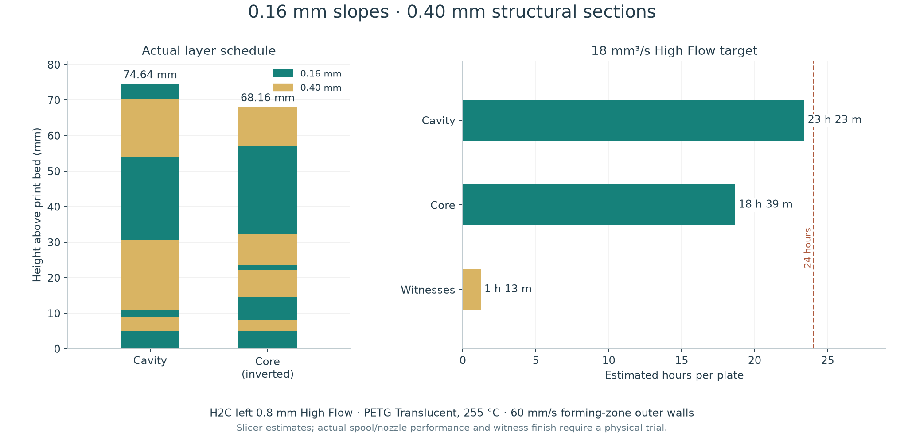
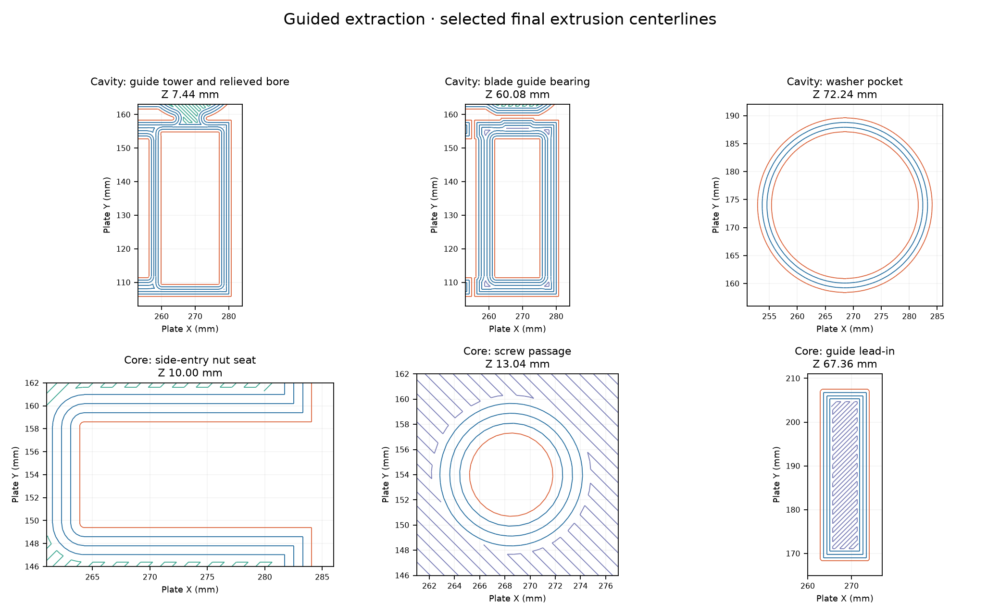

# Funnel mold print project

[**Default project — +0.04 mm trim**](funnel-mold-petg-hf08-variable-016-040.3mf)
uses the H2C's **left 0.8 mm High Flow nozzle**, PETG Translucent at 255 °C,
0.16 mm layers through the shallow slopes and 0.40 mm through straight
structural sections. It contains five editable bodies, two surface-speed
modifiers and native thumbnails. Both trim projects are fully sliced with no
brim or skirt. Permanent rounded feet provide the bed contact. The
[cavity print record](print-log.md) retains the separate first-run job archive.

[**Alternate project — +0.18 mm trim**](funnel-mold-petg-hf08-variable-016-040-z018.3mf)
is fully sliced. The [preset bundle](funnel-mold-hf08-z-trim-presets.bbscfg)
contains both printer trims, the filament and the process. Import the bundle with
**File → Import → Import Configs before opening either 3MF** on a new installation.
Bambu Studio imports four configurations, available as **User presets**:

| Selector | Saved preset |
|---|---|
| Printer, default | `Bambu Lab H2C 0.8 High Flow +0.04 Z trim` |
| Printer, alternate | `Bambu Lab H2C 0.8 High Flow +0.18 Z trim` |
| Filament | `Funnel mold PETG Translucent - HF 255C 18mm3s` |
| Process | `Funnel mold - no brim - 0.16 mm slopes - 0.40 mm structure` |

All four are installed in the current Bambu Studio account. Each 3MF references
its matching saved presets, which open without modified-setting markers.
If printer or AMS sync changes a selection, choose the intended High Flow trim,
the mold filament and the mold process from their saved lists, then re-slice all
plates. The object-specific fine-layer bands and surface-speed modifiers live in
the 3MF; a process preset alone does not create those geometry-specific settings.
All three plates explicitly select **Textured PEI Plate** in their plate settings.
All three plates explicitly use manual left High Flow assignment.
The trim is the user's observed build-plate correction across nozzle, size and
material changes. **+0.04 mm is the default for translucent PETG on the current plate.**

[Structure and finishing](README.md) and [extraction hardware and use](extraction.md)
accompany the project. The forming geometry has a 0.20 mm net finishing allowance.

## Plates

Bambu Studio 02.08.02.61 estimates for the default project:

| Plate | Orientation | Time | PETG | Layers |
|---|---|---:|---:|---:|
| 1 — Finish, hardware and guide witnesses | Flat datums on bed | 1 h 13 min 28 s | 58.80 g | 171 |
| 2 — Cavity | Opening up | 23 h 23 min 12 s | 1305.22 g | 315 |
| 3 — Core | Open back on bed; forming plug and blades up | 18 h 39 min 1 s | 1043.63 g | 309 |

Each plate is an independent job. Total material is **2,407.65 g**; prepare
approximately **3 kg of dry PETG** including reserve. Both large plates exceed
a 1 kg spool. Arrange compatible automatic spool backup, or a supervised runout
change, before starting. The project does not configure physical backup spools.
These are estimates rather than measured print durations; the cavity has about
37 minutes of estimated margin below one day.

Print all three witnesses first. Inspect the 17.6 mm backing bridge, test the
square-nut and guide fits, and trial the complete coating/release/silicone
combination. The 18 mm³/s flow target and 60 mm/s surface speed need to produce
sound extrusion on the actual dry spool and high-flow nozzle before either long
print. The witness is a useful part trial; it is not a measured maximum-flow
calibration or an extraction-load certification.

## Layer height and flow

The forming ramps are shallow: at 15°, an ideal 0.16 mm layer makes a terrace
about 0.60 mm wide. At 0.32 mm that becomes 1.19 mm, and at 0.40 mm 1.49 mm.
These geometric figures describe the staircase, not measured deposited beads.
Coarse layers on the shallow undersides also extend farther than a nominal
0.82 mm road can overlap. Fine bands cover both the undersides and the finished
forming ramps. The backing walls and straight guide sections use coarse layers.

| Body | Fine-layer bands, measured up from its print bed |
|---|---|
| Cavity | 0.40–5, 9–11, 30.5–54, 70.5–74.65 mm |
| Inverted core | 0.40–5, 8–14.5, 22–23.5, 32–57 mm |
| Finish witness | 0.40–5, 6.2–15.4 mm |
| Hardware witness | 0.40–5, 8–14 mm |
| Guide witness | 0.40 mm nominal layers throughout |

The first layer is 0.40 mm. Each fine band has an individual geometric reason in
[print-recipe.json](print-recipe.json). On the shared witness plate, Bambu merges
the objects' layer schedules; the reported plate layer count includes that schedule.

The installed Bambu H2C 0.8 PETG Translucent preset supplies **16 mm³/s** for
both Standard and High Flow. This mold's High Flow variant requests **18 mm³/s**;
the Standard variant remains at the manufacturer's 16.
A volumetric cap is a setting for a particular material/hotend/temperature
combination, not an intrinsic PETG limit. [Prusa's explanation](https://help.prusa3d.com/article/max-volumetric-speed_127176)
describes its interaction with line width, layer height and requested speeds.

## Active settings

[The configuration audit](profile-audit.md) explains the complete setting stack.

| Setting | Active value |
|---|---|
| Printer / assignment | H2C 0.8; left High Flow; one PETG filament; every plate manual |
| Bed / trim | Textured PEI, 70 °C; default +0.04 mm, alternate +0.18 mm |
| Nozzle temperature | 255 °C, including the first layer |
| Flow ratio / volumetric cap | Vendor 0.97 / requested 18 mm³/s for High Flow |
| Nominal widths | Vendor 0.82 mm; Arachne varies widths locally |
| Walls | Four requested loops; inner then outer |
| Residual fill | 100% alternating rectilinear (`zig-zag`) |
| Top / bottom stock | Eight requested layers and a 3.20 mm physical minimum on each side |
| Top surfaces | 60 mm/s; 2,000 mm/s² acceleration |
| Surface modifiers | Outer walls 60 mm/s; 2,000 mm/s² acceleration |
| Structural speeds | Stock H2C 0.40 process; actual speeds limited by flow, feature geometry and cooling |
| General / structural outer acceleration | Stock 8,000 / 5,000 mm/s² |
| First-layer walls / fill | Stock 50 / 105 mm/s requests, also limited by flow |
| Bridges | Stock 30 mm/s process setting |
| Cooling | Stock 20–60%; first three layers off; auxiliary fan off; overhang override 90% |
| Seam | Conventional aligned seam; 0% gap; scarf disabled |
| Brim | Disabled (`no_brim`, width 0); skirt loops 0 |
| Supports / raft / ironing / prime tower | Disabled |
| XY contour / hole compensation | Zero / zero; stock 0.15 mm elephant-foot compensation |
| Travel | Stock retract/lift and travel behavior; avoid-crossing-wall detours disabled |
| Arc fitting | Disabled to match Bambu Studio's curve-planning setting for the connected printer |
| Filament prime volume | Explicit 45 mm³; no prime tower or material changes |

All remaining CAD stock prints solid. The CAD rib bays and air channels supply
ventilation. Preserve them through finishing. Keep guides, nut seats, washer
seats and the rod socket uncoated.

The machine's start, end, tool-change and calibration templates come from the
installed H2C preset. The only custom machine-code edit is the explicit plate-trim
block. On textured PEI with this 0.8 mm nozzle, the default issues
`G29.1 Z0` then `G29.1 Z0.02`: stock −0.02 plus user +0.04. The alternate issues
`G29.1 Z0` then `G29.1 Z0.16`: stock −0.02 plus user +0.18.
Confirm left 0.8 mm High Flow and the intended trim after any hardware sync.
Re-slice all plates after changing the printer, nozzle, material, process or geometry.

## Verification

[Print inspection](print-profile.json) records project and G-code digests, slice
results, the configuration audit, geometry comparisons and toolpath measurements.
Both trim slices return success with empty plate warning fields. All six
embedded G-code files match their CLI exports and MD5 entries. No brim, skirt or
support paths are present. All deposited model paths stay inside the bed.
[The print-start check](print-start-check.json) belongs to the first-run job
recorded in [the print log](print-log.md).

[Foot verification](bed-foot-verification.json) confirms that geometry beyond
the first 3.2 mm of each print is unchanged. The cavity has an 8 mm rounded
frame, 6.4 mm tapered rib bases and expanded hardware feet; the core has matching
rib feet and rounded perimeter and arm pads. Nominal bed contact is 267.9 cm²
for the cavity and 422.3 cm² for the core. These are permanent solid features.
Backing-air exits remain open through them.

The five bodies are closed, consistently wound, connected meshes. All seven
components, including modifiers, retain their geometry and placement within
0.000002 mm through slicing. The cavity CAD envelope is 274 × 274 × 74.649 mm;
the inverted core is 274 × 274 × 68 mm. Layer quantization puts their final
commanded heights at 74.64 and 68.16 mm respectively; these are not metrology
readings from a physical print.

Across 80 sampled mold layers, **19,694** outer-wall segments inside the surface
modifiers stay at or below 60 mm/s. The full shallow-ramp bands use 0.16 mm
layers. The greatest calculated flow on extrusion moves longer than 1 mm is
about **17.48 mm³/s**, including the 0.97 flow ratio and G-code rounding. The
inspection also records the larger ratios on tiny rounded segments. Model
extrusion paths use straight segments; fitted G-code arcs are disabled.

| Passage / fit | Reading from the final paths |
|---|---|
| Four guide blades | 12.00 × 40.00 mm |
| Four guide bearings | 12.60 × 40.60 mm clear |
| Four square-nut slots | 8.40 mm clear width |
| Four jack-screw bores | About 5.74–5.76 mm diameter |
| Four washer pockets | About 25.37 mm diameter |
| Backing-air channels and tower exits | About 2.99 mm clear at the sampled mid-height |
| Silicone vents | About 2.42–2.43 mm above the first layer |
| Pour throat | About 10.95 mm diameter |
| Rod socket | About 6.39–6.40 mm through its body; about 6.07 mm at the thin entry lip |

Clearance readings subtract half the annotated road width from the distance to
its centreline. They describe nominal
toolpaths, not measured plastic. **Deburr the rod socket's narrow entry lip and
fit the actual 6.35 mm rod before coating.** It must slide freely to 28.8 mm depth.
Use a depth stop and preserve the blind end. Check all small fits on the witnesses.

[Mechanical verification](mechanical-verification.json) records the guide sweep,
hardware clearances and chamber envelope. At 32 mm working lift the guides retain
12 mm nominal engagement; the screw heads retain 1.8–3.0 mm clearance for
0.8–2.0 mm washers. [Section checks](extraction-loads.json) screen the arms and
blades for vertical and lateral loads. The [extraction instructions](extraction.md)
state the assumptions; no measured extraction force or certified capacity is assigned.

## At the bench

Dry the PETG, feed it from dry storage and print the witnesses. Let the mold halves
cool on the bed before removal. Clear the backing-air paths, silicone vents, pour
passage and rod entrance. Dry-assemble the halves and check the complete extraction
stroke before finishing. Finish both forming faces to the measured 0.20 mm net
growth described in [the finishing procedure](README.md#measure-the-finish).
Test the actual coating, release and silicone batch together before casting.
Use a hand hex key for extraction, advancing opposite sides equally.
