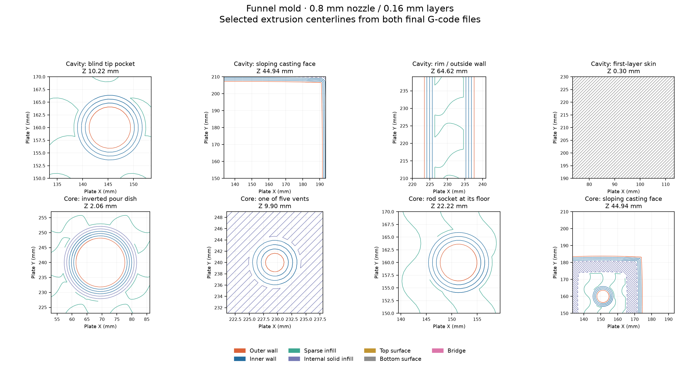

# Funnel mold print project

[funnel-mold-petg-08-016.3mf](funnel-mold-petg-08-016.3mf) contains the cavity and
core meshes, editable process and filament settings, and both plates' sliced G-code.
The two solids match the supplied mold meshes within the slicer's floating-point
serialization. The core is rotated 180° about X, with its plate on the bed and its
forming plug upward. Neither solid is scaled or cut.

## Plates

Bambu Studio 02.08.02.61 estimates:

| Plate | Orientation | Time | PETG | Layers |
|---|---|---|---|---|
| 1 — Cavity | Opening up | 21 h 3 min 42 s | 744.36 g | 466 |
| 2 — Core | Plate down, plug up | 13 h 38 min 59 s | 485.37 g | 315 |

These are separate print jobs. Combined material is 1,229.73 g. A full 1 kg spool
covers either plate; the remainder after the cavity does not cover the core.
Physical print, surface finish, vacuum behavior and silicone-release results are
not yet recorded.

## Settings

| Setting | Value |
|---|---|
| Printer | Bambu Lab H2C 0.8 Standard +0.04 Z trim |
| Filament assignment | Left nozzle, Standard flow, manual assignment on both plates |
| Filament | PETG Translucent, 255 °C throughout; flow ratio 0.97 |
| Bed | Textured PEI, 70 °C throughout |
| Layers | 0.16 mm; first layer 0.30 mm |
| Walls | Arachne, four requested loops, 0.80 mm width |
| Fill / top / first-layer width | 0.90 mm |
| Top shell | 13 layers, minimum vertical thickness 2.08 mm |
| Bottom shell | 10 layers, minimum thickness 1.60 mm |
| Interior | 15% gyroid |
| Outer wall / top surface speed | 30 / 30 mm/s requested |
| Inner wall / solid fill / sparse fill speed | 80 / 90 / 100 mm/s requested |
| First-layer wall / fill speed | 25 / 35 mm/s requested |
| Maximum volumetric speed | 12 mm³/s |
| Outer-wall / top-surface acceleration | 1,000 mm/s² |
| Normal part cooling | 20–40%; off for first three layers; auxiliary fan off |
| Overhang cooling | 90% override |
| Seam | Aligned scarf, inner walls included, conditional scarf off, gap 0% |
| Brim | Outside only, 6 mm, 0.15 mm separation |
| Supports / ironing | Disabled / disabled |
| XY contour / hole compensation | Zero / zero |

The active printer retains the reservoir trial's Z trim: an early `G29.1 Z0`
reset and a single final `G29.1 Z0.02` on textured PEI. Both nozzle slots are
configured as 0.8 mm Standard; the sliced plates use the left slot. The optional
printer presets remain in the reservoir's
[Z-trim bundle](../../cold-core/reservoir/reservoir-08-z-trim-presets.bbscfg).
Changing the printer, nozzle, trim or material requires slicing again.

## Inspection

[Inspection readings](print-profile.json) identify the project, meshes and G-code
by digest. Both embedded G-code files match their CLI exports and their MD5 entries.
Both plates return slicing success with empty plate-warning fields. All model and
brim extrusion stays inside the 330 × 320 mm printable area. Neither plate contains
support paths. Native Bambu Studio thumbnails show the print orientation.

The cavity mesh has 97,938 triangles; the core has 89,778. Each is one closed,
consistently wound body. The cavity is 189 × 189 × 74.649 mm; the core is
201 × 201 × 50.640 mm in its print orientation.

Selected layers cover the bottom skins, interior fill, blind cavity tip, sloping
forming faces, rim, registration skirt, pour dish, five vents and rod socket.
The socket is open from its blind floor toward the core tip. The pour dish is
the core's only downward-facing surface above the bed. It occupies the first
4 mm and does not form the funnel's wetted face.

The five vents retain nominal clear diameters of about 2.42–2.43 mm above the
first layer. The rod socket reads about 6.39–6.40 mm through its body and 6.32 mm
at its last printed layer. These are centerline-and-width readings; the ground
6.35 mm rod still needs a physical fit check and the entrance may need clearing.
The core's final extrusion is at Z 50.54 mm. The source mesh reaches 50.640 mm.

Outer-wall extrusion reaches 30 mm/s on the cavity. The core includes short
45 mm/s outer-wall segments in the pour-dish layers; the inspected forming-face
layers stay at or below 30 mm/s. The nominal 12 mm³/s flow cap is below the
installed Bambu PETG Translucent H2C 0.8 profile's 16 mm³/s value.

The paths and line widths describe the slicer's output, not measured deposited
plastic or a leak test. Scarf ramps and speed transitions remain in the G-code.

## At the bench

Dry the PETG before printing and feed it from dry storage. Bambu specifies
[65 °C for 8 hours](https://us.store.bambulab.com/products/petg-translucent?id=42479468281992)
in a blast drying oven. Check the first layer and let each plate cool before removal.

Clear all five vents and the pour port. Check the ground rod's slip fit and socket
depth before coating. Dry-assemble the halves: the skirt slides squarely over the
cavity and the parting lands seat without rocking. Keep the socket, registration
fit and parting lands free of pooled coating.

The core's forming surface carries the funnel's inside finish. Sand and seal it,
then coupon-test the exact PETG, sealer, release and silicone combination for cure
and repeated release before casting a funnel. The 0.16 mm terraces remain physical
features until finished. Smooth-On's
[sealer and release tests](https://www.smooth-on.com/support/faq/210/) show that
compatibility depends on the silicone and finish combination; a gloss acrylic
coating alone does not establish compatibility with BBDINO.

Degassing mixed silicone in a separate cup keeps the mold out of that vacuum cycle.
Vacuum exposure of a filled mold also depends on sealing its cavity face: its sparse
interior contains air, and an unsealed casting face can pass that air into silicone.
