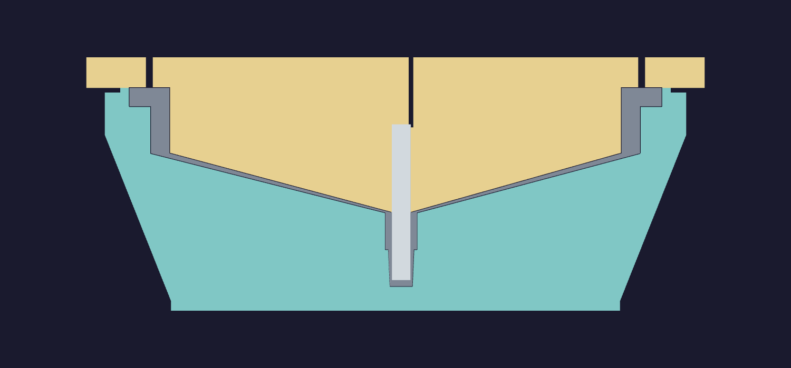

# Solid funnel mold

Two solid PETG bodies form the [funnel](../../funnel/README.md). The cavity is teal
and the inverted core is gold in the drawings. The forming geometry comes directly
from `funnel.build_solids()`.

The optional [version with two V channels per body](channels/README.md) removes
bulk from the print backs while retaining these forming and mating surfaces.


The cavity's continuous backing runs from a rounded [146 mm](FOOT_WIDTH) foot to
its rim. The outer taper is at least [60°](TAPER_ANGLE) above the print bed,
including the rounded corners. Its greatest outward step is
[0.23 mm](TAPER_GROWTH) per 0.40 mm layer. The core is
a solid plug on a flat plate. A [6 mm](REGISTER) locating skirt and one broad key
set the closing position and orientation. Four opening notches expose solid bearing
lands at the parting line. The fill hole and five casting vents pass straight
through the core plate.

The owned [6.35 mm](ROD_D) × [50.8 mm](ROD_LEN) steel dowel forms the spout bore.
It seats [28.8 mm](SOCKET) into the core. A small offset vent connects the socket's
clearance to the dry back, with the rod seated against the remaining end shoulder.



In section, grey is the silicone and light grey is the steel dowel. Both forming
faces reserve [0.20 mm](FINISH) of net finishing growth. The nominal silicone
casting, including the tip trimmed off after release, is [135 mL](CAST_VOLUME).

| Body | Envelope | Estimated print | PETG |
| --- | --- | --- | --- |
| [Cavity](cavity.step) | [189 × 189 × 72.6 mm](CAVITY_DIMS) | [25 h 03 min](CAVITY_TIME) | [1710 g](CAVITY_MASS) |
| [Core](core.step) | [201 × 201 × 50.4 mm](CORE_DIMS) | [17 h 56 min](CORE_TIME) | [1261 g](CORE_MASS) |

The [assembled mold](assembly.step) fits inside a [271.0 mm](ENVELOPE) circle.
The chamber's recorded inside diameter gives [14.4 mm](CHAMBER_GAP) of radial
clearance when centred. Fit through the actual opening and onto the catch tray is
a bench check.

## Print

[Default +0.04 trim](solid-mold.3mf) · [Alternate +0.18 trim](solid-mold-z018.3mf) ·
[Saved printer, filament and process presets](solid-mold-presets.bbscfg)

The two plates use the left 0.8 mm High Flow nozzle, translucent PETG at 255 °C,
an 18 mm³/s flow cap, 0.16 mm layers at the forming slopes and fit details, and
0.40 mm layers through the backing. All modeled stock prints at 100% fill. Each
large plate needs filament refill beyond a 1 kg spool. Bed contact is permanent
model material; the slices contain no brim, skirt or support paths.

Outer perimeters are capped at 40 mm/s. The overhang speed settings are
30 / 30 / 25 / 10 mm/s. The filament preset supplies 90% part cooling on all
outer perimeters after the first three layers, using a 0% overhang threshold.
Conventional seams use the back position with overhang avoidance. Travel planning
detours around perimeter walls where possible. The commanded speeds and seam locations
are recorded in [toolpath-review.json](toolpath-review.json).

The [full-height corner trial](corner-trial.3mf) contains a 54.5 × 54.5 × 72.6 mm
section of this cavity, with the same layer bands and saved presets. It exercises
the full taper height on a smaller print. Its smaller mass and shorter layer times
do not reproduce the whole mold's thermal conditions. Its settings and G-code
checks are in [corner-trial-profile.json](corner-trial-profile.json).
The [print log](../print-log.md) records observed specimens.

The recipe, all effective settings, layer bands, mesh digests, G-code checksums
and estimates are in [print-profile.json](print-profile.json). The CAD dimensions
and volumes are in [design.json](design.json). Printing, vacuum behaviour and
release with the actual finishing stack remain untested.

## Finish, cast and open

Prove the PETG, coating, release and [silicone](../silicone.md) together on a
finishing sample. Measure the net finish; keep the parting lands, locating skirt,
key and bores bare. Solid infill eliminates deliberately hollow backing cells;
the forming faces still require a continuous sealing finish.

1. Check the bare mold in the chamber. Dry-fit the key and skirt, and clear the
   dowel socket until the actual pin slides freely to its seat. Keep its vent open.
2. Degas the mixed silicone in a separate container. Fill the open cavity,
   including the blind spout pocket. Align the key and lower the core slowly with
   the dowel installed. Seat the parting lands evenly and top up through the fill hole.
3. Keep the fill and air passages open during a filled-mold vacuum cycle, with
   room for expansion and a catch tray. Return the chamber to ambient pressure
   slowly, check the fill level and top up while the silicone remains workable.
   Keep the core seated through cure.
4. Trim cured overflow flush with the straight port mouths. Begin opening in small,
   alternating movements at opposite notches with a blunt flat tool. As the silicone
   brim becomes accessible, peel its edge to admit air. Lift straight, follow the
   dowel's movement and peel the exposed silicone from the tooling. Withdraw the
   dowel axially and cut the sacrificial spout tip at its trim shoulder.

## Regenerate

The forming and backing geometry is in [solid_mold.py](solid_mold.py).

The hand-run tools are [solid_mold.py](/tools/funnel-mold-design/solid_mold.py),
[prepare_print.py](/tools/funnel-mold-design/prepare_print.py) and
[verify_print.py](/tools/funnel-mold-design/verify_print.py). They use the project's
CadQuery Python. CAD outputs are held in this directory; the two STEP drawings
`overview` and `section` are views of those same bodies.

```sh
tools/cad-venv/bin/python tools/funnel-mold-design/solid_mold.py --output hardware/printed-parts/zone-c/funnel-mold/solid
tools/cad-venv/bin/python tools/funnel-mold-design/prepare_print.py --models hardware/printed-parts/zone-c/funnel-mold/solid --output /tmp/funnel-solid-final/default-input.3mf
```

Prepare the alternate input with `--z-trim 0.18`. Slice both inputs in Bambu
Studio before use. `verify_print.py` reads the saved sliced archives, checks
their settings and embedded paths, and writes the delivered projects and reading.

After publication, run [review_geometry.py](/tools/funnel-mold-design/review_geometry.py)
with `--models hardware/printed-parts/zone-c/funnel-mold/solid`. It reads the printed
meshes with the cavity upright and the core inverted. The adjacent `.lint-answers`
files explain the finishing-pocket edges, opening notches and key clearance.

[prepare_trial.py](/tools/funnel-mold-design/prepare_trial.py) cuts the corner
from this directory's `cavity.step` into a separate output directory. Prepare
that directory with `prepare_print.py --only cavity`. Audit its default-trim
slice with `verify_print.py --single --project-stem corner-trial`.

## Sources
[value](NAME) texts are updated by:
- `/tools/funnel-mold-design/verify_print.py`
