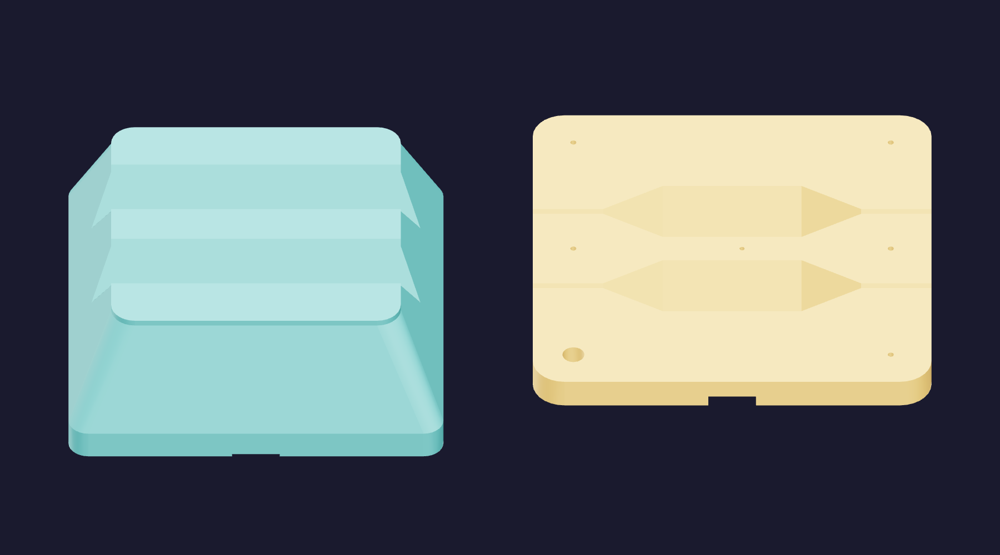
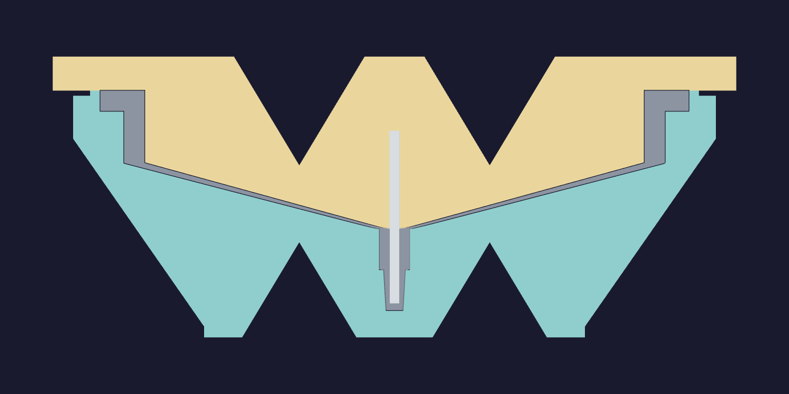

# Funnel mold with V channels

An optional version of the [solid mold](../README.md), with two open V channels
through the print back of each body. All remaining material prints at 100% fill.
The forming faces, finishing allowance, keyed rim, opening notches and casting
passages have the solid mold's geometry.

Teal is the cavity and gold is the core. Both backs face the camera in this view.
The core's channels taper to shallow mouths before reaching its perimeter plate.
Each channel opens through both sides above the plane of a flat shelf; the CAD
checks a clear 1 mm diameter passage along its entire length.

Grey is silicone and light grey is the steel dowel. The cavity prints upright
and the core prints inverted. Every added roof is at least 59.0 degrees to its
print bed, closing inward by at most 0.24 mm per side per 0.40 mm layer. The
pointed roof closes without a horizontal ceiling. The cavity channels are
28 mm deep; the core channels reach 32 mm and reduce to 3 mm at the side mouths.

The channels remain outside the forming surfaces' reserved finish. The closest
channel-to-forming-face backing is 9.4 mm in the cavity and 6.8 mm in the core.
The core's minimum occurs at a shallow mouth under the brim plate. The untouched
regions retain the solid mold's existing thicknesses.

## Material and printing

| Body | PETG | Estimated print |
| --- | --- | --- |
| [Cavity](cavity.step) | [1176 g](CAVITY_MASS) | [17 h 28 min](CAVITY_TIME) |
| [Core](core.step) | [1117 g](CORE_MASS) | [16 h 13 min](CORE_TIME) |

Together the slices use about 2.29 kg and take 33 h 41 min. Compared with the
solid body's two slices, that saves about 284 g (11%) and 2 h 49 min (7.7%).
The CAD removes 113.9 mL from each body. The cavity has 48.9 cm² of bed contact,
distributed over three long strips; the core has 316.4 cm². Each model remains
one connected solid. Bed adhesion of the narrower cavity strips is untested.

[Default +0.04 trim](channel-mold.3mf) · [Alternate +0.18 trim](channel-mold-z018.3mf) ·
[Saved presets](solid-mold-presets.bbscfg)

Both projects use the baseline's saved process, printer and filament presets:
left 0.8 mm High Flow nozzle, translucent PETG at 255 °C, 18 mm³/s flow cap,
0.16 mm layers at forming and fit details, and 0.40 mm through bulk stock.
The slices contain no support, brim or skirt paths. Each body still needs more
than one 1 kg spool. Detailed geometry measurements are in [design.json](design.json);
the slice settings and G-code audit are in [print-profile.json](print-profile.json).
The [layer review](layer-review.json) checks sections at the delivered G-code's
layer heights: 304 cavity layers and 240 core layers, with no floating model
sections above 0.01 mm². Each body's first layer has three contact regions.

## Vacuum and release

The open channels communicate with chamber air even on a flat shelf. They provide
no enclosed backing volume to hold atmospheric pressure during evacuation.
Keep the mouths clear of tape, coating, silicone overflow and fixtures. This is
a geometry-based pressure-equalization argument; printing, vacuum cycling and
demolding with the actual finishing stack remain physical tests.

The forming faces still require the solid mold's sealing finish. Follow its
[finishing, casting and opening instructions](../README.md#finish-cast-and-open).

## Regenerate

The channel construction is in [cut_channels.py](cut_channels.py), over the
solid mold's [generator](../solid_mold.py).

Run [cut_channels.py](/tools/funnel-mold-design/cut_channels.py) with the project's
CadQuery Python and `--output hardware/printed-parts/zone-c/funnel-mold/solid/channels`.
It builds the solid mold and subtracts the channels, then exports the CAD and
printed meshes. Use [prepare_print.py](/tools/funnel-mold-design/prepare_print.py)
with this models directory and `--label 'Funnel mold with V channels'` for each
Z trim. Slice the two inputs and run
[verify_print.py](/tools/funnel-mold-design/verify_print.py) with this models directory,
the slice directory and `--project-stem channel-mold`.

After publishing, [review_geometry.py](/tools/funnel-mold-design/review_geometry.py)
reads this models directory in each body's print orientation.
[review_layers.py](/tools/funnel-mold-design/review_layers.py) takes the same models
directory and `--project channel-mold.3mf` to check model-section connectivity.

## References

[Prusa's modeling guidance](https://help.prusa3d.com/article/modeling-with-3d-printing-in-mind_164135)
describes support and overhang constraints. The 59-degree roof and its layer growth
are measurements of this CAD; the slicer is the source of the print estimates.

## Sources
[value](NAME) texts are updated by:
- `/tools/funnel-mold-design/verify_print.py`
