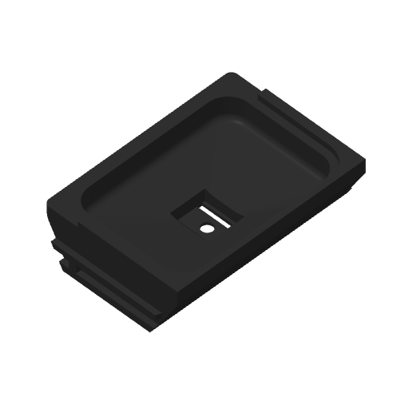

# Current funnel frame on Mark2

One current funnel frame is accepted on Mark2 as task/job **1312579244** at
**6:22 pm CDT on October 5, 2026**, using black PET-GF through external left
slot 254 and the fixed left hardened standard-flow 0.4 mm nozzle. The print
uses Textured PEI and Mark2's +0.04 mm requested / +0.02 mm emitted Z trim.
The native estimate is **6 h 19 min**, giving completion near **12:41 am CDT
on October 6**. Heating, calibration and physical printing can shift that estimate.
There is no programmed insertion pause.

The [launch](launch.json) binds one successful foreground Send and the new
accepted job identity. The [preflight](preflight.json) records Derek's start
request, both fresh printer readings, the peer's startup spacing and the exact
source, input and archive hashes. Scheduled monitoring and automatic resume
are not authorized by this job.

The [preparation](preparation.json) binds the current exported frame STEP/STL to
one isolated native input project. The frame prints on its flat underside,
with a 0.20 mm first layer and ordinary 0.24 mm layers, using the shared
PET-GF recipe and saved speeds, wall order and infill overlap. Functional rail
bearings retain automatic tree supports, 0.30 mm bottom Z clearance and
0.50 mm object XY clearance. There is no brim or elephant-foot compensation.
The upper front surround and lower body share one width and have no expanding
roof-side or inward/top show-round band.

The [native verification](verification.json) checks the exact source and
archive, ZIP integrity and embedded G-code MD5, fixed left-nozzle paths and
all **230 model layers**. The [emitted-path review](emitted-path-review.json)
checks native stock components, sampled outer/hole boundaries, the complete
model/support bed extent and first-to-second-layer bead overlap. It has no
unresolved perimeter diagnostics.

The [support audit](support-audit.json) records four bed-rooted support bodies
and four interface islands on the external rail bearings. The
[complete support-slab review](support-removal-review.json) sweeps every emitted
support bead at its actual width and full height outward through open space
without intersecting native stock. Detach rail contacts and sacrificial branch
junctions before removing the support sections through the open flanks.
Physical removal effort, surface finish, silicone brim support and assembled
fit have no acceptance result in this record.

