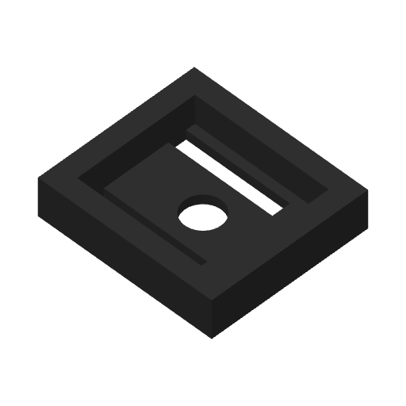

# Current cradle-trial receiver native H2C slice

This offline native slice binds the exact current STEP and STL below. It uses the
shared PET-GF recipe, left 0.4 mm nozzle and external black PET-GF (profile label
PET-CF). The first layer is 0.20 mm; normal layers are 0.24 mm. Saved speeds,
wall order and 15% infill/wall overlap are retained. Elephant-foot compensation
is zero and there is no brim. Requested H2C Z trim +0.18 mm emits G29.1 Z0.16
for the textured plate. **No print has been submitted from this receipt.**

| Artifact | SHA-256 |
| --- | --- |
| STEP | `79de294d370cbb103475febb4149b52832582c388db1de7d038edf93442038d2` |
| STL | `6d4c1b2d9ccdf8769db04c900337cc2358e51b61a4e43bdf1b6a8a2a010b6fd6` |
| Native input project | `ed045b714240d8235345020f1e1a1141c09b6e7a5847d9adc83b6f02622d92dd` |
| Native archive | `e572748e4dd94f49a147992231cedf72e7cc2ce8470bd1b168067020e841f6ed` |
| Emitted G-code | `e2eff4c4ca6dd14280c472a81ded63ccef30764f11aff710e0315adf9b09a509` |

The [preparation](preparation.json) and [verification](verification.json) retain
the exact native files, settings, production pose, embedded-mesh equality,
ZIP integrity and G-code MD5 checks. Native estimate: **23 min 2 s**.

The [emitted-path review](emitted-path-review.json) covers all
**50 model layers**, including every native stock
component and outer/hole perimeter. No native component lacks model wall paths.
Every second-layer bead overlaps the first layer by at least
79.7% of its area;
the outer-wall minimum is 99.7%.
All model and support beads retain at least
133.000 mm to the reachable bed edge.

The [support audit](support-audit.json) retains **0 support bodies**,
0 without explicit interface labels.
The [complete removal sweep](support-removal-review.json) checks all emitted
support beads against native stock using their actual widths and slab heights.
The receiver prints on its flat underside, matching the frame orientation. Its 3 mm web, drain hole and two wing slots receive model walls in every native section. There are no support paths and no perimeter diagnostics. This coupon qualifies only its recorded trial geometry; it does not represent a slice of the full frame or qualify production retention.

The [accepted v4 record](../../../cradle-trial/physical-acceptance.json) remains
limited to its frozen printed pair. Current 3.15 mm hooks, corresponding slots
and flat silicone bearing require separate physical acceptance. Native slicing
does not establish insertion force, retention, operating life, support-removal
effort or contact finish.

