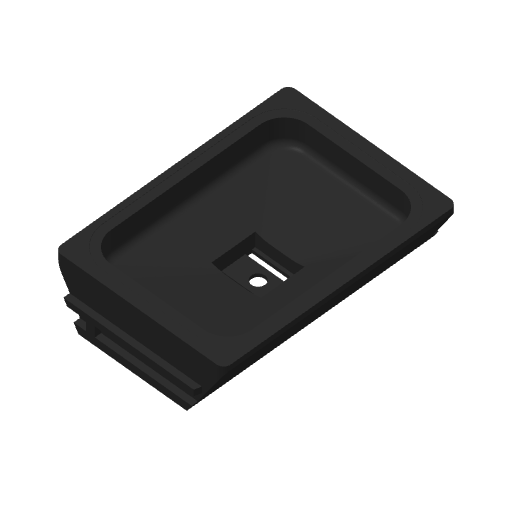

# Expanded funnel frame native H2C slice

This offline native slice binds the exact current STEP and STL below. It uses the
shared PET-GF recipe, left 0.4 mm nozzle and external black PET-GF (profile label
PET-CF). The first layer is 0.20 mm; normal layers are 0.24 mm. Saved speeds,
wall order and 15% infill/wall overlap are retained. Elephant-foot compensation
is zero and there is no brim. Requested H2C Z trim +0.18 mm emits G29.1 Z0.16
for the textured plate. **No print has been submitted from this receipt.**

| Artifact | SHA-256 |
| --- | --- |
| STEP | `011cba0d23badd7f0bc31ddffee6b55f68ac8b6cec8044aeb9d457e9b34be089` |
| STL | `9bbdd18722b968407c6eb844d1d70d4f85963a26afb1dceedbd5b4d0f754b6bd` |
| Native input project | `7a3e87f7f3c5aa1d28d6dc5b190a01dffee3338efb38e7b5daa01ca24597a292` |
| Native archive | `5e2727797dd2ab2408b9ca6b76835f553e4a2eefcea52fd64fa1e30000f43a1d` |
| Emitted G-code | `76f2446486242eaa014621a47019a6b18957dd5d39a99724e6e95c54a18e268b` |

The [preparation](preparation.json) and [verification](verification.json) retain
the exact native files, settings, production pose, embedded-mesh equality,
ZIP integrity and G-code MD5 checks. Native estimate: **6 h 15 min 22 s**.

The [emitted-path review](emitted-path-review.json) covers all
**205 model layers**, including every native stock
component and outer/hole perimeter. No native component lacks model wall paths.
Every second-layer bead overlaps the first layer by at least
69.7% of its area;
the outer-wall minimum is 69.7%.
All model and support beads retain at least
49.399 mm to the reachable bed edge.

The [support audit](support-audit.json) retains **4 support bodies**,
0 without explicit interface labels.
The [complete removal sweep](support-removal-review.json) checks all emitted
support beads against native stock using their actual widths and slab heights.
The frame prints on its full flat underside. Four supports reach only the external rail-lifting bearings; the drain hole, wing slots and silicone socket receive no supports. Every complete support bead is swept outward into open space without intersecting native stock. Detach the rail contacts and sacrificial branch junctions before moving the sections out through the open flanks. No intact-tree extraction is assumed.

The single raw perimeter diagnostic is native Face 96, the upward Z48.8 silicone-brim clearance seat. The actual Top surface road covers its witness; [the native reading](perimeter-diagnostic-readings.json) and [resolution](perimeter-diagnostic-resolution.json) retain that measurement.

The [accepted v4 record](../../../cradle-trial/physical-acceptance.json) remains
limited to its frozen printed pair. Current 3.15 mm hooks, corresponding slots
and flat silicone bearing require separate physical acceptance. Native slicing
does not establish insertion force, retention, operating life, support-removal
effort or contact finish.

