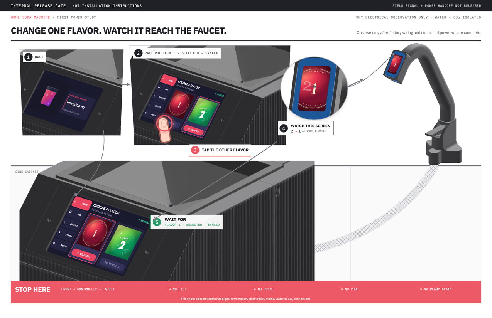

# First-power selection-path study

This is an internal 11 × 17 in release-gate study. Its HTML is deliberately outside
the root-level `hardware/quickstart/*.html` build inputs, so `_build.py` does not bind
it into the public installation PDF.



The picture tests one dry electrical behavior only:

1. observe the shipping boot screen;
2. begin on HOME with Flavor 2 selected and synchronized;
3. tap the other card, Flavor 1;
4. observe the faucet artwork change from Flavor 2 to Flavor 1;
5. wait for HOME to show Flavor 1 selected and synchronized.

That sequence exercises the enclosure display's request, the main board's
persistence, and the main-board-to-faucet publication path. It does not exercise
the reciprocal faucet touch path and does not establish any beverage-ready state.

The sheet is not an installation or commissioning procedure. It may become a public
second sheet only after signal termination, strain relief, and field power handoff
have released procedures and the whole sequence passes on an assembled shipping unit.
Water and CO₂ remain isolated for this check. Filling, priming, refrigeration,
carbonation, faucet flow sensing, flavor injection, and pouring are outside its scope.

## Render

Generate the exact compiled screen artwork, then render the study at 150 px/in:

```sh
tools/cad-venv/bin/python hardware/quickstart/studies/first-power-link/decode_art.py
node tools/render/render-card.js \
  --batch hardware/quickstart/studies/first-power-link \
  hardware/quickstart/studies/first-power-link/out \
  --size 2550x1650 --dpr 1 --pdf 17x11in
```

The UI layout is recreated from the shipping firmware's dimensions, words, colors,
and state transitions. Boot and flavor artwork is decoded byte-for-byte from the
compiled RGB565 headers. This is not a framebuffer capture.

The rendered PDF remains an internal study and is not copied to the drawings shelf.
