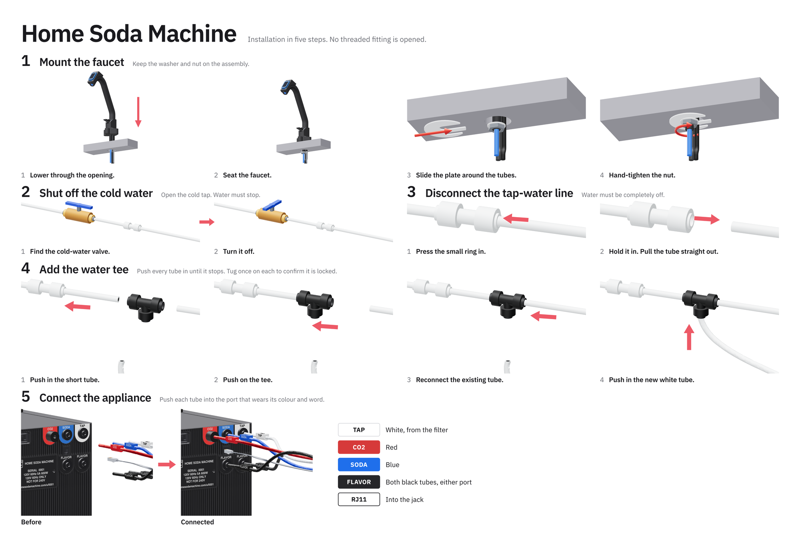

# One-sheet study

One 19 × 13 in sheet, landscape, borderless, carrying the whole installation quick start: the five
chapters and their fourteen registered scenes from [`../../`](/hardware/quickstart/README.md), in
reading order, on unprinted paper. It lies on top of the packing inside the carton, so it is the
first thing seen when the lid comes off and the only sheet the install needs.



`sheet.html` is the sheet. `proof.html` is the same page given over to the stock itself: edge
rulers that read the borderless overscan directly, the field and port colours as swatches, a grey
ramp, rule weights, the guide's type at 6–48 pt, and the connected rear wall at life size.

## Page

19 × 13 in authored at 5700 × 3900 px (300 px/in) and rendered at dpr 1.2: 6840 × 4680 px,
360 dpi, the ET-8550's own grid. The outer 0.5 in (150 px) holds nothing that matters; borderless
printing scales the page 2–3 % ([`cards/STYLE.md`](/hardware/assembly/cards/STYLE.md)). No element
paints a background: the field is the paper, and the paper is warm white.

## Scenes

Rows 2, 3 and 4 show the one under-sink world at one scale, 0.6375 of the source frame. Rows 2 and
3 crop each 2000 × 1100 frame to the 330 px ribbon the tube runs in (`object-fit: cover` at
46.5 %), so the same fitting is the same size in every frame from the valve to the finished tee.
Row 1 sets the two lowering frames at one scale on one baseline and crops the two under-counter
frames to their inked extent. Row 5 carries the same rear pair the 11 × 17 sheet does, with the
port chips as a legend in the wall's own colours ([`../../art/colors.css`](/hardware/quickstart/art/colors.css)).

The proof's life-size rear wall is the ortho camera's 360 mm over 1800 px, 0.2 mm per source
pixel: a 1350 px crop is 270 × 230 mm on the page at 127 dpi. A life-size hero wants the render
at 2.4× its current size (`CONNECT_RENDER_SIZE` in [`../../_cad_art.py`](/hardware/quickstart/_cad_art.py)).

## Render

```sh
node tools/render/render-card.js \
  --batch hardware/quickstart/studies/one-sheet \
  hardware/quickstart/studies/one-sheet/out \
  --size 5700x3900 --dpr 1.2 --pdf 19x13in
```

`out/` is built, not carried. `preview.png` is the sheet at 2000 px.

## Print

ET-8550, rear feed, one sheet at a time. Page size **13x19 borderless**, media type premium
semigloss, photo quality, `out/sheet.pdf` and `out/proof.pdf` at 100 %. Stock: A-SUB satin RC
photo paper, 260 gsm (72 lb), 13 × 19 in, warm white, waterproof, single-sided —
[B0DSJ9X4CR](https://www.amazon.com/dp/B0DSJ9X4CR), 50 sheets. The 4 × 6 and letter bench decks
print on the same class of RC stock ([`purchases.md`](/hardware/ledger/purchases.md) §13).
