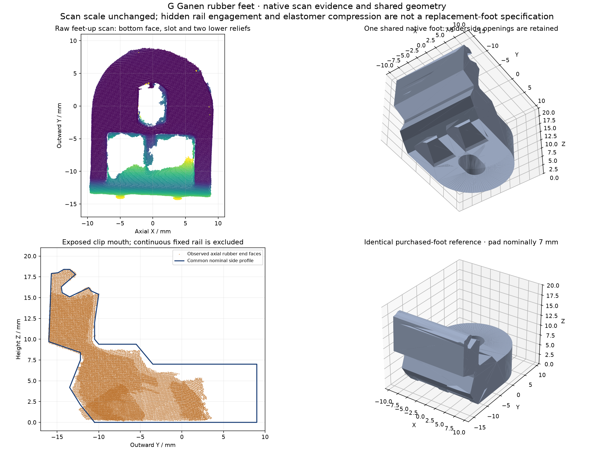

# Common purchased rubber foot

All four G Ganen feet use one native shape. Derek confirms they are identical,
removable rubber sliders with pads approximately **7 mm thick**. The reference
retains the rounded outer pad, obround screw opening, two underside reliefs and
raised clip with its exposed C-shaped mouth. It describes the purchased foot;
it is not a design for manufacturing a replacement.

`g_ganen_foot.py` supplies `build_foot()`, `placed_foot(station_x, side, slot_y)`,
`observed_placement(row)`, `observed_foot(row)`, `parameters()` and
`rail_engagement_interval()`. The local origin is the nominal slot centre on the
bearing plane; X follows the rail, +Y points outward, and Z points upward. The
negative side uses a proper 180° rotation. The installed copies use Z=0; the
reference's observed copies retain independent rigid bearing-plane poses.

The shared pad is nominally 7 mm thick, 18 mm wide with a 9 mm radius nose. The
visible obround opening is 4.5 × 6.8 mm, long axis outward. The installed slot
station is |Y|=38.5 mm. These are rounded common dimensions, not separate fits
that turn free-foot deflection into four different manufactured shapes.

## Scan evidence

[measurement-review.json](measurement-review.json) records the selections and
input hashes. First-pass outer-nose fits give radii 8.72–8.91 mm with absolute
p95 residuals 0.26–0.34 mm; visible axial face separations are 17.56–17.96 mm.
Complete lower slot sections measure 4.07–4.67 mm wide and 6.38–6.92 mm long.
The scan's independent free-foot poses retain bend, registration disagreement,
edge rounding and spray; no fitted scale removes those differences.

The raised clip is identified on exposed axial rubber end faces, especially the
rear +Y foot in the on-back pass. Its visible mouth is distinct from the fixed
rail continuing above it. All 7,974 selected end-face observations lie within
0.160 mm of the common profile's occupied area; this is an external profile
check, not an internal gripping-surface fit. The underside relief mouths are
observed; their simplified inner depths are not a replacement tooling drawing.

## Rail stations

The fixed rail's observed axial surface spans about X=0.4–76.9 mm. A conservative
X=0.5–76.5 interval and the common clip span **−9 to +9 mm** give fully engaged
slot stations **9.5 and 67.5 mm**. These are chosen full-engagement positions,
not observed hard stops. A captured rear slot at X≈74.44 demonstrates partial
overhang; its permissible load or retention is not established by the scan.

The fixed casing reference fills the reentrant rail/cradle region. Any overlap
there must be attributed to that filled reference volume, not treated as rubber
penetrating a measured solid wall. The actual pad and surrounding component
clearances belong to the installed assembly checks.

## Native verification

[native-update.json](native-update.json) binds both current STEP/payload pairs.
The update reuses all **22 rigid native components** unchanged and replaces only
four feet with rigid placements of one shape. Non-foot generator functions,
measured geometric parameter values and both port records are unchanged.
All 52 detailed/integration component round trips pass validity, face count,
vertex, bound and volume checks. The detailed model has 26 solids/26,490 faces;
the integration model has 26 solids/5,496 faces.

The prior rigid scan readings and outer-envelope containment proofs remain
attributed to those exact unchanged components. `prior-evidence/` retains their
reports and hashes. Whole-pump timing measurements retain their original STEP
identity and are historical; they are not current performance claims.
