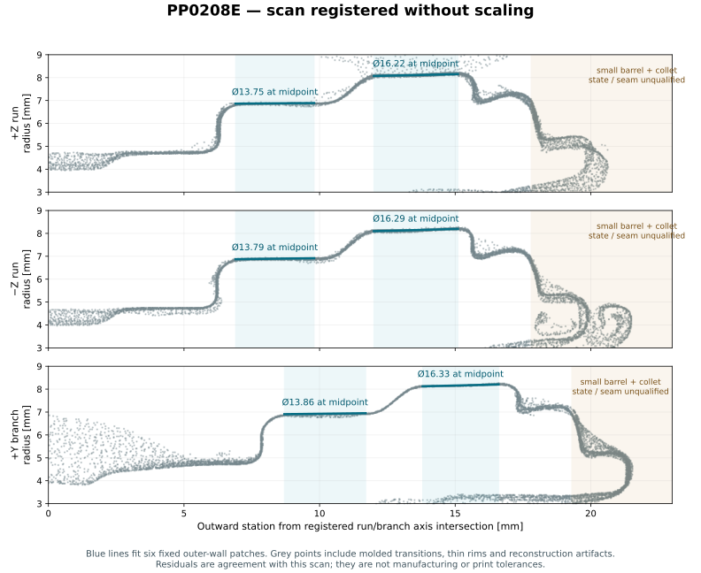
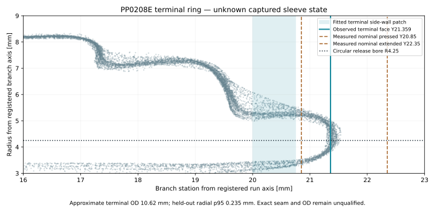

# John Guest PP0208E — 1/4" union tee

The production black polypropylene tee in the install kit, the water split and the six
manifold tee stations. The scan reference is the five-view capture in
`~/Documents/3D Scans/2026-09-19-jg-pp0208e-tee/`. Its raw scale is retained at **1.0**.

## Measured external reference

[`scan-registration.json`](scan-registration.json) registers that scan into the production
frame: run on **±Z**, branch on **+Y**, origin at the common orthogonal-axis intersection.
It names the source PLY by SHA-256 and stores the full rigid transform. The registration fits
six external surface patches with separate radius/taper parameters. Alternate triangles are
held out of the fit; the table reports their untrimmed residuals.

| External surface | Axial interval from origin, mm | Diameter at interval midpoint, mm | Radius taper, mm/mm | Held-out absolute residual, 95th percentile |
|---|---:|---:|---:|---:|
| +Z run root | 6.9–9.8 | 13.754 | 0.0084 | 0.107 mm |
| −Z run root | 6.9–9.8 | 13.789 | 0.0146 | 0.074 mm |
| +Y branch root | 8.7–11.7 | 13.859 | 0.0144 | 0.092 mm |
| +Z run widest collar | 12.0–15.1 | 16.224 | 0.0264 | 0.096 mm |
| −Z run widest collar | 12.0–15.1 | 16.292 | 0.0321 | 0.066 mm |
| +Y branch widest collar | 13.8–16.6 | 16.330 | 0.0293 | 0.061 mm |

The independently fitted branch axis lies at **90.027°** to the run axis. Its closest approach
to that axis is about **0.18 mm**. The production frame retains orthogonal intersecting axes;
that constraint does not warp or rescale the scan. The surface residuals describe this sample
and reconstruction, not manufacturing tolerances or printed-part clearance.

The widest collars have slight draft: their diameters increase toward their outer ends.
**Ø16.3 mm** is the documented nominal. **Ø16.5 mm** is a rounded envelope of the sampled
collar surfaces, not a guaranteed maximum across production parts. The branch's fixed
external steps are approximately **1.5 mm farther outward** than the corresponding run
steps. The fixed and moving surfaces at each nose remain separate interface questions.

The production clearance reference in [`../tee-connector/`](../tee-connector/) uses the
**Ø16.5 mm sampled collar envelope**, **Ø14.0 mm rounded root envelope** and measured
**42.5 mm extended run span**. Journals add **0.25 mm radial running air**, giving **Ø17.0 mm**.
The carrier troughs, insertion route and tie clearances consume that same envelope.
Conservative connecting shoulders precede the observed widening; the fit-band endpoints
are not treated as exact molded shoulder edges. The terminal detail and physical release
qualification remain open.



## Operating datums

Derek's measurements on the production tee control the mechanism:

| Datum | Value |
|---|---:|
| Run span, sleeves extended | 42.5 mm |
| Run span, both sleeves pressed | 39.2 mm |
| One run sleeve's stroke | 1.65 mm |
| Branch outside width, terminal extended / pressed | 30.5 / 29.0 mm |
| Branch terminal stroke | 1.50 mm |
| Nominal branch face from run axis, extended / pressed | 22.35 / 20.85 mm |
| Carrier nose gap at connected | 0.5 mm |
| Tube first meets resistance, from pressed sleeve face | 7.0 mm |
| Tube held, from pressed sleeve face | 8.5 mm |
| Tube bottoms, from pressed sleeve face | 10.0 mm |

Their complete context and observed release/relocking action are in
[`../tee-connector/README.md`](../tee-connector/README.md#measured-on-the-pp0208e-in-hand).
These internal operating measurements are not inferred from the scan.

[`branch-operating-measurements.json`](branch-operating-measurements.json) records the
outside widths on the contact surfaces in [`branch-measurement.svg`](branch-measurement.svg).
The nominal run-collar back radius is 8.15 mm: subtracting it gives the 22.35 / 20.85 mm
branch-axis stations. The conservative 8.25 mm clearance radius is a separate datum and is
not subtracted from the caliper readings. Derek identifies the small outermost terminal
ring as the moving part; the larger reduced barrel behind it stays fixed.

[`terminal-ring-scan.json`](terminal-ring-scan.json) fits the terminal surface independently
without changing the registered frame or scale. The branch terminal face is near 21.36 mm,
between the measured operating endpoints. The approximate terminal wall is Ø10.62 mm,
with 0.235 mm held-out radial p95 and 33 of 36 angular bins present. The merged surface
therefore supports an intermediate captured state, not a qualified terminal seam or OD.

The production clearance reference preserves a fixed reduced barrel at R7.75, bounded at
18.50 mm on the run and 20.25 mm on the branch. These conservative envelope ends are not
manufactured seam measurements. Its moving terminal clearance radius remains 5.715 mm.
The circular Ø8.5 release opening retains the flat annular bearing. Actual contact area and
release force require the physical terminal ring and printed mechanism.

[`terminal-bearing-review.json`](terminal-bearing-review.json) reads the observed front
face directly. It shows 20.07 mm² of projected face outside the release aperture, with
99.73% coverage of R4.25–4.75 mm and face present in all 36 angular sectors. The existing
scan and measured moving-face identity/stroke support the complete enclosure assembly
trial without another tee scan. Exact rear seam and OD remain unmeasured; projected area
does not establish simultaneous contact or a strength rating. The trial checks contact,
full release and relocking. The native R5.0 witness is plate stock, not a measured minimum
terminal-face radius.



## Production consumers

[`consumer-corrections.json`](consumer-corrections.json) lists the source locations and
dimensions affected by this reference. They include the manifold, the water split, the tee
carrier, the enclosure's branch journals/release face and the tee–valve bow fixture. Their
placed solids, tube projections and motion checks require one coherent change. No consumer
is qualified merely by enlarging its bore.

## Published drawing and illustration

John Guest's [Equal Tee drawing, Pp4608_01/23](https://www.johnguest.com/sites/jg/files/2023-04/JG%20Drinks%20Polypropylene%20Equal%20Tee%20Data%20Sheet.pdf)
lists the 1/4" row's tube OD 6.35 mm, pressed run span 39.0 mm, reach 19.5 mm,
insertion dimension 15.7 mm, widest collar Ø16.3 mm, flow bore Ø4.3 mm and total branch
envelope 27.7 mm. Derek's measured operating depths and run spans remain the mechanism's
inputs.

`jg_pp0208e_tee.py` is the current illustration builder. Its assumed Ø10.6 root, 8.2–16.3 mm
collar interval, identical arm steps and Ø9.7 collet are not the measured exterior above.
Its no-argument interface is consumed by the install-guide artwork. It does not qualify
production enclosure fit or sleeve motion.

## Reproduce the registration

```sh
tools/cad-venv/bin/python hardware/reference/jg-pp0208e-tee/fit_scan.py
```

The script rejects a different input digest. It reads the retained PLY directly, selects the
six stated outer-wall patches, fits an area-weighted robust rigid frame, and writes the
registration and held-out residuals. It does not infer internal bores, repair the open mesh,
move a collet or produce a manufacturing tolerance.
