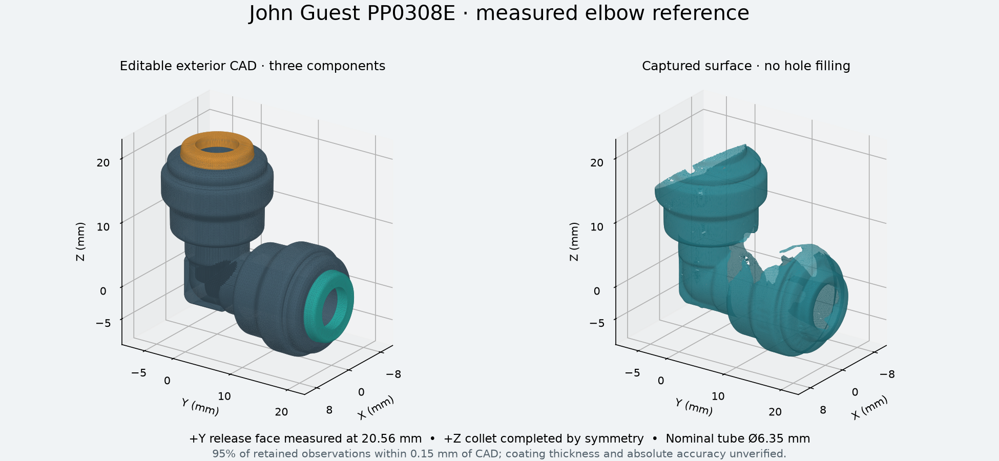
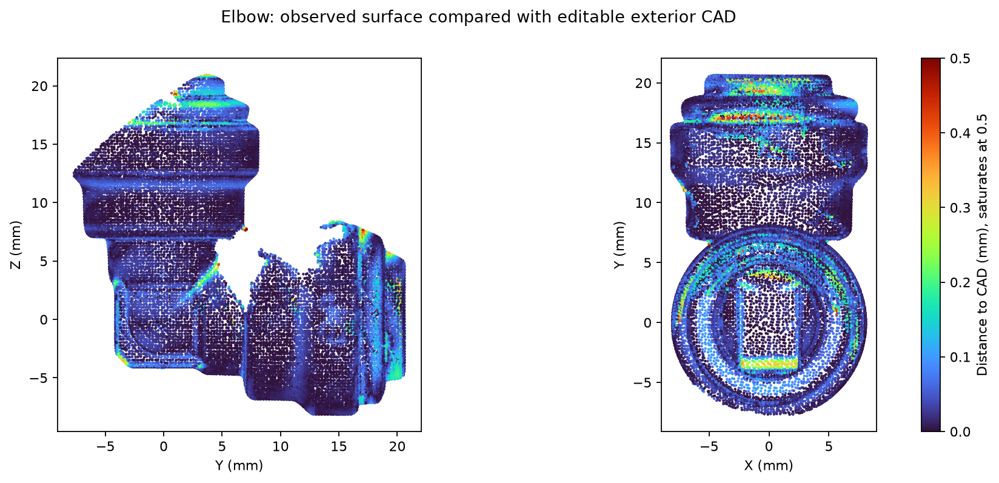

# John Guest PP0308E — scanned exterior reference

This is the coated elbow supplied for the funnel interface, identified as the
black polypropylene 1/4-inch PP0308E from the project inventory. The reference
contains an editable exterior CAD assembly, its unfilled measured surface, and
the source cloud. All coordinates are millimetres at the scanner's native scale.



- [`jg-pp0308e-elbow.step`](jg-pp0308e-elbow.step): three named components,
  `fixed_body`, `y_collet`, and `z_collet`.
- [`jg-pp0308e-elbow.stl`](jg-pp0308e-elbow.stl): the same exterior reference.
- [`observed-surface.ply.gz`](observed-surface.ply.gz): native mesh triangles
  after fixture exclusion and rigid transformation. Gaps remain open.
- [`elbow.py`](elbow.py): editable CadQuery builder and port datums.

## Datums and dimensions

The two nominal orthogonal socket axes meet at the origin and open along +Y and
+Z. +Y is the exposed socket in the capture; +Z is the socket supported in putty.
The frame is fitted jointly to four tapered cylindrical bands without rescaling.
This coordinate convention matches the existing elbow reference convention.

| Feature | Reference, mm | Evidence |
|---|---:|---|
| +Y release face from axis intersection | 20.562 | 3,446 face points, all 36 angular sectors present |
| +Z release face from axis intersection | 20.562 | Symmetry completion from +Y |
| +Y / +Z root diameter, near station 9.55 | 13.705 / 13.603 | Separate measured tapered-band fits |
| +Y / +Z collar diameter, near station 14.70 | 16.283 / 16.137 | Separate measured tapered-band fits |
| +Y fixed nose face | about 18.84 | Normal-selected axial profile |
| Collet projection beyond fixed face | about 1.73 | Captured resting state; not release travel |
| Collet external diameter near station 19.5 | about 10.52 | Coaxial modeling envelope of the exposed collet |
| Tube outside diameter | 6.35 | Nominal 1/4-inch tube specification |

`port('y')`, `port('z')`, and `stations()` return `(position, outward_axis)` at
the release faces. `build()` returns the three named components;
`build_elbow_connector()` returns their compound in a CadQuery workplane.
`INSERTION` and `RELEASE_TRAVEL` are explicitly `None`.

The bend retains the observed round core and thin outer web. Short revolved
profile segments approximate the molded rounds. The +Z fixed profile uses the
+Y form with the measured root and collar radius differences. The obscured +Z
nose and collet use symmetry; their full shape is not independently observed.
The nominal 90-degree axis relationship is a modeling constraint, not an
independent angle measurement.

## Capture and checks

The capture contains 799 MINI 2 frames in Revo Scan 6.3.2: High Accuracy,
feature tracking, normal object mode, colour off, manual depth exposure 2,
base removal off, and a 120–250 mm range. The table is at 0 degrees. Native
fusion spacing is 0.10 mm. Native meshing has denoising and hole filling disabled.
The source cloud contains 355,275 points. Its SHA-256 is
`b6f935b34965c9d3b7fe997052517add4517bf4d3b656d8643e25c18282fcdfe`.

[`source-cloud.ply.gz`](source-cloud.ply.gz) decompresses to those untouched
source bytes, including the fixture. [`scan-selection.json`](scan-selection.json)
states the inspected initial frame and table-plane exclusion.
[`scan-measurements.json`](scan-measurements.json) records the rigid transform,
fits, withheld angular sectors, and modeling profiles. The full native project,
raw frames, calibration files, and archive hashes are retained locally under
`~/Documents/3D Scans/2026-10-01-elbow/pass-01/`.

[`scan-model-check.json`](scan-model-check.json) compares all 31,080 retained
0.25 mm voxel samples with the exported CAD at 0.025 mm tessellation. No points
are removed for disagreeing with CAD. The 95th-percentile distance is **0.150 mm**
overall, **0.133 mm** at the bend, **0.025–0.072 mm** across the collar bands,
and **0.076 mm** on the exposed release face. The maximum retained distance is
**0.528 mm**. Collet-side and mouth details are less exact than the fitted bands.
The exported STEP contains three valid solids.



These are residuals against a single coated scan. They do not establish absolute
accuracy, part tolerances, coating thickness, or repeatability. Fusion spacing is
not a dimensional accuracy claim. The unfilled scan remains the detailed surface
reference where a smoothed CAD profile does not capture a small feature.

## Where it stands in the machine

The elbow is the funnel drain's disconnect. It stands in the
[elbow cradle](/hardware/printed-parts/zone-c/funnel/README.md#elbow-cradle) under the
funnel frame, its +Z leg up the frame's drain hole with the fixed nose face on the frame's
underside, and its +Y leg aft. The +Z collet holds the
[drain stub](/hardware/reference/funnel-drain-stub/funnel_drain_stub.py) the silicone plug
pushes onto; the +Y collet starts `fluid-4` to V-B. The cradle's pocket is the elbow's upward
shadow grown by the printed slip, read off this reference's profiles.

## Scope for mating parts

This reference establishes the exterior, collar seats, and captured release-face
location. Socket insertion depth, internal stops, seals, gripping teeth, and
release travel are unmeasured. The CAD's nominal tube corridors are layout
clearances; they deliberately supply no insertion stop or internal mechanism.
Do not use them to determine a tube cut length or release actuator stroke.
The collets are shown in their captured resting state, not a verified operating
endpoint. Unobserved inner-bend patches use a smooth modeled completion.

The source part family is listed on the
[manufacturer's union elbow page](https://www.johnguest.com/us/en/od-tube-fittings/polypropylene-black/elbows/union-elbow).

## Reproduction

Run from the repository root with the existing CAD environment:

```sh
tools/cad-venv/bin/python hardware/reference/jg-pp0308e-elbow/measure_scan.py
tools/cad-venv/bin/python hardware/reference/jg-pp0308e-elbow/derive_profiles.py
tools/cad-venv/bin/python hardware/reference/jg-pp0308e-elbow/elbow.py
tools/cad-venv/bin/python hardware/reference/jg-pp0308e-elbow/validate_scan.py
tools/cad-venv/bin/python hardware/reference/jg-pp0308e-elbow/check_artifacts.py
tools/cad-venv/bin/python hardware/reference/jg-pp0308e-elbow/render_reference.py
```

The fit reproduction checks the stored rigid transform and all four diameters
within 0.00001 mm numerical agreement. `validate_scan.py` reads the exported
STEP, not an in-memory substitute. Neither check converts fit precision into
absolute physical accuracy.
