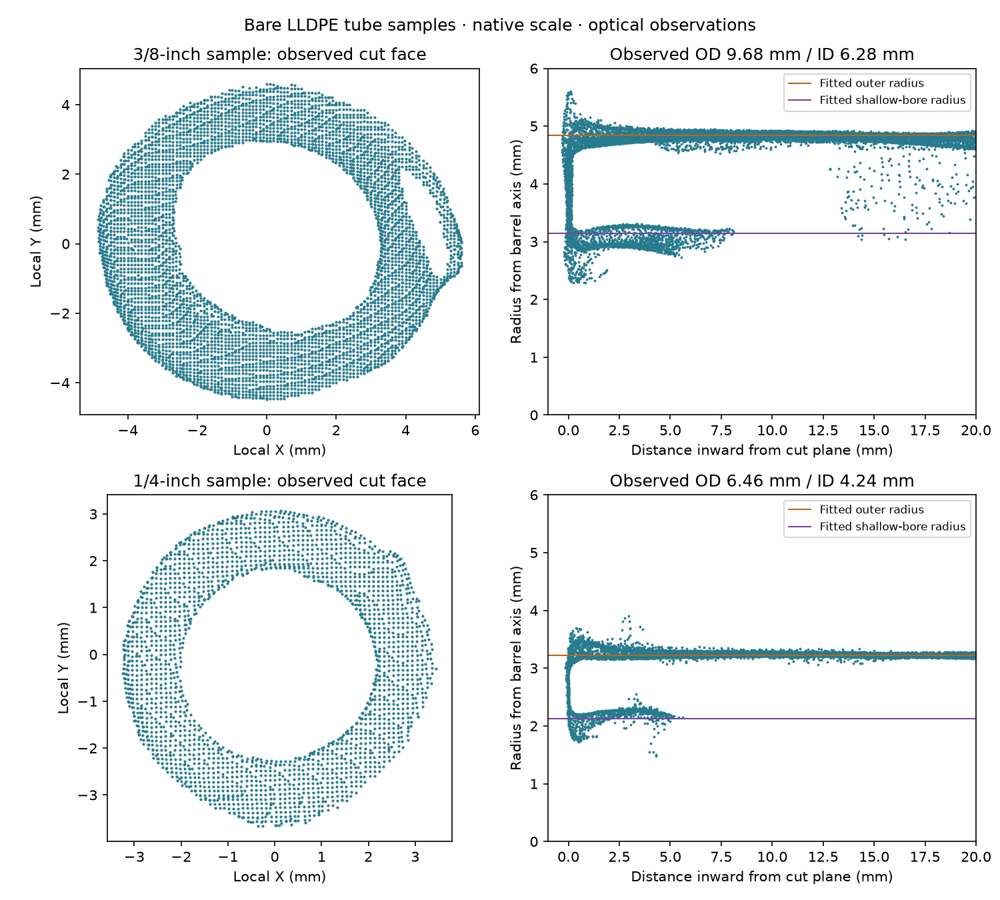

# LLDPE tube samples

Derek identifies the two bare white samples as ¼-inch and ⅜-inch outside diameter.
The native MINI 2 captures and raw projects are retained in
`~/Documents/3D Scans/2026-09-20-lldpe-tubes/`.
[capture-manifest.json](capture-manifest.json) records the acquisition settings and file hashes.

The end-view pass contains 668 frames at 30° tilt and 35 seconds per rotation, fused at
0.10 mm. Both cut faces and shallow bores are visible. The separate 600-frame level pass
contains side-wall observations. Neither cloud is rescaled, smoothed or hole-filled.

[scan-measurements.json](scan-measurements.json) records independent fits to the native
end-view cloud. Nominal size identifies each sample and does not enter the fitting objective.

| Sample | Optical outer diameter | Optical shallow-bore diameter | Outer fit absolute residual, p95 |
|---|---:|---:|---:|
| ¼-inch | 6.455 mm | 4.243 mm | 0.064 mm |
| ⅜-inch | 9.681 mm | 6.279 mm | 0.104 mm |

These are observations of bare surfaces in the fused cloud. Fit residuals do not establish
scanner accuracy or manufacturing tolerance, and the visible bore does not establish its
shape farther inside the tube. The production tube outside diameters remain the nominal
6.35 mm and 9.525 mm.



From the repository root, with the capture archive present:

```sh
tools/cad-venv/bin/python hardware/reference/lldpe-tubes/analyze_scan.py
```

The script verifies the raw cloud hash and point count, records its selection regions,
checks outer-diameter sensitivity across three axial bands, and writes the measurement
record and section plots.
