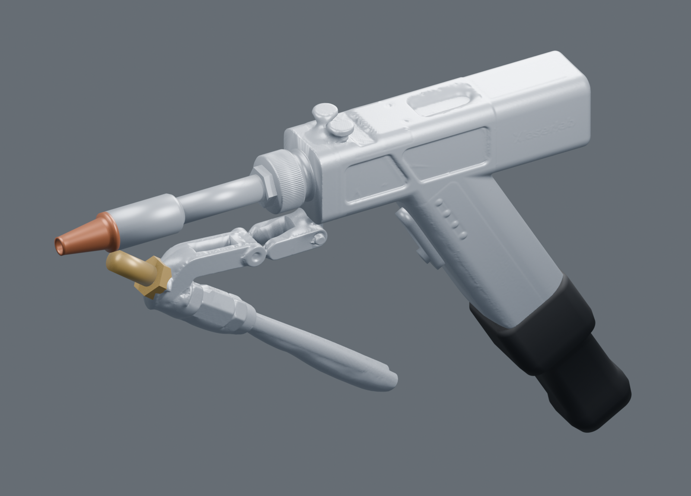

# XLaserLab SUP29F-XH exterior reference

A complete exterior for designing printed gun mounts, reconstructed from the
MINI 2 scan and the eight supplied photographs. The handle is reflected about
the fitted barrel midpoint. The wire feeder and its captured guide pose are
included. The copper nozzle, released trigger and proximal umbilical boot use
photo estimates.



## Files

[Download the complete model package](reference-models.zip). It contains:

| File | Use |
| --- | --- |
| `xlaserlab-sup29f-xh.stl` | Primary exterior for close-fitting mount design; scanned housing, grip, feeder and guide with reconstructed end features. Millimetres, Z up. |
| `xlaserlab-sup29f-xh.glb` | Named components and approximate appearance for inspection. Metres, Y up, as required by glTF. |
| `xlaserlab-sup29f-xh.step` | Simplified editable CAD assembly with analytic surfaces and 16 named parts. Millimetres, Z up. |
| `xlaserlab-sup29f-xh-cad.stl` | Closed mesh of the simplified CAD assembly. |
| `validation.json`, `mesh-check.json` | Checks bound to the delivered files by SHA-256. |
| `measurements.json`, `photo-measurements.json` | Dimension sources and the photo scaling calculations. |

The detailed STL is one closed, consistently oriented volume. Its envelope,
including the modelled 80 mm boot section, is about 279.3 × 36.1 × 193.3 mm.
The GLB retains separate overlapping parts for inspection. It is not the fused
STL solid.

The STEP uses idealized housing panels, grip transitions and feeder hardware.
Measured differences from the scan reach several millimetres in those regions;
the [comparison record](validation.json) reports them separately. Use the
detailed STL for contact geometry. Both models carry nominal exterior geometry
with no print-fit clearance added.

## Coordinate frame and midpoint

X points forward along the barrel. Y is transverse. Z points toward the housing
adjustment knobs. The origin is the barrel axis at the front housing face;
the symmetry plane is Y = 0. The housing lies behind X = 0 and the grip extends
downward and rearward.

The midpoint comes from a shared axis fitted to two independent cylindrical
regions: the Ø12.074 mm barrel stem and Ø17.899 mm silver sleeve. The broad
housing-side plane sets roll, and the scanned front face sets axial position.
The joint cylinder fit has a 0.009 mm median and 0.037 mm 95th-percentile residual
to the captured points. These are fitting residuals, not scanner accuracy.

[alignment.json](alignment.json) supplies the exact native-to-model transform:
`model = (native - origin) @ basis_rows.T`. [fit_frame.py](fit_frame.py)
recomputes it from the committed source cloud.

## Measured and estimated geometry

| Feature | Model dimension | Basis |
| --- | --- | --- |
| Barrel stem | Ø12.0743 mm | Shared cylinder fit to the scan. |
| Silver sleeve | Ø17.8993 mm; straight length 30.7 mm | Scan fit and axial extent. |
| Housing CAD proxy | 134.4 mm long, 33.9 mm across Y, 36.7 mm high | Nominal dimensions fitted to observed faces; the detailed mesh retains their actual relief. |
| Grip CAD proxy | 38 × 34 mm section; 83 mm to the boot; 29.91° rearward from vertical | Scan side profile and corner tangencies; unobserved front face is inferred. |
| Exposed copper nozzle | 25 mm long; Ø17.9 mm collar, Ø14.6 mm taper base, Ø8.4 mm nose | Photos scaled locally against the scanned silver sleeve. |
| Boot cuff | 31 mm long; maximum 40.5 × 35.8 mm section | Photo estimate and the operator's grip-sized initial-section observation. |
| Boot continuation | 80 mm total modelled length; 29 × 28.5 mm neck | Visible cuff, shoulder and neck profile; arbitrary truncation of the flexible umbilical. |
| Trigger | 38 × 10 mm paddle; Ø7.6 mm button | Photo-derived clearance envelope in the released position. |
| Feeder hollows and missing brass projection | Explicit openings and thread-diameter envelope | Scan bounds and photos; hidden surfaces are inferred. |

The [marked photos](photos/IMG_7911-measured.jpg) show the local scaling.
The nozzle estimates are 25.7 mm in IMG_7911 and 24.2 mm in IMG_7915; the model
uses 25 mm. [IMG_7910](photos/IMG_7910-measured.jpg) gives an approximate
31.4 mm cuff length. Pixel coordinates, references and calculations are saved
in [photo-measurements.json](photo-measurements.json).

For layout, treat the nozzle length as an estimate within roughly 2 mm, its
diameters within roughly 1 mm, and the cuff length within roughly 6 mm. These
are modeling allowances, not calibrated measurement intervals. The nozzle mouth
is a shallow display recess; it does not describe the internal gas or optical
passage. The forward brass thread is represented by its outer diameter.

## Surface checks and scope

The [validation](validation.json) compares 3,500 retained-side observations per
region with the saved STL. Housing and grip 95th-percentile distances are below
0.022 mm; stem and sleeve distances are below 0.036 mm. The ring's value is
0.204 mm. The guide is below 0.018 mm. Feeder hardware reaches 1.47 mm at the
95th percentile and 3.48 mm at the 99th percentile around inferred hollows and
incomplete brass surfaces. Those feeder features need more allowance than the
main handle.

This comparison describes agreement with the supplied cloud. It does not bound
coating thickness, absolute scanner accuracy, missing surfaces or printed fit.
Reflection reproduces the observed side's detail on the other side; actual
side-specific features are not independently captured. The boot is a fixed
reference pose. The remaining umbilical and the fine filler wire are outside
the model. Color is for identification and does not specify construction
materials. No physical mount fit or load qualification is recorded.

## Source and rebuilding

[scan-evidence.json](scan-evidence.json) identifies the 378,299-point Revo Scan
capture, its hashes, scan settings, archive and all eight photographs. The
native project and full-resolution exported photos are preserved locally at:

`/Users/derekbredensteiner/Documents/3D Scans/2026-10-05-xlaserlab-sup29f-xh`

The public source cloud is `source/fused-scan.npz`, containing native X, Y, Z
and normals. The pinned closed housing/feeder surfaces are in
`source/reconstructed-surfaces.npz`. Photographs under `photos/` are 1824 × 1368
derivatives without EXIF location metadata.

The usual rebuild uses those pinned surfaces and the editable parameters in
[xlaserlab_sup29f_xh.py](xlaserlab_sup29f_xh.py):

```sh
python reconstruct.py --output /absolute/path/to/output
```

Run from a Python environment with [requirements.txt](requirements.txt) and the
repository CAD helpers available. Outputs default to the repository's
`output/xlaserlab-sup29f-xh/` directory. `--remesh` recomputes the closed surfaces
from the point cloud and writes them into the output directory. Surface
reconstruction uses screened Poisson, depth 9, point weight 8, two samples per
node and one thread; its
[PyMeshLab documentation](https://pymeshlab.readthedocs.io/en/latest/filter_list.html#generate_surface_reconstruction_screened_poisson)
describes the implementation. Explicit face/end constraints complete unobserved
regions, and the bracket hollows remain clear.

The final union retains Y ≥ 0 and reflects it. A 0.0001 mm CSG cleanup removes
numerical seam slivers before export; the saved binary STL is reloaded and
checked. `validate.py` checks topology, reflected surfaces, hollow probes,
glTF scale and scan agreement. `measure_photos.py` recreates the marked photos.
`render_reference.py` runs in Blender to generate the four inspection views.
